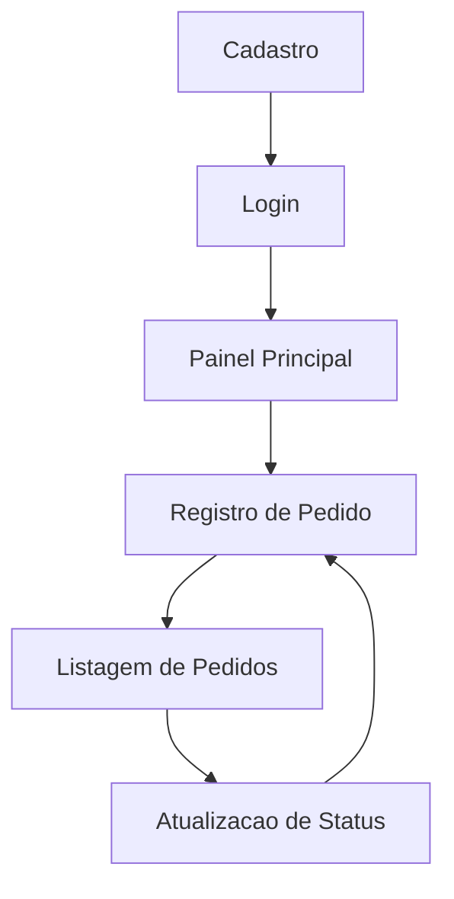
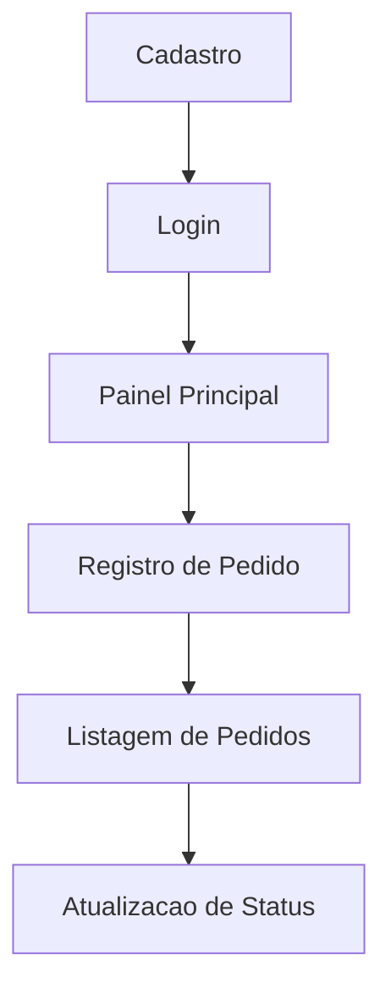

# Exemplo de DSM com Loop — Erro de Planejamento

> **Exemplo didático:** Este material mostra um caso de **dependência circular** no planejamento. O objetivo é ajudar a turma a identificar quando o grafo revela um erro de ordem de implementação.

[⬇️ Baixar / Copiar Código Fonte do Exemplo](https://raw.githubusercontent.com/paulossjunior/aula-extensao/main/docs/modelos/dsm-exemplo-loop-erro.md)

---

## 1. Visão Geral

| Campo | Descrição |
|-------|-----------|
| Nome do Produto | RedePesca |
| Equipe | Grupo 02 |
| Domínio analisado | Fluxo inicial de pedidos e acompanhamento |
| Objetivo da análise | Mostrar como loops no grafo indicam erro de planejamento |
| Data | 06/04/2026 |

---

## 2. Elementos do Sistema

| ID | Elemento | Tipo | Descrição |
|----|----------|------|-----------|
| E1 | Cadastro de usuário | Funcionalidade | Criação de conta |
| E2 | Login | Funcionalidade | Acesso à plataforma |
| E3 | Painel principal | Interface | Tela inicial do usuário |
| E4 | Registro de pedido | Funcionalidade | Cadastro de novo pedido |
| E5 | Listagem de pedidos | Funcionalidade | Exibição dos pedidos |
| E6 | Atualização de status | Funcionalidade | Alteração do estado do pedido |

---

## 3. Matriz DSM

> Neste exemplo, a matriz já mostra um problema: alguns elementos passam a depender circularmente uns dos outros.

| Elemento \ Depende de | E1 | E2 | E3 | E4 | E5 | E6 |
|-----------------------|----|----|----|----|----|----|
| E1 Cadastro           |    |    |    |    |    |    |
| E2 Login              | X  |    |    |    |    |    |
| E3 Painel             |    | X  |    |    | X  |    |
| E4 Registro de pedido |    |    | X  |    |    | X  |
| E5 Listagem de pedidos|    |    | X  | X  |    |    |
| E6 Atualização status |    |    | X  |    | X  |    |

---

## 4. Grafo de Dependências com Loop

> Neste caso, o grafo mostra uma **dependência circular** entre partes do sistema.

### Leitura do grafo

- `Login` depende de `Cadastro`
- `Painel Principal` depende de `Login`
- `Registro de Pedido` depende do `Painel Principal`
- `Listagem de Pedidos` depende do `Registro de Pedido`
- `Atualização de Status` depende da `Listagem de Pedidos`
- o problema aparece quando `Atualização de Status` passa a depender novamente de `Registro de Pedido`, fechando um ciclo

---

## 5. Onde Está o Erro

### Loop identificado

O loop acontece neste trecho:

1. registro de pedido
2. listagem de pedidos
3. atualização de status
4. volta para registro de pedido

Isso significa que a equipe montou um planejamento em que uma tarefa depende de outra, que por sua vez volta a depender da primeira.

### Por que isso é um erro de planejamento

Esse tipo de loop gera problemas como:

- nenhuma das tasks consegue ser iniciada com clareza
- a equipe perde noção da ordem correta de implementação
- surgem bloqueios artificiais
- o backlog fica confuso e difícil de priorizar

Em outras palavras, o grafo mostra que a equipe desenhou um fluxo impossível ou mal sequenciado.

---

## 6. Como Corrigir

### Ajuste conceitual

A atualização de status não deveria liberar ou redefinir o registro inicial do pedido. Ela deve acontecer **depois** que o pedido já existe e pode ser visualizado.

### Ordem corrigida

Uma ordem mais coerente seria:

1. cadastro
2. login
3. painel principal
4. registro de pedido
5. listagem de pedidos
6. atualização de status

### Grafo corrigido

---

## 7. Impactos no Planejamento

### Sinais de alerta para a equipe

- uma task depende de algo que ela mesma ajuda a criar
- duas tasks exigem que a outra esteja pronta antes de começar
- o backlog não deixa claro o primeiro incremento funcional

### Ajustes necessários no backlog

- separar melhor as responsabilidades de cada feature
- escolher uma primeira entrega mínima sem dependência circular
- usar o DSM para validar a ordem antes de distribuir as tasks em sprint

### Relação com Scrum e features fim a fim

No **Scrum**, loops como esse atrapalham a definição de um incremento claro na sprint.

Nas **features fim a fim**, o loop mostra que a equipe ainda não separou bem o fluxo de valor do usuário.

No **DSM**, esse erro fica visível de forma rápida, porque a dependência circular aparece tanto na matriz quanto no grafo.

---

## 8. Conclusão

### Principais aprendizados

Nem todo grafo de dependência está correto. Quando aparece um loop, isso pode indicar um erro de planejamento, uma dependência circular ou uma decomposição ruim das tarefas.

### Ajustes necessários no backlog ou arquitetura

Antes de iniciar a sprint, a equipe deve revisar as dependências e garantir que exista uma sequência viável de implementação, sem ciclos que bloqueiem a execução.
