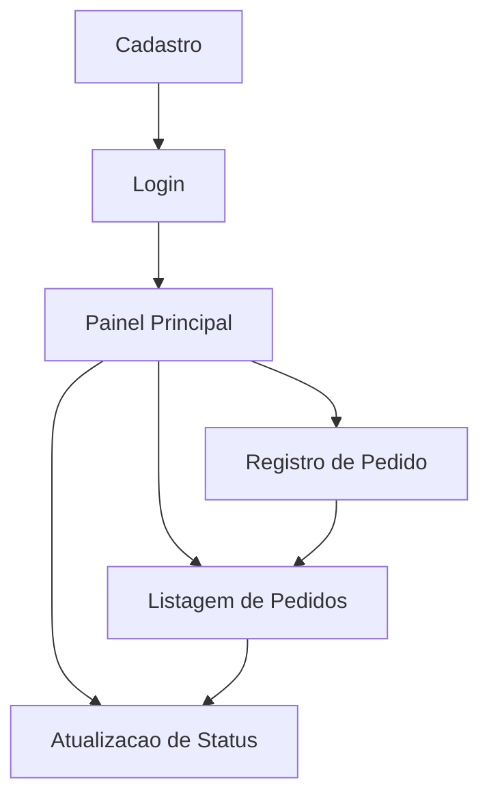

# Exemplo de DSM — Dependências com Liberação de Múltiplas Tasks

> **Exemplo preenchido:** Este exemplo mostra uma situação em que a conclusão de uma tarefa habilita duas ou mais tarefas seguintes. O cenário continua baseado no contexto da plataforma de pedidos para pescadores.

[⬇️ Baixar / Copiar Código Fonte do Exemplo](https://raw.githubusercontent.com/paulossjunior/aula-extensao/main/docs/modelos/dsm-exemplo.md)

---

## 1. Visão Geral

| Campo | Descrição |
|-------|-----------|
| Nome do Produto | RedePesca |
| Equipe | Grupo 02 |
| Domínio analisado | Fluxo inicial de autenticação e operação de pedidos |
| Objetivo da análise | Identificar dependências e visualizar quais tarefas podem avançar em paralelo |
| Data | 06/04/2026 |

---

## 2. Elementos do Sistema

| ID | Elemento | Tipo | Descrição |
|----|----------|------|-----------|
| E1 | Cadastro de usuário | Funcionalidade | Permite criar conta na plataforma |
| E2 | Login | Funcionalidade | Permite autenticar o usuário |
| E3 | Painel principal | Interface | Tela inicial após login |
| E4 | Registro de pedido | Funcionalidade | Formulário para cadastrar pedido |
| E5 | Listagem de pedidos | Funcionalidade | Exibe os pedidos já cadastrados |
| E6 | Atualização de status | Funcionalidade | Permite alterar o estado do pedido |

---

## 3. Matriz DSM

> Marque com `X` quando o elemento da linha depende do elemento da coluna.

| Elemento \ Depende de | E1 | E2 | E3 | E4 | E5 | E6 |
|-----------------------|----|----|----|----|----|----|
| E1 Cadastro           |    |    |    |    |    |    |
| E2 Login              | X  |    |    |    |    |    |
| E3 Painel             |    | X  |    |    |    |    |
| E4 Registro de pedido |    |    | X  |    |    |    |
| E5 Listagem de pedidos|    |    | X  | X  |    |    |
| E6 Atualização status |    |    | X  | X  | X  |    |

---

## 4. Grafo de Dependências

> Neste exemplo, a conclusão do **Painel principal** habilita mais de uma task seguinte.

### Leitura do grafo

- `Login` depende de `Cadastro`
- `Painel Principal` depende de `Login`
- quando o **Painel Principal** fica pronto, ele libera mais de uma frente:
  - `Registro de Pedido`
  - `Listagem de Pedidos`
  - `Atualização de Status`
- depois, algumas dessas tasks ainda se conectam entre si:
  - `Listagem de Pedidos` depende do registro dos pedidos
  - `Atualização de Status` depende da existência e visualização dos pedidos

---

## 5. Interpretação do Exemplo

### Tarefa que habilita múltiplas tasks

Neste exemplo, a task **Painel Principal** é um ponto de bifurcação.

Quando ela é concluída, a equipe pode avançar em paralelo com:

1. registro de pedido
2. listagem de pedidos
3. atualização de status

Isso é importante porque mostra que uma tarefa estrutural pode destravar várias frentes de trabalho.

### Dependências críticas

| Origem | Depende de | Impacto | Observação |
|--------|------------|---------|------------|
| Login | Cadastro | Alto | Sem cadastro, não há acesso ao sistema |
| Painel principal | Login | Alto | O painel depende da autenticação |
| Atualização de status | Painel, registro e listagem | Alto | Precisa do fluxo principal já estabelecido |

### Elementos que podem ser desenvolvidos em paralelo

- refinamento visual do painel
- validação do formulário de pedido
- estrutura inicial da listagem

### Elementos que devem vir antes

1. cadastro
2. login
3. painel principal

---

## 6. Impactos no Planejamento

### Ordem sugerida de implementação

1. cadastro de usuário
2. login
3. painel principal
4. registro de pedido e listagem em paralelo
5. atualização de status

### Riscos de acoplamento

- tentar implementar status antes de existir pedido real
- criar listagem sem definir os dados mínimos do pedido
- alterar o painel principal depois de várias funcionalidades já dependerem dele

### Decisões arquiteturais importantes

- definir cedo a estrutura do painel principal
- estabelecer o modelo de dados do pedido antes da listagem avançar
- separar responsabilidades para que tarefas paralelas não gerem conflito

---

## 7. Relação com as Features Fim a Fim

| Feature | Elementos envolvidos | Dependências principais | Sprint sugerida |
|---------|----------------------|-------------------------|-----------------|
| Acesso à plataforma | Cadastro, Login, Painel | Cadastro -> Login -> Painel | Sprint 1 |
| Registrar pedido | Painel, Registro de pedido | Painel -> Registro | Sprint 2 |
| Acompanhar pedidos | Painel, Listagem, Atualização de status | Painel -> Listagem -> Status | Sprint 3 |

---

## 8. Conclusão

### Principais aprendizados

O DSM ajuda a perceber que algumas tasks não apenas dependem de outras, mas também funcionam como pontos de liberação para várias frentes seguintes.

### Ajustes necessários no backlog ou arquitetura

O backlog deve tratar o painel principal como elemento estruturante, pois sua conclusão destrava múltiplas implementações posteriores.
