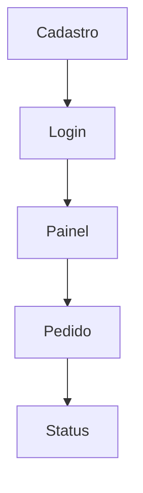

# Template de DSM — Design Structure Matrix

> **Instruções:** Use este modelo para mapear dependências entre módulos, funcionalidades, componentes ou partes do sistema. O objetivo é visualizar o que depende de quê para apoiar o planejamento da arquitetura e da ordem de implementação.

[⬇️ Baixar / Copiar Código Fonte do Template](https://raw.githubusercontent.com/paulossjunior/aula-extensao/main/docs/modelos/dsm-template.md)

---

## 1. Visão Geral

| Campo | Descrição |
|-------|-----------|
| Nome do Produto | |
| Equipe | |
| Domínio analisado | |
| Objetivo da análise | |
| Data | |

---

## 2. Elementos do Sistema

> Liste os principais elementos que serão analisados na matriz.

| ID | Elemento | Tipo | Descrição |
|----|----------|------|-----------|
| E1 |          |      |           |
| E2 |          |      |           |
| E3 |          |      |           |
| E4 |          |      |           |
| E5 |          |      |           |
| E6 |          |      |           |

---

## 3. Matriz DSM

> Marque com `X` quando o elemento da linha depende do elemento da coluna.

| Elemento \ Depende de | E1 | E2 | E3 | E4 | E5 | E6 |
|-----------------------|----|----|----|----|----|----|
| E1                    |    |    |    |    |    |    |
| E2                    |    |    |    |    |    |    |
| E3                    |    |    |    |    |    |    |
| E4                    |    |    |    |    |    |    |
| E5                    |    |    |    |    |    |    |
| E6                    |    |    |    |    |    |    |

---

## 4. Grafo de Dependências

> Este exemplo simples em Mermaid pode ser adaptado para o seu produto.

### Leitura do grafo

- `Login` depende de `Cadastro`
- `Painel` depende de `Login`
- `Pedido` depende de `Painel`
- `Status` depende de `Pedido`

---

## 5. Leitura das Dependências

### Dependências críticas

| Origem | Depende de | Impacto | Observação |
|--------|------------|---------|------------|
|        |            |         |            |
|        |            |         |            |
|        |            |         |            |

### Elementos que podem ser desenvolvidos em paralelo

- ...
- ...
- ...

### Elementos que devem vir antes

1. ...
2. ...
3. ...

---

## 6. Impactos no Planejamento

### Ordem sugerida de implementação

1. ...
2. ...
3. ...
4. ...

### Riscos de acoplamento

- ...
- ...
- ...

### Decisões arquiteturais importantes

- ...
- ...
- ...

---

## 7. Relação com as Features Fim a Fim

> Relacione a matriz com as entregas planejadas no backlog.

| Feature | Elementos envolvidos | Dependências principais | Sprint sugerida |
|---------|----------------------|-------------------------|-----------------|
|         |                      |                         |                 |
|         |                      |                         |                 |
|         |                      |                         |                 |

---

## 8. Conclusão

### Principais aprendizados

> ...

### Ajustes necessários no backlog ou arquitetura

> ...
