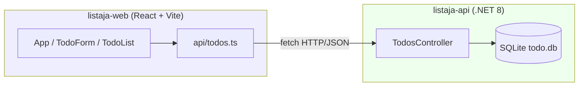
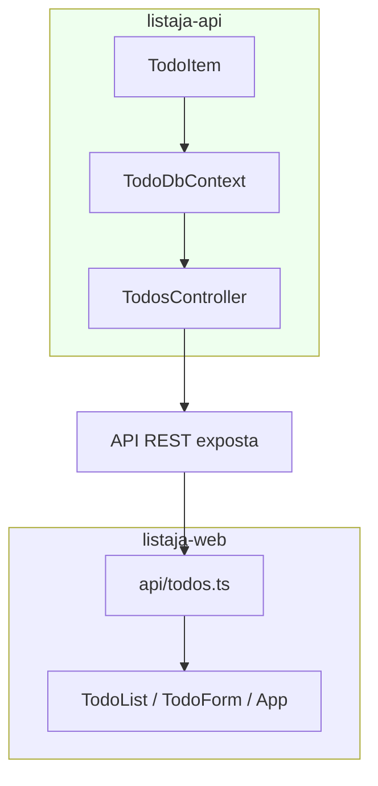

# Exemplo de SDD — TODO List em Arquitetura Apartada (React + C#) com Spec-Kit

> **Exemplo preenchido:** Este exemplo mostra o GitHub Spec-Kit aplicado em **dois repositórios independentes** — `listaja-api` (back-end C#) e `listaja-web` (front-end React) — que se conectam apenas por uma API REST. Use-o como referência depois da Aula 09.

[⬇️ Baixar / Copiar Código Fonte do Exemplo](https://raw.githubusercontent.com/paulossjunior/aula-extensao/main/docs/modelos/sdd-exemplo-todo-react-csharp.md)

---

## 1. Visão Geral

| Campo | Descrição |
|-------|-----------|
| Nome do Produto | ListaJá |
| Equipe (fictícia) | Grupo 07 |
| Data | 04/05/2026 |
| Domínio | Aplicativo pessoal de lista de tarefas com prazo opcional |
| Repositório do back | `listaja-api` (ASP.NET Core 8 Web API + EF Core + SQLite) |
| Repositório do front | `listaja-web` (React 18 + Vite + TypeScript) |
| Integração | REST/JSON sobre HTTP, sem autenticação |
| Persistência | SQLite (arquivo `todo.db`) — apenas no back |
| Objetivo | Demonstrar, do começo ao fim, como o GitHub Spec-Kit conduz um produto pequeno em **dois repositórios apartados**, da constitution ao código |

> Esta é **uma execução plausível**, não a única possível. Outro grupo, com a mesma stack, certamente produziria specs e tasks ligeiramente diferentes.

### Por que apartar em dois repositórios?

A versão monorepo deste mesmo exemplo (com `back/` e `front/` lado a lado) também é válida. A escolha por dois repositórios independentes é deliberada e tem motivos didáticos claros:

1. **Independência de release.** Front e back podem evoluir em ritmos diferentes. A API pode receber dois deploys numa tarde sem que o front sequer saiba; o front pode trocar `useState` por Zustand sem mexer no servidor.
2. **Times separados.** Em produtos reais, é comum um time tocar a API e outro tocar a UI. Dois repositórios deixam essa fronteira de propriedade explícita, com revisões de PR, esteiras de CI e cadências de release próprias.
3. **Contrato como fronteira.** O REST API vira o **contrato explícito** entre os dois repos. É exatamente o tipo de fronteira que o SDD ajuda a documentar — uma spec de cada lado descreve o que o outro lado pode esperar.
4. **Replicabilidade do back.** Outros clientes (mobile, CLI, integração interna) poderiam consumir a mesma API sem dependerem do código do front.

Trade-off honesto, que será revisitado na Seção 12: dois repositórios significam **dois fluxos de spec-kit**, **duas constitutions**, **duas revisões** a cada mudança que cruza a fronteira, e o **risco de o contrato divergir** entre os repos se ninguém olhar lado a lado. Esse custo é real.

---

## 2. Topologia da Solução

A interação entre os dois serviços é toda feita por HTTP. Nenhum deles compartilha memória, processo, build ou mesmo sistema de arquivos.



Em desenvolvimento, o front sobe na porta `5173` (padrão do Vite) e o back na porta `5080`. O CORS do back libera explicitamente a origem do front.

| Aspecto | listaja-api | listaja-web |
|---------|-------------|-------------|
| Linguagem / runtime | C# / .NET 8 | TypeScript / Node 20+ |
| Framework principal | ASP.NET Core Web API | React 18 + Vite |
| Persistência | EF Core + SQLite | localStorage opcional para o nome do usuário |
| Porta dev | 5080 | 5173 |
| Spec-Kit init | `specify init listaja-api` | `specify init listaja-web` |
| Tipo de spec | Contratos REST + regras de negócio do servidor | Experiência do usuário + chamadas à API |
| CI | xUnit + dotnet test | Vitest + ESLint |
| Quem revisa | Time de backend | Time de frontend |

A separação por colunas dessa tabela é uma boa heurística: se uma decisão se encaixa bem em uma das colunas e mal na outra, ela provavelmente é uma decisão **de um lado só** e não precisa cruzar a fronteira.

---

## 3. Setup do Spec-Kit nos Dois Repositórios

Cada repositório recebe seu próprio `specify init`. Os comandos `/speckit.*` ficam disponíveis dentro de cada um, **independentemente**.

```bash
# Pré-requisitos comuns
uv --version
uv tool install specify-cli --from git+https://github.com/github/spec-kit.git
```

```bash
# Repositório do back-end
mkdir listaja-api && cd listaja-api
git init
specify init . --integration claude
```

```bash
# Repositório do front-end (em outra pasta, paralelamente)
mkdir listaja-web && cd listaja-web
git init
specify init . --integration claude
```

Depois do `init`, cada repositório passou a apresentar a estrutura mínima abaixo (resumida):

```
listaja-api/
├── .specify/
│   ├── memory/
│   │   └── constitution.md
│   └── ... (templates internos)
├── specs/
└── README.md

listaja-web/
├── .specify/
│   ├── memory/
│   │   └── constitution.md
│   └── ... (templates internos)
├── specs/
└── README.md
```

Os slash-commands disponíveis em **ambos os repositórios**, depois do `init`, são os mesmos:

| Comando | Função |
|---------|--------|
| `/speckit.constitution` | Registra os princípios do produto |
| `/speckit.specify` | Descreve o quê e o porquê da feature |
| `/speckit.clarify` | Reduz ambiguidades por perguntas estruturadas |
| `/speckit.plan` | Decisões técnicas: stack, arquitetura, contratos |
| `/speckit.tasks` | Quebra o plano em tarefas com dependências |
| `/speckit.analyze` | Cruza spec, plan e tasks em busca de inconsistências |
| `/speckit.checklist` | Gera checklist de qualidade da spec |
| `/speckit.implement` | Executa as tarefas e gera código |

A diferença é o que cada repositório vai escrever dentro desses comandos: o back foca em contratos e regras; o front foca em experiência e consumo da API.

---

## 4. Fase 1 — Constitution dos Dois Repositórios

A constitution descreve princípios duráveis. Como cada repositório tem seu próprio agente e suas próprias decisões, cada um escreve a sua.

### 4.1 Constitution do `listaja-api`

**Arquivo:** `listaja-api/.specify/memory/constitution.md`

```markdown
# Constitution — listaja-api

## Princípios de Qualidade
- Toda mudança de código passa por revisão de Pull Request.
- Analyzers do .NET ativados; warnings tratados como erros em CI.
- Mensagens de commit seguem Conventional Commits.

## Política de Testes
- xUnit cobrindo Controllers e regras de validação.
- Cobertura mínima de 70% em projeto de testes dedicado.
- Testes de integração com WebApplicationFactory ficam para v2.

## Contrato e Compatibilidade
- A API segue padrão REST: substantivos no plural, verbos HTTP semânticos.
- Operações de escrita devem ser idempotentes quando o método HTTP exigir
  (ex.: PATCH `/complete` aplicado duas vezes não falha).
- Quebras de contrato exigem nova versão (`/api/v2/...`) e nota de migração.

## Performance
- Resposta da API abaixo de 300 ms para listagem de até 500 tarefas.
- Sem N+1 em queries do EF Core; uso explícito de `AsNoTracking` em leituras.

## Restrições do Contexto
- Sem autenticação na v1. Identificação apenas por nome (`OwnerName`).
- Persistência local em SQLite. Sem dependência de serviços de nuvem.
- Datas em UTC no servidor.
- Idioma de mensagens de erro: pt-BR.
```

### 4.2 Constitution do `listaja-web`

**Arquivo:** `listaja-web/.specify/memory/constitution.md`

```markdown
# Constitution — listaja-web

## Princípios de Qualidade
- Toda mudança de código passa por revisão de Pull Request.
- ESLint + TypeScript estrito; sem `any` solto no código de produção.
- Mensagens de commit seguem Conventional Commits.

## Política de Testes
- Vitest + Testing Library para componentes-chave (formulário e lista).
- Mock da camada `api/` em testes de componente.
- Testes ponta a ponta com Playwright ficam para v2.

## Acessibilidade e UX
- Foco visível em todos os elementos interativos.
- Inputs com `<label>` associado.
- Feedback imediato em qualquer ação que altere dados.
- Mensagens de erro de rede legíveis em pt-BR; nada de stack trace na tela.

## Performance
- Bundle inicial abaixo de 200 KB gzip.
- Renderização da lista lida com até 500 itens sem travar a aba.

## Restrições do Contexto
- Idioma único: pt-BR.
- Sem dependência de lib de estado externa na v1; `useState`/`useReducer` bastam.
- A URL base da API vem de `VITE_API_BASE_URL`. Nunca usar URL hardcoded.
- O front não conhece detalhes do banco; só conhece o contrato REST documentado.
```

### 4.3 Princípios compartilhados (fora dos repos)

Algumas decisões aparecem nas duas constitutions porque, na prática, são **compartilhadas pelo produto**:

- "Sem autenticação na v1."
- "Idioma único pt-BR."
- "Datas tratadas como UTC no servidor; conversão local é responsabilidade do front."

Em times grandes, é comum extrair esse núcleo compartilhado para um terceiro repositório de governança (algo como `listaja-charter`) e referenciá-lo em ambas as constitutions. Para um produto pequeno como o ListaJá, o custo desse terceiro repositório supera o benefício; mas é importante deixar registrado que **a coerência entre as duas constitutions é responsabilidade humana** — o spec-kit não tem hoje conceito nativo de "constitution compartilhada".

---

## 5. Fase 2 — Specification em Cada Repositório

Aqui aparece o ponto pedagógico mais importante da arquitetura apartada: **as specs são diferentes em cada lado, ainda que falem do mesmo produto**.

### 5.1 Spec do `listaja-api`

Comando dado ao agente, dentro de `listaja-api`:

> *"Quero uma API REST que permita criar, listar, concluir e excluir tarefas pessoais de um usuário identificado por nome simples."*

**Arquivo:** `listaja-api/specs/001-todo-api/spec.md`

```markdown
# Specification — API de Lista de Tarefas

## Contexto
A `listaja-api` expõe operações sobre tarefas pessoais.
Cada tarefa pertence a um único `OwnerName` (string simples).
Esta API é consumida por clientes externos (web, e potencialmente mobile/CLI).

## User Stories (perspectiva do cliente da API)

### US-A1 — Criar tarefa
Como cliente da API, quero enviar um POST com título, prazo opcional e dono,
para que uma nova tarefa seja persistida e devolvida com `id` e `createdAt`.

### US-A2 — Listar tarefas de um dono
Como cliente da API, quero enviar um GET filtrado por `owner`,
para receber todas as tarefas daquele dono em ordem de criação decrescente.

### US-A3 — Marcar como concluída
Como cliente da API, quero enviar um PATCH `/{id}/complete`,
para alterar o estado da tarefa para concluída de forma idempotente.

### US-A4 — Excluir tarefa
Como cliente da API, quero enviar um DELETE `/{id}`,
para remover a tarefa do banco em definitivo.

## Contratos (resumidos)

| Método | Rota                              | Status sucesso | Status erro                  |
|--------|-----------------------------------|----------------|------------------------------|
| GET    | /api/todos?owner={nome}           | 200            | 400 owner ausente            |
| POST   | /api/todos                        | 201            | 400 título inválido          |
| PATCH  | /api/todos/{id}/complete          | 200            | 404 id inexistente           |
| DELETE | /api/todos/{id}                   | 204            | 404 id inexistente           |

## Regras de Negócio do Servidor
- `Title` é obrigatório, com 1 a 200 caracteres após `Trim()`.
- `DueDate`, quando presente, é uma data válida (sem componente de hora).
- `OwnerName` é obrigatório, máximo 80 caracteres.
- Ordem padrão de listagem: `CreatedAt` decrescente.
- Datas armazenadas em UTC.
- Concluir uma tarefa já concluída retorna 200 sem alterar `CreatedAt`.

## Fora de Escopo
- Autenticação ou criação de conta.
- Edição de tarefa existente (apenas concluir/excluir).
- Compartilhamento entre `OwnerName` distintos.
- Notificação de prazo.
```

### 5.2 Spec do `listaja-web`

Comando dado ao agente, dentro de `listaja-web`:

> *"O usuário registra suas tarefas pessoais com texto e prazo opcional, lista o que tem em aberto, marca como concluído quando termina e remove o que não interessa mais. A interface conversa com a API REST do `listaja-api`."*

**Arquivo:** `listaja-web/specs/001-todo-ui/spec.md`

```markdown
# Specification — Interface do ListaJá

## Contexto
A `listaja-web` é a interface web do ListaJá.
Consome a API REST do `listaja-api` (contrato em listaja-api/specs/001-todo-api/spec.md).
Cada usuário se identifica digitando um nome curto na própria tela; não há login.

## User Stories (perspectiva do usuário final)

### US-W1 — Identificar-se
Como usuário da interface, quero digitar meu nome em um campo,
para que a aplicação carregue minhas tarefas correspondentes.

### US-W2 — Criar tarefa
Como usuário da interface, quero preencher um campo de texto e, opcionalmente,
um prazo, e clicar em "Adicionar", para registrar uma nova tarefa.

### US-W3 — Ver minha lista
Como usuário da interface, quero ver minhas tarefas em uma lista única,
com indicação visual diferente para concluídas e em aberto.

### US-W4 — Concluir tarefa
Como usuário da interface, quero clicar em "Concluir" numa tarefa em aberto,
para que ela passe a aparecer riscada.

### US-W5 — Excluir tarefa
Como usuário da interface, quero clicar em "Excluir" numa tarefa,
para removê-la da lista de forma definitiva.

## Critérios de UX
- Feedback visual imediato após cada ação que altera dados.
- Estados de carregamento (`loading`) para listagem inicial.
- Mensagem amigável quando a API estiver fora do ar
  ("Não foi possível conectar ao servidor. Tente novamente.").
- A tela cabe sem rolagem horizontal em telas a partir de 360 px.
- Foco visível em inputs e botões; rótulos associados via `<label>`.

## O que é responsabilidade do back (e este spec NÃO repete)
- Tamanho máximo do título (validado também aqui por usabilidade,
  mas a regra autoritativa vive em listaja-api/specs/001-todo-api/spec.md).
- Ordem padrão da lista (vem pronta da API).
- Persistência em si.

## Fora de Escopo
- Autenticação.
- Edição de tarefa existente.
- Notificações de prazo.
- Modo offline.
```

> **Insight didático:** os dois specs juntos descrevem o produto inteiro, mas nenhum deles sozinho. O spec do back não fala de cor de botão; o spec do front não fala de SQL. A fronteira entre os dois é justamente o contrato REST descrito no spec do back e referenciado pelo spec do front.

---

## 6. Fase 3 — Clarify nos Dois Lados

Cada repositório roda seu próprio `/speckit.clarify`. As perguntas que aparecem em cada lado **são tipicamente diferentes**, porque cada agente está olhando para um spec distinto.

### 6.1 Clarify do `listaja-api`

```markdown
## Clarifications — listaja-api

### Q1. Tarefas excluídas devem ir para uma lixeira (soft delete) ou ser apagadas em definitivo?
Resposta do time: hard delete. Lixeira ficaria para uma versão futura.

### Q2. Qual a ordem padrão da listagem retornada pelo GET?
Resposta do time: por `CreatedAt` decrescente. Concluídas e em aberto na mesma resposta.

### Q3. Há limite de caracteres para o `Title`?
Resposta do time: sim, 1 a 200 caracteres após Trim. Validação no servidor.
```

### 6.2 Clarify do `listaja-web`

```markdown
## Clarifications — listaja-web

### Q1. Erro de rede: feedback inline (perto do botão) ou toast no topo?
Resposta do time: inline, com `role="alert"`, perto do elemento que disparou a ação.

### Q2. Antes de excluir uma tarefa, pedimos confirmação?
Resposta do time: não na v1. Excluir é direto. Anotado como possível ajuste após uso real.

### Q3. A ordem das tarefas na tela respeita a ordem da API ou o usuário pode reordenar?
Resposta do time: apenas a ordem da API. Reordenação manual fica para v2.
```

> Reparem: a Q1 de cada lado fala de erro, mas com perspectivas opostas. O back se preocupa com **soft vs hard delete** (uma decisão de banco). O front se preocupa com **inline vs toast** (uma decisão de UX). Nenhuma das duas decisões caberia bem na constitution do outro repositório.

---

## 7. Fase 4 — Plan em Cada Repositório

### 7.1 Plan do `listaja-api`

**Arquivo:** `listaja-api/specs/001-todo-api/plan.md`

```markdown
# Plan — listaja-api

## Arquitetura interna
ASP.NET Core 8 Web API expondo controllers REST.
Persistência local com SQLite acessado por Entity Framework Core.

## Modelo de Dados

Entidade `TodoItem`:

| Campo      | Tipo            | Observações                   |
|------------|-----------------|-------------------------------|
| Id         | Guid            | Chave primária                |
| Title      | string (<=200)  | Texto da tarefa               |
| DueDate    | DateTime?       | Prazo opcional, apenas data   |
| Done       | bool            | Indica conclusão              |
| OwnerName  | string (<=80)   | Nome do dono da tarefa        |
| CreatedAt  | DateTime        | Definido no servidor (UTC)    |

## Contratos REST

| Método | Rota                              | Body / Query                      |
|--------|-----------------------------------|-----------------------------------|
| GET    | /api/todos?owner={nome}           | query string                      |
| POST   | /api/todos                        | { title, dueDate?, ownerName }    |
| PATCH  | /api/todos/{id}/complete          | sem body                          |
| DELETE | /api/todos/{id}                   | sem body                          |

## Camadas
Controllers -> DbContext (EF Core) -> SQLite.
A camada de Services foi descartada para a v1: as regras são tão simples
que residiriam vazias entre Controller e DbContext.

## Estrutura de Pastas

```
listaja-api/
├── src/
│   └── ListaJa.Api/
│       ├── Controllers/TodosController.cs
│       ├── Models/TodoItem.cs
│       ├── Data/TodoDbContext.cs
│       ├── Program.cs
│       └── ListaJa.Api.csproj
├── tests/
│   └── ListaJa.Api.Tests/
│       └── TodosControllerTests.cs
└── .specify/
```

## Decisões Técnicas
- SQLite por simplicidade local; troca para Postgres ficaria como ajuste futuro.
- CORS liberado **explicitamente** para `http://localhost:5173` (porta padrão do Vite).
- Migrations por `EnsureCreated` na v1 (script único). EF Migrations entram quando
  o schema começar a evoluir.
- Datas em UTC; conversão para fuso local é responsabilidade do cliente.
```

### 7.2 Plan do `listaja-web`

**Arquivo:** `listaja-web/specs/001-todo-ui/plan.md`

```markdown
# Plan — listaja-web

## Arquitetura interna
SPA em React 18 + Vite + TypeScript. Camadas:
- `api/` — funções tipadas que falam HTTP com `listaja-api`.
- `components/` — componentes de UI puros, sem chamadas HTTP diretas.
- `hooks/` — composição de estado quando necessário (não há na v1).
- `App.tsx` — orquestração e estado de alto nível.

## Configuração de ambiente

A URL base da API vem da variável `VITE_API_BASE_URL`, lida via `import.meta.env`.

```
.env.development  -> VITE_API_BASE_URL=http://localhost:5080
.env.production   -> VITE_API_BASE_URL=https://api.listaja.example
```

Nenhum arquivo do código deve conter a URL da API hardcoded.

## Estrutura de Pastas

```
listaja-web/
├── src/
│   ├── api/todos.ts
│   ├── components/TodoForm.tsx
│   ├── components/TodoList.tsx
│   ├── App.tsx
│   └── main.tsx
├── tests/
│   └── TodoForm.test.tsx
├── index.html
├── .env.development
├── .env.production
└── package.json
```

## Decisões Técnicas
- Sem lib de estado externa: `useState`/`useEffect` cobrem o necessário.
- Tipos do `TodoItem` declarados localmente em `src/api/todos.ts`,
  espelhando o contrato descrito em listaja-api/specs/001-todo-api/spec.md.
- Tratamento de erro: `try/catch` por chamada, com mensagem amigável em pt-BR.
- O nome do usuário é guardado em `localStorage` (chave `listaja:owner`)
  para sobreviver a recargas; sem cookies, sem auth.
```

---

## 8. Fase 5 — Tasks

### 8.1 Tasks do `listaja-api`

| ID | Tarefa | US | Paralelizável | Depende de |
|----|--------|----|---------------|------------|
| A01 | Criar projeto `ListaJa.Api` (.NET 8) e `ListaJa.Api.Tests` | — | — | — |
| A02 | Adicionar EF Core + provider SQLite | — | — | A01 |
| A03 | Criar entidade `TodoItem` em `Models/` | US-A1 | — | A02 |
| A04 | Criar `TodoDbContext` com `DbSet<TodoItem>` e mapeamentos | US-A1 | — | A03 |
| A05 | Configurar `Program.cs` (DbContext, CORS para 5173, controllers) | todas | — | A04 |
| A06 | Endpoint POST `/api/todos` com validação | US-A1 | — | A05 |
| A07 | Endpoint GET `/api/todos?owner=` com ordenação | US-A2 | — | A05 |
| A08 | Endpoint PATCH `/api/todos/{id}/complete` idempotente | US-A3 | — | A06 |
| A09 | Endpoint DELETE `/api/todos/{id}` | US-A4 | — | A06 |
| A10 | Testes xUnit do `TodosController` (caminhos felizes e 404) | todas | [P] com A09 | A06, A07, A08 |

### 8.2 Tasks do `listaja-web`

| ID | Tarefa | US | Paralelizável | Depende de |
|----|--------|----|---------------|------------|
| W01 | Criar projeto Vite + React + TypeScript | — | [P] com A01 | — |
| W02 | Configurar `.env.development` e `.env.production` | — | — | W01 |
| W03 | Implementar `src/api/todos.ts` lendo `VITE_API_BASE_URL` | US-W2..W5 | — | W02 |
| W04 | Implementar `TodoForm.tsx` com validação local | US-W2 | — | W03 |
| W05 | Implementar `TodoList.tsx` (concluir/excluir) | US-W3, W4, W5 | — | W03 |
| W06 | Compor `App.tsx` com input de nome e estados de carregamento | todas | — | W04, W05 |
| W07 | Persistir `ownerName` em `localStorage` | US-W1 | [P] com W06 | W03 |
| W08 | Tratamento de erro de rede (mensagem amigável) | todas | [P] com W06 | W03 |
| W09 | Testes Vitest de `TodoForm` (validação e submit) | US-W2 | [P] com W06 | W04 |
| W10 | Configurar ESLint + script `lint` no `package.json` | — | [P] | W01 |

### 8.3 Tarefas Compartilhadas / Pontos de Sincronização

A arquitetura apartada cobra um trabalho extra: **alinhar lados**. Estes são os pontos onde os dois repos precisam combinar antes de qualquer um implementar.

| ID | Combinação | Quem precisa concordar |
|----|------------|------------------------|
| S01 | Forma exata do JSON do `TodoItem` (campos, casing, formato de data) | A03 ↔ W03 |
| S02 | Lista final dos endpoints, métodos e códigos HTTP | A06–A09 ↔ W03 |
| S03 | Política de erros: estrutura do corpo de resposta em 4xx | A06 ↔ W08 |
| S04 | Origem CORS liberada (porta do front em dev) | A05 ↔ W01 |

Em times reais, esses itens viram um documento curto compartilhado (um `CONTRACT.md` em algum repositório de governança, ou anexado ao spec do back) e são revisados em conjunto **antes** de A06 e W03 começarem.

---

## 9. Fase 6 — Implement

Os snippets abaixo são representativos do código gerado em cada repositório, depois de revisados pelo grupo. Estão organizados por repositório.

### 9.1 Código do `listaja-api`

**`listaja-api/src/ListaJa.Api/Models/TodoItem.cs`**

```csharp
namespace ListaJa.Api.Models;

public class TodoItem
{
    public Guid Id { get; set; } = Guid.NewGuid();
    public string Title { get; set; } = string.Empty;
    public DateTime? DueDate { get; set; }
    public bool Done { get; set; }
    public string OwnerName { get; set; } = string.Empty;
    public DateTime CreatedAt { get; set; } = DateTime.UtcNow;
}
```

**`listaja-api/src/ListaJa.Api/Data/TodoDbContext.cs`**

```csharp
using Microsoft.EntityFrameworkCore;
using ListaJa.Api.Models;

namespace ListaJa.Api.Data;

public class TodoDbContext : DbContext
{
    public TodoDbContext(DbContextOptions<TodoDbContext> options) : base(options) { }

    public DbSet<TodoItem> Todos => Set<TodoItem>();

    protected override void OnModelCreating(ModelBuilder modelBuilder)
    {
        modelBuilder.Entity<TodoItem>(e =>
        {
            e.HasKey(t => t.Id);
            e.Property(t => t.Title).IsRequired().HasMaxLength(200);
            e.Property(t => t.OwnerName).IsRequired().HasMaxLength(80);
        });
    }
}
```

**`listaja-api/src/ListaJa.Api/Program.cs`**

```csharp
using Microsoft.EntityFrameworkCore;
using ListaJa.Api.Data;

var builder = WebApplication.CreateBuilder(args);

builder.Services.AddDbContext<TodoDbContext>(opt =>
    opt.UseSqlite("Data Source=todo.db"));

builder.Services.AddCors(opt =>
    opt.AddDefaultPolicy(p => p
        .WithOrigins("http://localhost:5173")
        .AllowAnyHeader()
        .AllowAnyMethod()));

builder.Services.AddControllers();

var app = builder.Build();

using (var scope = app.Services.CreateScope())
{
    var db = scope.ServiceProvider.GetRequiredService<TodoDbContext>();
    db.Database.EnsureCreated();
}

app.UseCors();
app.MapControllers();
app.Run();
```

**`listaja-api/src/ListaJa.Api/Controllers/TodosController.cs`**

```csharp
using Microsoft.AspNetCore.Mvc;
using Microsoft.EntityFrameworkCore;
using ListaJa.Api.Data;
using ListaJa.Api.Models;

namespace ListaJa.Api.Controllers;

public record CreateTodoDto(string Title, DateTime? DueDate, string OwnerName);

[ApiController]
[Route("api/[controller]")]
public class TodosController : ControllerBase
{
    private readonly TodoDbContext _db;

    public TodosController(TodoDbContext db) => _db = db;

    [HttpGet]
    public async Task<ActionResult<IEnumerable<TodoItem>>> List([FromQuery] string owner)
    {
        if (string.IsNullOrWhiteSpace(owner)) return BadRequest("owner é obrigatório");
        var items = await _db.Todos
            .Where(t => t.OwnerName == owner)
            .OrderByDescending(t => t.CreatedAt)
            .AsNoTracking()
            .ToListAsync();
        return Ok(items);
    }

    [HttpPost]
    public async Task<ActionResult<TodoItem>> Create([FromBody] CreateTodoDto dto)
    {
        var title = (dto.Title ?? string.Empty).Trim();
        if (title.Length == 0 || title.Length > 200)
            return BadRequest("título inválido");
        var owner = (dto.OwnerName ?? string.Empty).Trim();
        if (owner.Length == 0 || owner.Length > 80)
            return BadRequest("ownerName inválido");

        var item = new TodoItem
        {
            Title = title,
            DueDate = dto.DueDate,
            OwnerName = owner
        };
        _db.Todos.Add(item);
        await _db.SaveChangesAsync();
        return CreatedAtAction(nameof(List), new { owner = item.OwnerName }, item);
    }

    [HttpPatch("{id:guid}/complete")]
    public async Task<ActionResult<TodoItem>> Complete(Guid id)
    {
        var item = await _db.Todos.FindAsync(id);
        if (item is null) return NotFound();
        item.Done = true;
        await _db.SaveChangesAsync();
        return Ok(item);
    }

    [HttpDelete("{id:guid}")]
    public async Task<IActionResult> Delete(Guid id)
    {
        var item = await _db.Todos.FindAsync(id);
        if (item is null) return NotFound();
        _db.Todos.Remove(item);
        await _db.SaveChangesAsync();
        return NoContent();
    }
}
```

### 9.2 Código do `listaja-web`

**`listaja-web/.env.development`**

```bash
VITE_API_BASE_URL=http://localhost:5080
```

**`listaja-web/.env.production`**

```bash
VITE_API_BASE_URL=https://api.listaja.example
```

**`listaja-web/src/api/todos.ts`**

```typescript
export interface TodoItem {
  id: string;
  title: string;
  dueDate: string | null;
  done: boolean;
  ownerName: string;
  createdAt: string;
}

export interface CreateTodoInput {
  title: string;
  dueDate: string | null;
  ownerName: string;
}

const BASE_URL: string = import.meta.env.VITE_API_BASE_URL as string;
const TODOS_URL = `${BASE_URL}/api/todos`;

async function parseOrThrow<T>(res: Response, errorMsg: string): Promise<T> {
  if (!res.ok) throw new Error(errorMsg);
  return (await res.json()) as T;
}

export async function listTodos(owner: string): Promise<TodoItem[]> {
  const res = await fetch(`${TODOS_URL}?owner=${encodeURIComponent(owner)}`);
  return parseOrThrow<TodoItem[]>(res, "Falha ao listar tarefas");
}

export async function createTodo(input: CreateTodoInput): Promise<TodoItem> {
  const res = await fetch(TODOS_URL, {
    method: "POST",
    headers: { "Content-Type": "application/json" },
    body: JSON.stringify(input),
  });
  return parseOrThrow<TodoItem>(res, "Falha ao criar tarefa");
}

export async function completeTodo(id: string): Promise<TodoItem> {
  const res = await fetch(`${TODOS_URL}/${id}/complete`, { method: "PATCH" });
  return parseOrThrow<TodoItem>(res, "Falha ao concluir tarefa");
}

export async function deleteTodo(id: string): Promise<void> {
  const res = await fetch(`${TODOS_URL}/${id}`, { method: "DELETE" });
  if (!res.ok) throw new Error("Falha ao excluir tarefa");
}
```

**`listaja-web/src/components/TodoForm.tsx`**

```tsx
import { useState, FormEvent } from "react";
import { createTodo, TodoItem } from "../api/todos";

interface Props {
  ownerName: string;
  onCreated: (item: TodoItem) => void;
}

export function TodoForm({ ownerName, onCreated }: Props) {
  const [title, setTitle] = useState<string>("");
  const [dueDate, setDueDate] = useState<string>("");
  const [error, setError] = useState<string | null>(null);
  const [submitting, setSubmitting] = useState<boolean>(false);

  async function handleSubmit(e: FormEvent<HTMLFormElement>): Promise<void> {
    e.preventDefault();
    setError(null);
    const trimmed = title.trim();
    if (trimmed.length === 0 || trimmed.length > 200) {
      setError("Texto deve ter entre 1 e 200 caracteres.");
      return;
    }
    setSubmitting(true);
    try {
      const created = await createTodo({
        title: trimmed,
        dueDate: dueDate ? dueDate : null,
        ownerName,
      });
      onCreated(created);
      setTitle("");
      setDueDate("");
    } catch (err) {
      setError((err as Error).message);
    } finally {
      setSubmitting(false);
    }
  }

  return (
    <form onSubmit={handleSubmit}>
      <label>
        Nova tarefa
        <input
          type="text"
          value={title}
          maxLength={200}
          onChange={(e) => setTitle(e.target.value)}
        />
      </label>
      <label>
        Prazo
        <input
          type="date"
          value={dueDate}
          onChange={(e) => setDueDate(e.target.value)}
        />
      </label>
      <button type="submit" disabled={submitting}>
        {submitting ? "Adicionando..." : "Adicionar"}
      </button>
      {error && <p role="alert">{error}</p>}
    </form>
  );
}
```

**`listaja-web/src/components/TodoList.tsx`**

```tsx
import { TodoItem, completeTodo, deleteTodo } from "../api/todos";

interface Props {
  items: TodoItem[];
  onChanged: (item: TodoItem) => void;
  onDeleted: (id: string) => void;
}

export function TodoList({ items, onChanged, onDeleted }: Props) {
  async function handleComplete(id: string): Promise<void> {
    const updated = await completeTodo(id);
    onChanged(updated);
  }

  async function handleDelete(id: string): Promise<void> {
    await deleteTodo(id);
    onDeleted(id);
  }

  if (items.length === 0) {
    return <p>Nenhuma tarefa por aqui.</p>;
  }

  return (
    <ul>
      {items.map((t) => (
        <li key={t.id}>
          <span style={{ textDecoration: t.done ? "line-through" : "none" }}>
            {t.title}
            {t.dueDate ? ` (até ${t.dueDate.slice(0, 10)})` : ""}
          </span>
          {!t.done && (
            <button onClick={() => handleComplete(t.id)}>Concluir</button>
          )}
          <button onClick={() => handleDelete(t.id)}>Excluir</button>
        </li>
      ))}
    </ul>
  );
}
```

**`listaja-web/src/App.tsx`**

```tsx
import { useEffect, useState } from "react";
import { listTodos, TodoItem } from "./api/todos";
import { TodoForm } from "./components/TodoForm";
import { TodoList } from "./components/TodoList";

const OWNER_KEY = "listaja:owner";

export default function App() {
  const [ownerName, setOwnerName] = useState<string>(
    () => localStorage.getItem(OWNER_KEY) ?? ""
  );
  const [items, setItems] = useState<TodoItem[]>([]);
  const [loading, setLoading] = useState<boolean>(false);
  const [networkError, setNetworkError] = useState<string | null>(null);

  useEffect(() => {
    if (!ownerName) {
      setItems([]);
      return;
    }
    localStorage.setItem(OWNER_KEY, ownerName);
    setLoading(true);
    setNetworkError(null);
    listTodos(ownerName)
      .then(setItems)
      .catch(() =>
        setNetworkError(
          "Não foi possível conectar ao servidor. Tente novamente."
        )
      )
      .finally(() => setLoading(false));
  }, [ownerName]);

  function handleCreated(item: TodoItem): void {
    setItems((prev) => [item, ...prev]);
  }

  function handleChanged(item: TodoItem): void {
    setItems((prev) => prev.map((t) => (t.id === item.id ? item : t)));
  }

  function handleDeleted(id: string): void {
    setItems((prev) => prev.filter((t) => t.id !== id));
  }

  return (
    <main>
      <h1>ListaJá</h1>
      <label>
        Seu nome:
        <input
          type="text"
          value={ownerName}
          onChange={(e) => setOwnerName(e.target.value)}
        />
      </label>
      {ownerName && (
        <>
          <TodoForm ownerName={ownerName} onCreated={handleCreated} />
          {loading && <p>Carregando...</p>}
          {networkError && <p role="alert">{networkError}</p>}
          <TodoList
            items={items}
            onChanged={handleChanged}
            onDeleted={handleDeleted}
          />
        </>
      )}
    </main>
  );
}
```

---

## 10. Como Executar Localmente os Dois Serviços

Como os repositórios são independentes, é preciso subir cada um no seu próprio terminal.

```bash
# Terminal 1 — back
cd listaja-api/src/ListaJa.Api
dotnet run --urls=http://localhost:5080
```

```bash
# Terminal 2 — front
cd listaja-web
npm install
npm run dev   # sobe em http://localhost:5173
```

Pontos importantes:

- O front **precisa** do back de pé. Sem o back, a chamada inicial em `App.tsx` cai em `networkError`.
- O CORS do back já libera `http://localhost:5173` no `Program.cs`. Se você mudar a porta do Vite, precisa ajustar essa origem.
- O arquivo `todo.db` é criado automaticamente na pasta de execução do `dotnet run` na primeira vez.
- Em produção, basta apontar `VITE_API_BASE_URL` para a URL pública da API e ajustar a origem CORS correspondente — nenhuma linha do código de aplicação muda.

---

## 11. Comparação com a DSM

A DSM agora tem dois "blocos" claros, separados pela fronteira HTTP:

| Componente \ Depende de | M | DB | C | API | CL | UI |
|-------------------------|---|----|---|-----|----|----|
| M  `TodoItem` (back)          |   |    |   |     |    |    |
| DB `TodoDbContext`            | X |    |   |     |    |    |
| C  `TodosController`          | X | X  |   |     |    |    |
| **API REST exposta**          |   |    | X |     |    |    |
| CL `api/todos.ts` (front)     |   |    |   | X   |    |    |
| UI `TodoList`/`TodoForm`/`App`|   |    |   |     | X  |    |



A leitura interessante: a **única aresta que cruza a fronteira entre os dois subgrafos é o vértice `API`**. Isso é exatamente o que se quer numa arquitetura apartada — uma fronteira fina, bem definida, e com **um único ponto de acoplamento explícito**. Toda a complexidade do EF Core, das migrations e das validações vive à esquerda; toda a complexidade de renderização, estado e UX vive à direita.

A DSM também ajuda a confirmar que a ordem das tarefas faz sentido: A03 (modelo) precede A04 (DbContext), que precede A05/A06 (configuração e endpoints), que precedem W03 (cliente HTTP), que precede W04–W06 (componentes). E mostra por que **os pontos de sincronização S01–S04 da Seção 8.3 importam tanto**: eles são, na prática, o contrato do nó central do grafo.

---

## 12. Reflexão Final — Arquitetura Apartada e SDD

A combinação "dois repositórios + spec-kit em cada um" é poderosa, mas tem custos reais. Vale registrar os dois lados.

### Acertos observados

1. **A fronteira REST força disciplina.** Cada lado precisou especificar o que entrega e o que consome. Não dá para "esconder" uma decisão importante numa função compartilhada — não há função compartilhada.
2. **Contratos versionados ficam visíveis.** O spec do back lista códigos HTTP e formato de payload em uma seção própria. O spec do front cita esse contrato em vez de repetir as regras. Quando o contrato mudar, o lugar a editar é óbvio.
3. **Evolução independente.** O front pode trocar Vite por Next.js sem que o back saiba. O back pode migrar de SQLite para Postgres sem quebrar o front, desde que o contrato REST se mantenha. O `VITE_API_BASE_URL` permite, inclusive, apontar o mesmo front para uma API em outro servidor sem recompilar.

### Limites observados

1. **Dobro de constituição, dobro de spec, dobro de revisão.** Para uma TODO list de quatro endpoints, a quantidade de markdown produzida quase iguala a quantidade de código. O custo da apartação não é zero.
2. **Risco de divergência silenciosa do contrato.** O spec do back pode dizer que `PATCH /complete` retorna 200; o spec do front pode assumir 204. Se ninguém revisar lado a lado, a integração só falha em runtime. Os pontos de sincronização da Seção 8.3 existem para mitigar isso, mas exigem disciplina humana.
3. **Onboarding mais pesado.** Um aluno novo precisa rodar `specify init` duas vezes, entender dois fluxos paralelos, e descobrir como abrir os dois repositórios no mesmo agente. Em monorepo, basta um clone.
4. **Spec-kit não tem hoje conceito nativo de "spec compartilhada entre repos".** A coerência das duas constitutions e dos dois specs é responsabilidade humana. Não há, por enquanto, um `/speckit.contract` que viva em um repositório e seja referenciado pelos outros.

### Recomendação prática

Para produtos pequenos e times pequenos, **comece monorepo**: um único `specify init`, uma constitution, uma spec, e o suficiente para validar a ideia. Quando aparecer pelo menos um destes sinais — outro cliente da API (mobile, CLI), times distintos para front e back, ou ciclos de release muito diferentes —, **aparte os repositórios** e use este exemplo como guia. A apartação não é gratuita, mas o contrato explícito que ela cria costuma valer o investimento na fase certa do produto.

---

## 13. Como reproduzir este exemplo

```bash
# 1. Pré-requisitos
#    - uv (https://docs.astral.sh/uv/)
#    - .NET 8 SDK
#    - Node.js 20+

# 2. Instalar o Spec-Kit
uv tool install specify-cli --from git+https://github.com/github/spec-kit.git

# 3. Criar o repositório do back e iniciar o spec-kit
mkdir listaja-api && cd listaja-api
git init
specify init . --integration claude

# Dentro do agente do listaja-api, rodar as 6 fases na ordem:
#    /speckit.constitution
#    /speckit.specify
#    /speckit.clarify
#    /speckit.plan
#    /speckit.tasks
#    /speckit.implement

# 4. Criar o repositório do front (em outra pasta, paralelamente)
cd ..
mkdir listaja-web && cd listaja-web
git init
specify init . --integration claude

# Dentro do agente do listaja-web, rodar as mesmas 6 fases na ordem.

# 5. Antes de "implement" em qualquer um dos lados, revisem juntos
#    os pontos de sincronização da Seção 8.3 (S01–S04). Esse é o
#    momento de descobrir contratos divergentes — não em runtime.

# 6. Subir os dois serviços localmente
cd ../listaja-api/src/ListaJa.Api
dotnet run --urls=http://localhost:5080

# em outro terminal
cd ../../listaja-web
npm install
npm run dev
```

Abra `http://localhost:5173`, informe um nome qualquer e comece a registrar tarefas. O arquivo `todo.db` é criado automaticamente pelo back na primeira execução. Se o front mostrar a mensagem de erro de rede, confira se o `dotnet run` está rodando na porta `5080` e se `VITE_API_BASE_URL` aponta para essa porta.
