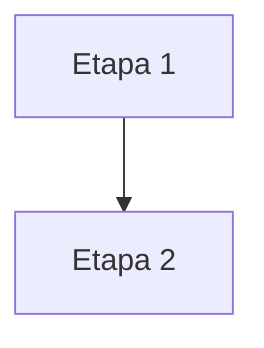

# Aula NN — [Título da Aula]

**Data:** DD/MM/AAAA | **Horário:** 11h20 às 13h00 | **Local:** Lab 207 | **Modalidade:** Presencial

[⬇️ Baixar / Copiar Código Fonte do Template](https://raw.githubusercontent.com/paulossjunior/aula-extensao/main/docs/modelos/template.md)

---

## Introdução

Apresenta o tema e situa a aula no curso. **Declare aqui o objetivo**: o que o aluno sai sabendo fazer ao final deste encontro.

Se a aula depende de algo feito antes, diga qual aula e qual artefato — com link relativo para a página.

---

## Materiais de Apoio

*Seção opcional. Use quando a aula exige leitura ou ferramenta previamente instalada.*

- [Referência principal](https://link-verificado.com)
- Aula anterior relacionada: `../plano-de-aula/aulas/aula-NN-AAAA-MM-DD.md`
- Template ou exemplo desta pasta: `nome-do-template.md`

!!! note "Leitura recomendada"
    Antes da aula, leia ou assista: [Nome do Material](https://link-verificado.com)

---

## Discovery do Projeto

O conteúdo da aula. Organize em subseções com `###`, uma por conceito.

### Conceito 1 — [Título]

Explicação. Prefira tabela quando houver comparação, e diagrama Mermaid quando houver fluxo ou dependência.

| Item | O que é |
|------|---------|
| | |

### Conceito 2 — [Título]

!!! warning "Cuidado comum"
    O erro que os grupos costumam cometer neste tema, e como evitá-lo.

!!! abstract "Conexão com outra aula"
    Onde este conteúdo se encaixa no que já foi visto ou no que vem depois.

---

## Tarefas

### Tarefa 1 — [Nome da Atividade]

**Duração estimada:** XX min
**Formato:** Individual / Duplas / Grupos

Descrição do que deve ser feito, em passos numerados quando houver ordem.

**Entregável:** O que o aluno produz, conforme a [Especificação de Entregas](../entregas/index.md#como-entregar).

---

### Tarefa 2 — [Nome da Atividade]

**Duração estimada:** XX min
**Formato:** Individual / Duplas / Grupos

Descrição do que deve ser feito.

**Entregável:** O que o aluno produz.

---

!!! tip "Orçamento de tempo"
    A soma das durações deve caber no slot de **100 minutos**, deixando espaço para a exposição. As aulas existentes ficam entre 70 e 80 minutos de tarefa.

---

## Encerramento

Síntese do que foi trabalhado, sem repetir a introdução.

Aponte a **próxima aula** com data real e diga o que vem nela — conferindo no [Cronograma](../cronograma/cronograma.md) para não prometer conteúdo que a próxima aula não entrega.

!!! note "Tarefa de Casa — [Título]"
    Para a próxima aula:

    1. Primeiro passo
    2. Segundo passo
    3. O que levar pronto para o próximo checkpoint

---

## Referências

- **[Título da referência](https://link-verificado.com):** por que vale ler.
- Aula relacionada: `../plano-de-aula/aulas/aula-NN-AAAA-MM-DD.md` — o que ela cobre.

!!! danger "Antes de publicar"
    Teste todos os links externos. Rode `mkdocs build --strict`: link interno quebrado ou âncora inexistente derruba o build.
