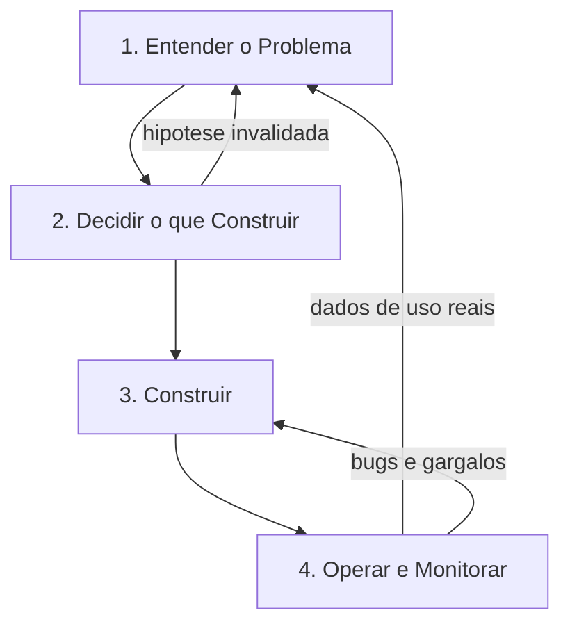
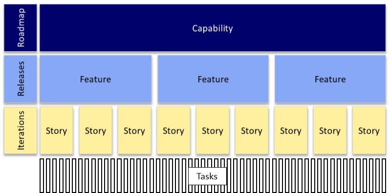
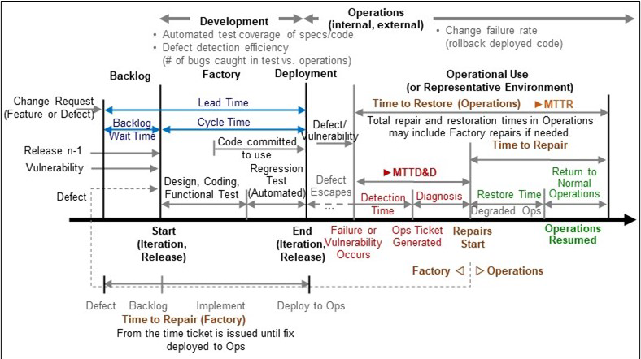
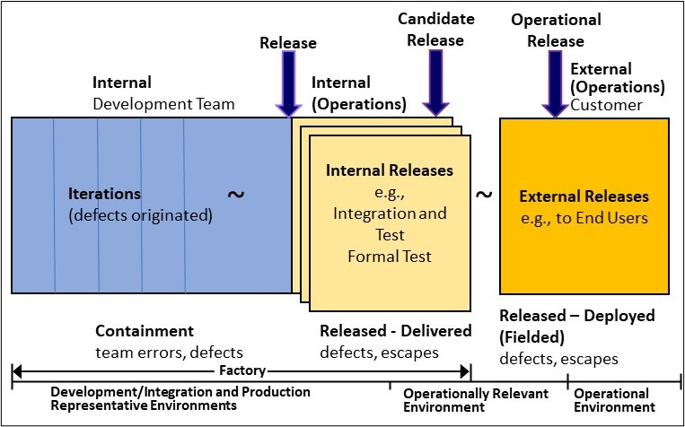
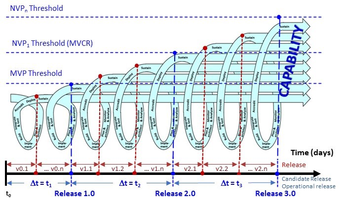
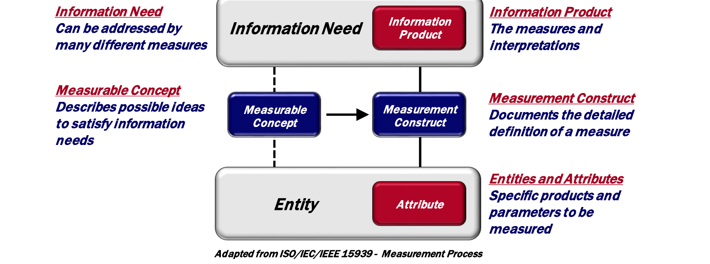
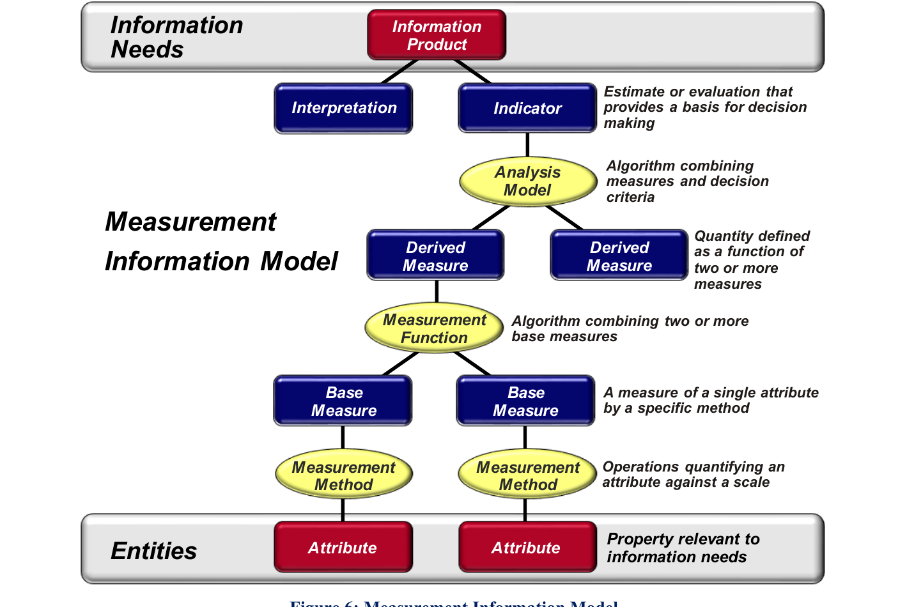
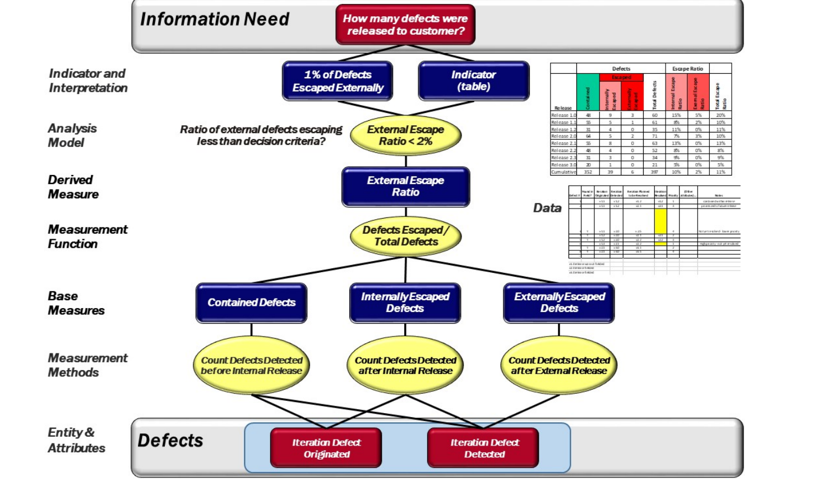
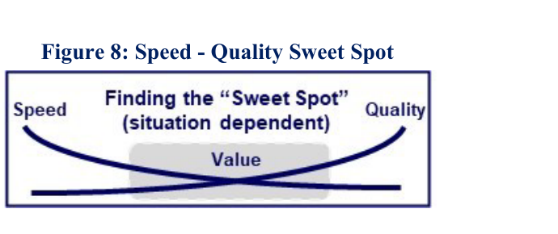

# Aula 01 — Visão Geral do Processo de Software

**Data:** 03/08/2026 | **Horário:** 11h20 às 13h00 | **Local:** Lab 207 | **Modalidade:** Presencial

[⬇️ Baixar / Copiar Código Fonte da Aula](https://raw.githubusercontent.com/paulossjunior/aula-extensao/main/docs/plano-de-aula/aulas/aula-01-2026-08-03.md)

---

## Introdução

Primeiro encontro. Antes de escrever qualquer linha de código, precisamos do mapa da estrada inteira: **o que acontece desde a percepção de um problema até o software rodando e sendo monitorado em produção**.

A maior parte dos cursos de programação para no meio do caminho: termina quando o código funciona na máquina do aluno. Aqui não. O critério que vale 50 pontos desta disciplina exige **produto em produção, sendo usado por gente de verdade** — e software em produção quebra, fica lento, recebe uso que ninguém previu e precisa ser observado. Monitorar não é apêndice do processo: é a fase que fecha o ciclo e alimenta a próxima rodada de decisões.

Esta aula apresenta esse ciclo completo, mostra onde cada aula do semestre entra nele e alinha como a disciplina funciona.

---

## Contexto

### Como a disciplina funciona

| Dia | Horário | Local | O que acontece |
|-----|---------|-------|----------------|
| Segunda | 11h20–13h00 | Lab 207 | Aula de conteúdo: discovery, hands-on e feedback |
| Terça | 13h50–16h30 | EaD | Exercícios e trabalho de grupo, sem aula expositiva |

**Toda última segunda-feira do mês** é apresentação do trabalho, sem conteúdo novo. Datas exatas no [Cronograma](../../cronograma/cronograma.md).

A nota são **100 pontos**, com uma peculiaridade: os checkpoints práticos não somam, **multiplicam**.

| Frente | Valor | O que é |
|--------|-------|---------|
| Código próprio | 25 pontos | Repositório individual do aluno, comprovando a aplicação do conteúdo |
| Mini-curso no YouTube | 25 pontos | Vídeo individual, aberto à comunidade, explicando o próprio código |
| Produto do grupo | 50 pontos | O produto em produção, com o portal de documentação |
| Checkpoints práticos | **× 0 a 1** | Média de quatro verificações individuais, no Lab, sobre o próprio código |

```text
NF = (COD + CUR + PRD) x CP
```

Os checkpoints acontecem em **31/08, 28/09, 26/10 e 30/11**, nas segundas de apresentação. São individuais: o aluno senta na máquina e resolve uma tarefa pequena sobre o repositório dele ou do grupo.

!!! danger "Quem não souber trabalhar sobre o próprio código, perde os pontos"
    O multiplicador incide sobre **tudo**. Produto em produção e mini-curso publicado não garantem nota a quem não consegue sustentar o que foi entregue em seu nome. É também por isso que o uso de agentes de IA é liberado: a ferramenta escreve, mas quem responde é você.

Há ainda a **prova final** em 14/12, um trabalho individual à parte que cobre todo o conteúdo da disciplina. Detalhes e critérios em [Avaliação](../../avaliacao/avaliacao.md).

!!! warning "O critério que decide os 50 pontos"
    Plano, protótipo e slide não pontuam sozinhos. É preciso **produto rodando e sendo usado por público real** — por isso a última fase do processo, operar e monitorar, é conteúdo de prova e não detalhe de implementação.

---

### O processo de ponta a ponta



O ciclo tem quatro fases e **duas setas de volta**. As setas de volta são a parte que costuma ser ignorada — e são justamente o que separa um projeto que aprende de um projeto que só entrega.

#### Fase 1 — Entender o problema

**Pergunta que responde:** o problema existe mesmo, e para quem?

Observação de campo, entrevista, análise de concorrentes e formulação de hipótese. O produto ainda não existe; o que existe é evidência de que alguém sofre com algo.

- **Artefatos:** problema descrito, público-alvo, hipótese de valor, PRD inicial
- **Risco de pular:** construir com competência uma solução que ninguém quer

#### Fase 2 — Decidir o que construir

**Pergunta que responde:** de tudo que poderia ser feito, o que entra primeiro?

Recorte do escopo, priorização, definição de features fim a fim, arquitetura inicial e ordem de implementação.

- **Artefatos:** backlog, épicos e user stories, DSM de dependências, especificação
- **Risco de pular:** time ocupado construindo peças que não se encaixam nem entregam valor

#### Fase 3 — Construir

**Pergunta que responde:** o que foi especificado virou software que funciona?

Implementação em ciclos curtos, testes, revisão e integração contínua. É aqui que os agentes de IA entram com mais força — e é aqui que uma especificação ruim vira código ruim em escala.

- **Artefatos:** código, testes, pipeline de CI, deploy automatizado
- **Risco de pular:** não há como pular; o risco é começar por aqui, sem as fases 1 e 2

#### Fase 4 — Operar e monitorar

**Pergunta que responde:** está de pé, está sendo usado, está resolvendo o problema?

Software em produção precisa responder quatro perguntas continuamente:

| Pergunta | O que observar |
|----------|----------------|
| Está no ar? | *Health check*, disponibilidade, tempo de resposta |
| Está quebrando? | Logs de erro, exceções, taxa de falha |
| Está sendo usado? | Acessos, funcionalidades acionadas, abandono |
| Está resolvendo? | Indicadores definidos na Fase 1, feedback do usuário |

- **Artefatos:** logs, métricas, painel de acompanhamento, canal de feedback
- **Risco de pular:** o produto pode estar fora do ar há dias e o grupo descobrir na apresentação

!!! tip "A fase 4 alimenta a fase 1"
    Uso real gera dados que nenhuma entrevista produz: qual tela ninguém abre, onde o usuário desiste, que erro acontece toda terça-feira. Esses dados viram hipótese nova e o ciclo recomeça. É o *Build → Measure → Learn* do Lean Startup aplicado ao ciclo inteiro, não só ao protótipo.

---

### Práticas que atravessam o ciclo

Independentemente da fase, algumas práticas acompanham o semestre inteiro e aparecem nas aulas seguintes:

- **Personas e user stories** para descrever quem usa e o que precisa
- **Prototipação rápida** para testar uma ideia antes de construí-la
- **Sprints curtas com retrospectiva**, para o time corrigir o próprio processo
- **Estimativa em grupo** (*planning poker*) em vez de estimativa individual
- **Cliente como integrante do time**, não como avaliador externo que aparece no fim

---

## Como Medir o Processo — PSM CID Measurement Framework

Descrever o processo é metade do trabalho. A outra metade é **saber se ele está funcionando**, e isso exige medida. O material de referência que vamos usar é o **PSM Continuous Iterative Development (CID) Measurement Framework**, versão 2.1 (2021), produzido em conjunto por três organizações: *Practical Software and Systems Measurement* (PSM), *National Defense Industrial Association* (NDIA) e *International Council on Systems Engineering* (INCOSE).

O framework define **Desenvolvimento Contínuo e Iterativo (CID)** como o método de gerenciar desenvolvimento, teste e liberação de software de modo a entregar, contínua ou iterativamente, sistemas funcionais de capacidade crescente. É o guarda-chuva que cobre Agile, DevOps, DevSecOps e SAFe.

Três características tornam esse material útil para nós:

- **É agnóstico de metodologia.** Foi escrito para ser adaptado, não seguido à risca.
- **Cobre o ciclo inteiro**, incluindo o que acontece depois do deploy — exatamente a fase que este curso não deixa de fora.
- **Separa três perspectivas** de quem precisa da informação: **time**, **produto** e **empresa**. A mesma medida-base pode servir às três, agregada em níveis diferentes.

!!! warning "O erro clássico de medição"
    O framework é direto: o maior problema com medidas é elas **não serem usadas**. A recomendação é escolher um **conjunto mínimo**, cada medida com um responsável identificado, que informe uma decisão concreta e provoque uma ação. Medida que ninguém olha deve ser descartada ou substituída.

---

### 1. Decomposição do trabalho



Requisitos de missão viram **capacidades** (*capabilities*), que se quebram em **features**, que se quebram em **stories**, que se quebram em **tasks**. Cada nível se organiza em um horizonte de tempo diferente:

| Nível | Horizonte | O que é |
|-------|-----------|---------|
| Capability | Roadmap | Solução de alto nível, atravessa várias releases |
| Feature | Release | Serviço ou característica que atende uma necessidade, com critério de aceitação, dentro de uma release |
| Story | Iteração | Comportamento pequeno, baseado em cenário de usuário, implementável e demonstrável em uma iteração |
| Task | — | Passos necessários para satisfazer uma story |

Esse é o mesmo vocabulário que usaremos nas Aulas 07 e 12, quando montarmos backlog, épicos e user stories.

---

### 2. Contexto de medição: onde cada medida nasce



Esta é a figura mais importante para o nosso curso, porque ela mostra as **quatro fases do nosso ciclo com as medidas encaixadas em cada transição**:

- **Backlog** — coleção de itens propostos: necessidades novas e defeitos de releases anteriores. Só vira trabalho o que for priorizado e aceito (*committed work*).
- **Factory** — a fábrica: requisitos, design, implementação e teste do trabalho aceito, culminando no deploy. Trabalho planejado e executado iterativamente.
- **Operations** — o que sai da fábrica é implantado em operação interna ou externa: ambiente de integração do time, teste operacional ou uso final.
- **Rework** — a release implantada precisa de correção por defeito, vulnerabilidade ou anomalia. A operação pode seguir em **modo degradado** (contorno, caminho redundante) até o serviço ser restaurado.

Os intervalos de tempo marcados na figura são as medidas:

| Medida | O que mede |
|--------|------------|
| **Lead Time** | Do momento em que o trabalho é identificado até a solicitação ser satisfeita |
| **Cycle Time** | Do momento em que o trabalho entra em execução até estar concluído |
| **MTTD** (*Mean Time to Detect*) | Tempo até detectar e diagnosticar a falha |
| **MTTR** (*Mean Time to Restore*) | Tempo total de restauração: detectar, diagnosticar, corrigir e implantar |
| **Change Failure Rate** | Proporção de mudanças implantadas que precisaram de *rollback* |

!!! tip "Por que MTTD e MTTR importam para o trabalho de extensão"
    O critério dos 50 pontos exige produto em produção. Se o sistema do grupo cair e ninguém perceber por três dias, o MTTD é de três dias — e isso é um resultado mensurável, não uma impressão. É a diferença entre "está no ar" e "sabemos que está no ar".

O framework ainda distingue **quatro ambientes** onde a medição pode ocorrer, e nem toda organização tem os quatro separados:

1. Desenvolvimento/Integração
2. Representativo de produção
3. Operacionalmente relevante
4. Operacional

A empresa costuma olhar as medidas do ambiente operacional; o time e o produto começam a medir nos ambientes anteriores.

---

### 3. Terminologia de defeitos: contido x escapado



A distinção central e a mais cobrada em revisão de qualidade:

- **Defeito contido** (*contained*, também chamado *save*) — detectado e resolvido **antes** da release. É o sistema de qualidade funcionando.
- **Defeito escapado** (*escaped*) — detectado ou resolvido **depois** da release que o continha. Escapes são rastreados separadamente para releases internas e externas.

**Defeito**, na definição do framework, é qualquer condição do produto que não atende ao requisito ou à expectativa do usuário, faz o produto funcionar mal, produzir resultado incorreto ou inesperado, comportar-se de modo não intencional, ou gerar prejuízo de qualidade, custo, prazo ou desempenho. Documentação também pode conter defeito.

A figura mostra onde cada tipo aparece: iterações internas (defeitos originados) → releases internas (entregues, com escapes) → releases externas (implantadas em campo, com escapes). Tudo à esquerda do limite é *Factory*; à direita é *Operations*.

---

### 4. O processo CID ao longo do tempo



A espiral mostra iterações sucessivas (v0.1, v0.n, v1.1, v1.2 …) acumulando capacidade. Nem toda iteração vira release externa: um subconjunto é **candidate release**, e um subconjunto desses é efetivamente liberado para uso operacional.

Os patamares horizontais são limiares de maturidade do produto:

| Termo | Significado |
|-------|-------------|
| **MVP** (*Minimum Viable Product*) | Versão inicial que entrega capacidades básicas a usuários para avaliação e feedback. O aprendizado do MVP molda escopo, requisitos e design das releases seguintes. |
| **MVCR** (*Minimum Viable Capability Release*) | Conjunto de features adequado para ir a um ambiente operacional, entregando valor real ao usuário final. Equivale ao *Minimum Marketable Product* da indústria. |
| **NVP** (*Next Viable Product*) | Próximo conjunto de features na entrega seguinte. |

E os tipos de release (*release style*):

- **Cadenciada** — por tempo, por exemplo trimestral
- **Por feature** — libera quando o conjunto está pronto, por exemplo o MVP
- **Deploy contínuo** — exige disciplina e maturidade altas

!!! note "Expectativa realista para o semestre"
    O framework observa que deploy contínuo exige maturidade significativa e que **a maioria dos programas adota alguma forma de cadência**. Para o nosso curso, cadência mensal amarrada às apresentações é uma escolha honesta: cada última segunda do mês é uma release.

---

### 5. Vocabulário essencial

Termos do framework que passam a valer como vocabulário comum da disciplina:

| Termo | Definição resumida |
|-------|--------------------|
| **Roadmap** | Descrição de alto nível da visão e direção do produto ao longo do tempo; descreve metas e capacidades das releases externas |
| **Backlog do produto** | Lista priorizada de necessidades detalhadas. Contém features novas, mudanças, correções de defeito e mudanças de infraestrutura. Defeitos achados em desenvolvimento **e em operação** entram aqui |
| **Backlog da iteração** | Decomposição dos itens do backlog do produto priorizados para o ciclo curto |
| **Story Points** | Valor subjetivo, sem unidade, atribuído pelo time como medida relativa de esforço e complexidade. **Não é comparável entre times** |
| **Iteração / Sprint** | Bloco curto de tempo em que o time desenvolve e demonstra um conjunto de stories |
| **Release** | Agrupamento de capacidades ou features utilizável para demonstração, avaliação ou entrega |
| **Release interna** | Pronta para uso fora do time de desenvolvimento — integração, teste ou demonstração |
| **Candidate release** | Passou pelo pipeline e pelo teste de sistema; pronta para transição ao usuário |
| **Release operacional** | Aprovada para uso operacional |
| **Problem Report** | Registro de problema no produto — também chamado *trouble ticket* |
| **Change Request** | Solicitação de mudança no produto |
| **Stakeholder** | Indivíduo ou organização com direito, participação ou interesse no sistema (ISO/IEC/IEEE 15288) |
| **Product Value** | Grau em que o produto entregue satisfaz as necessidades dos stakeholders — inclui melhoria de missão, eficiência, redução de risco e custo |

---

### 6. Do dado à decisão

Medir não é coletar número: é ligar um **dado** a uma **necessidade de informação** que sustenta uma decisão. O framework usa o modelo da ISO/IEC/IEEE 15939.



A leitura é de baixo para cima: **entidades** têm **atributos** mensuráveis (tamanho, esforço, número de defeitos); o **construto de medição** define como quantificar esses atributos; o **conceito mensurável** descreve ideias que satisfazem a necessidade; o **produto de informação** entrega medida e interpretação a quem decide.



Detalhando, existem três níveis de medida:

| Nível | O que é |
|-------|---------|
| **Base measure** | Medida de um único atributo por um método específico |
| **Derived measure** | Quantidade definida como função de duas ou mais medidas |
| **Indicator** | Estimativa ou avaliação que fornece base para decisão, combinando medidas e critérios de decisão |



O exemplo concreto da Figura 7 percorre o modelo inteiro para uma pergunta real:

1. **Necessidade de informação:** quantos defeitos foram liberados para o cliente?
2. **Medidas-base:** contar defeitos contidos, escapados internamente e escapados externamente
3. **Função de medição:** defeitos escapados ÷ total de defeitos
4. **Medida derivada:** *External Escape Ratio*
5. **Modelo de análise:** a razão está abaixo do critério de decisão?
6. **Indicador e interpretação:** menos de 1% dos defeitos escapou externamente

---

### 7. Princípios de medição



O princípio que mais interessa a um time iniciante: **existe um ponto de equilíbrio entre velocidade e qualidade**. Ênfase excessiva em velocidade custa qualidade do produto; ênfase excessiva em qualidade derruba a velocidade de entrega. Algumas melhorias — automação, principalmente — deslocam as duas curvas ao mesmo tempo e melhoram os dois lados.

Os demais princípios:

- As medidas do framework são **exemplos**, identificados por survey e revisão de especialistas, não uma lista obrigatória
- Medidas de time, produto e empresa coexistem, e **nem todas podem ser agregadas** entre níveis
- Selecione um **conjunto mínimo prático**, adaptado às circunstâncias, ferramentas e processos do grupo
- Toda medida escolhida precisa ter stakeholder identificado, informar decisão e **provocar ação**, dando visibilidade cedo o suficiente para correção de rumo
- **Automatize a coleta** sempre que praticável, integrada ao fluxo de trabalho

As onze medidas com especificação detalhada no framework:

| | |
|---|---|
| Automated Test Coverage | Defect Resolution |
| Burndown | MTTR / MTTD |
| Committed vs. Completed Progress | Release Frequency |
| Cumulative Flow | Team Velocity |
| Cycle Time / Lead Time | Product Value |
| Defect Detection | |

---

### Como isso se encaixa no nosso ciclo

| Fase do nosso ciclo | Elemento do PSM CID | Medidas candidatas para o trabalho de extensão |
|---------------------|---------------------|------------------------------------------------|
| 1 — Entender o problema | Roadmap, capacidades | Product Value |
| 2 — Decidir o que construir | Backlog, decomposição em features e stories | Committed vs. Completed, Burndown |
| 3 — Construir | Factory, iterações, releases | Cycle Time, Defect Detection, Automated Test Coverage |
| 4 — Operar e monitorar | Operations, rework | **MTTD, MTTR**, Change Failure Rate, Release Frequency |

!!! quote "Atribuição e direitos"
    Figuras 1 a 8 e definições reproduzidas de *Practical Software and Systems Measurement — Continuous Iterative Development Measurement Framework, Part 1: Concepts, Definitions, Principles, and Measures*, Versão 2.1, 15 de abril de 2021. Editores: Cheryl L. Jones, Geoff Draper, Bill Golaz e Paul Janusz. Produtos nº PSM-2021-03-001 e INCOSE-TP-2020-001-06.

    Desenvolvido e publicado por membros do **Practical Software & Systems Measurement (PSM)**, da **National Defense Industrial Association (NDIA)** e do **International Council on Systems Engineering (INCOSE)**.

    *Copyright Notice — General Use:* "Permission to reproduce, use this document or parts thereof, and to prepare derivative works from this document is granted, with attribution to PSM, NDIA, and INCOSE, and the original author(s), provided this copyright notice is included with all reproductions and derivative works."

    Documento original: *Unclassified — Distribution Statement A: Approved for Public Release; Distribution is Unlimited.*

---

### Onde cada aula entra no ciclo

| Fase | Aulas |
|------|-------|
| 1 — Entender o problema | Aula 02 (problema e mercado), Aula 03 (prototipação e requisitos), Aula 04 (identificação de clientes) |
| 2 — Decidir o que construir | Aula 06 (validação da proposta), Aula 07 (ágil, arquitetura e DSM) |
| 3 — Construir | Aula 09 (Spec-Driven Development), Aula 10 (AGENTS.md, Spec-Kit e skills.sh), Aula 12 (Caveman + Spec-Kit), Aula 13 (Epics, User Stories e Gherkin), Aula 14 (orquestração com CrewAI) |
| 4 — Operar e monitorar | Aula 14 (observabilidade: health check, logs, alerta e MTTD). A Aula 16 aprofunda com o Hermes Agent, em aula extra sem entrega |

### Ferramentas que precisam estar funcionando

| Ferramenta | Fase | Uso |
|------------|------|-----|
| **MkDocs + Material** | Todas | Portal de documentação do grupo, evoluído aula a aula |
| **GitHub** | 2, 3, 4 | Repositório, revisão de código e deploy automático |
| **Agente de IA** | 1, 2, 3 | Claude Code, Cursor, Copilot, Gemini ou Windsurf — escolha do grupo |
| **Figma Maker** | 1, 2 | Prototipação rápida da proposta |
| **Spec-Kit** | 3 | Fluxo constitution → spec → plan → tasks → implementação |
| **Mermaid** | 2 | Diagramas de dependência e arquitetura dentro do MkDocs |

!!! tip "Postura esperada"
    O agente de IA acelera a escrita, não a decisão. O grupo continua responsável por justificar o problema escolhido, o público, a arquitetura e o que foi para produção.

---

## Tarefas

### Tarefa 1 — Mapear um Produto Real no Ciclo

**Duração estimada:** 15 min
**Formato:** Duplas

Escolham um produto digital que vocês usam todo dia e reconstruam as quatro fases dele.

| Fase | Pergunta a responder |
|------|----------------------|
| 1 — Problema | Que problema esse produto resolve, e para quem? |
| 2 — Escopo | Que funcionalidade parece ter vindo primeiro? |
| 3 — Construção | Com que frequência ele parece receber mudanças? |
| 4 — Monitoramento | Como vocês acham que a equipe descobre que algo quebrou? |

**Entregável:** Ciclo de um produto real preenchido, com o palpite sobre monitoramento justificado.

---

### Tarefa 2 — Formação dos Grupos e Portal de Documentação

**Duração estimada:** 30 min
**Formato:** Grupos

Montar o time e deixar a infraestrutura de documentação de pé antes de qualquer conteúdo técnico.

1. Formem os grupos e registrem integrantes, formas de contato e competências que o time já tem e quais faltam
2. Registrem o problema do campus que o grupo pretende atacar — uma dor vivida no campus com potencial de ser estendida para a comunidade externa
3. Criem o repositório no GitHub
4. Subam a estrutura mínima com MkDocs + tema Material e publiquem via GitHub Pages
5. Criem a página inicial com nome do grupo, integrantes e tema

!!! note "Referência"
    A estrutura deste próprio site serve de modelo: `mkdocs.yml` na raiz, conteúdo em `docs/` e deploy por GitHub Actions.

**Entregável:** URL do portal publicado e acessível, com tema escolhido.

---

### Tarefa 3 — Onde Meu Grupo Vai Tropeçar

**Duração estimada:** 10 min
**Formato:** Grupos

Para cada uma das quatro fases, o grupo escreve **uma frase** sobre o maior risco que enxerga hoje no próprio projeto.

Exemplo de resposta útil na fase 4: *"ninguém do grupo já colocou nada em produção antes"*. Exemplo de resposta inútil: *"pode dar errado"*.

**Entregável:** Quatro riscos registrados no portal do grupo, um por fase.

---

## Encerramento

Hoje vimos o mapa inteiro: problema, escopo, construção, operação — e as setas que fazem o uso real voltar a alimentar as decisões. Também alinhamos como a disciplina funciona e cada grupo saiu com time formado e portal publicado.

Na próxima aula **(10/08/2026)** entramos na Fase 1 para valer: identificar um problema real, mapear quem já tenta resolvê-lo e formular a primeira **hipótese de valor**.

!!! note "Tarefa de Casa — Preparar o Terreno"
    Para a próxima aula:

    1. Deixe o portal do grupo publicado e acessível, com os quatro riscos registrados.
    2. Instale e teste o agente de IA escolhido pelo grupo.
    3. Leve **pelo menos um problema real observado** dentro do tema escolhido, com uma frase sobre quem sofre com ele.
    4. Leia o [Manifesto Ágil](https://agilemanifesto.org/iso/ptbr/manifesto.html) — são quatro valores e doze princípios, leitura de cinco minutos que sustenta todo o resto do curso.

---

## Referências

Material de base:

- **[Scrum e XP direto das trincheiras:](https://www.infoq.com/br/minibooks/scrum-xp-from-the-trenches)** um bom livro introdutório sobre Scrum e XP.
- **[Rules of Extreme Programming:](http://www.extremeprogramming.org/rules.html)** regras do Extreme Programming que são implementadas nas equipes ágeis.
- **[Human Centered Design:](https://www.designkit.org/resources.html)** um bom livro para entender como criar um produto certo para o seu cliente.
- **[Manifesto Ágil:](https://agilemanifesto.org/iso/ptbr/manifesto.html)** manifesto que descreve os valores e princípios da agilidade.
- **[A Nova Metodologia:](https://medium.com/@thoughtworksbr/a-nova-metodologia-69b8f8a379c7)** um ótimo texto que descreve alguns conceitos e pensamentos necessários para entender o pensamento ágil.

Medição do processo:

- **[PSM CID Measurement Framework, Part 1 (v2.1, 2021):](http://www.psmsc.com/CIDMeasurement.asp)** conceitos, definições, princípios e medidas para desenvolvimento contínuo e iterativo — base da seção de medição desta aula. As Partes 2 e 3 trazem as especificações detalhadas das medidas, medição corporativa, *software assurance* e dívida técnica.
