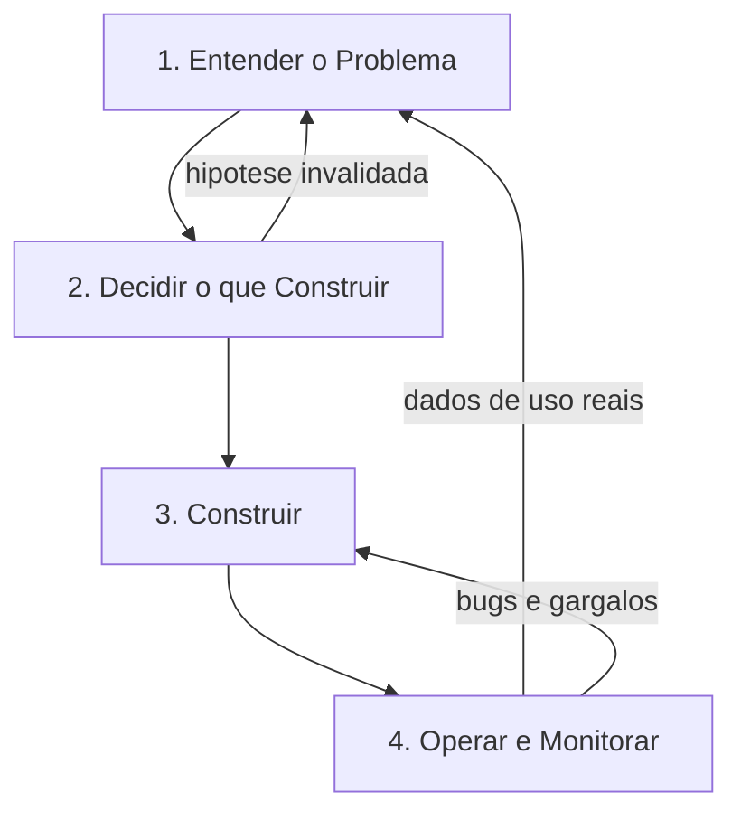

# Aula 01 — Visão Geral do Processo de Software

**Data:** 03/08/2026 | **Horário:** 11h20 às 13h00 | **Local:** Lab 207 | **Modalidade:** Presencial

[⬇️ Baixar / Copiar Código Fonte da Aula](https://raw.githubusercontent.com/paulossjunior/aula-extensao/main/docs/plano-de-aula/aulas/aula-01-2026-08-03.md)

---

## Introdução

Primeiro encontro. Antes de escrever qualquer linha de código, precisamos do mapa da estrada inteira: **o que acontece desde a percepção de um problema até o software rodando e sendo monitorado em produção**.

A maior parte dos cursos de programação para no meio do caminho: termina quando o código funciona na máquina do aluno. Aqui não. O critério que vale 50 pontos desta disciplina exige **produto em produção, sendo usado por gente de verdade** — e software em produção quebra, fica lento, recebe uso que ninguém previu e precisa ser observado. Monitorar não é apêndice do processo: é a fase que fecha o ciclo e alimenta a próxima rodada de decisões.

Esta aula apresenta esse ciclo completo, mostra onde cada aula do semestre entra nele e alinha como a disciplina funciona.

---

## Contexto

### Como a disciplina funciona

| Dia | Horário | Local | O que acontece |
|-----|---------|-------|----------------|
| Segunda | 11h20–13h00 | Lab 207 | Aula de conteúdo: discovery, hands-on e feedback |
| Terça | 13h50–16h30 | EaD | Exercícios e trabalho de grupo, sem aula expositiva |

**Toda última segunda-feira do mês** é apresentação do trabalho, sem conteúdo novo. Datas exatas no [Cronograma](../../cronograma/cronograma.md).

A nota são **100 pontos**, e a aprovação exige **60 ou mais**. Ela se divide em duas frentes individuais — código próprio e mini-curso —, o trabalho em grupo, e uma **entrevista individual** que funciona como porteira dos pontos do grupo. Há ainda a prova final em 14/12, à parte da soma. A tabela completa, a fórmula e os exemplos de cálculo estão em **[Avaliação](../../avaliacao/avaliacao.md)**: leia antes da próxima aula.

O que importa para hoje é o alcance do critério do trabalho em grupo. Ele exige **produto em produção**, e os pontos só são liberados para quem souber sustentar, diante do professor, aquilo que foi entregue em seu nome. É também por isso que o uso de agentes de IA é liberado nesta disciplina: a ferramenta escreve, mas quem responde é você.

!!! warning "O critério que decide os 50 pontos"
    Plano, protótipo e slide não pontuam sozinhos. É preciso **produto rodando e sendo usado por público real** — por isso a última fase do processo, operar e monitorar, é conteúdo de prova e não detalhe de implementação.

---

### O processo de ponta a ponta

O ciclo tem quatro fases e **duas setas de volta**. As setas de volta são a parte que costuma ser ignorada — e são justamente o que separa um projeto que aprende de um projeto que só entrega.

#### Fase 1 — Entender o problema

**Pergunta que responde:** o problema existe mesmo, e para quem?

Observação de campo, entrevista, análise de concorrentes e formulação de hipótese. O produto ainda não existe; o que existe é evidência de que alguém sofre com algo.

- **Artefatos:** problema descrito, público-alvo, hipótese de valor, PRD inicial
- **Risco de pular:** construir com competência uma solução que ninguém quer

#### Fase 2 — Decidir o que construir

**Pergunta que responde:** de tudo que poderia ser feito, o que entra primeiro?

Recorte do escopo, priorização, definição de features fim a fim, arquitetura inicial e ordem de implementação.

- **Artefatos:** backlog, épicos e user stories, DSM de dependências, especificação
- **Risco de pular:** time ocupado construindo peças que não se encaixam nem entregam valor

#### Fase 3 — Construir

**Pergunta que responde:** o que foi especificado virou software que funciona?

Implementação em ciclos curtos, testes, revisão e integração contínua. É aqui que os agentes de IA entram com mais força — e é aqui que uma especificação ruim vira código ruim em escala.

- **Artefatos:** código, testes, pipeline de CI, deploy automatizado
- **Risco de pular:** não há como pular; o risco é começar por aqui, sem as fases 1 e 2

#### Fase 4 — Operar e monitorar

**Pergunta que responde:** está de pé, está sendo usado, está resolvendo o problema?

Software em produção precisa responder quatro perguntas continuamente:

| Pergunta | O que observar |
|----------|----------------|
| Está no ar? | *Health check*, disponibilidade, tempo de resposta |
| Está quebrando? | Logs de erro, exceções, taxa de falha |
| Está sendo usado? | Acessos, funcionalidades acionadas, abandono |
| Está resolvendo? | Indicadores definidos na Fase 1, feedback do usuário |

- **Artefatos:** logs, métricas, painel de acompanhamento, canal de feedback
- **Risco de pular:** o produto pode estar fora do ar há dias e o grupo descobrir na apresentação

!!! tip "A fase 4 alimenta a fase 1"
    Uso real gera dados que nenhuma entrevista produz: qual tela ninguém abre, onde o usuário desiste, que erro acontece toda terça-feira. Esses dados viram hipótese nova e o ciclo recomeça. É o *Build → Measure → Learn* do Lean Startup aplicado ao ciclo inteiro, não só ao protótipo.

---

### Práticas que atravessam o ciclo

Independentemente da fase, algumas práticas acompanham o semestre inteiro e aparecem nas aulas seguintes:

- **Personas e user stories** para descrever quem usa e o que precisa
- **Prototipação rápida** para testar uma ideia antes de construí-la
- **Sprints curtas com retrospectiva**, para o time corrigir o próprio processo
- **Estimativa em grupo** (*planning poker*) em vez de estimativa individual
- **Cliente como integrante do time**, não como avaliador externo que aparece no fim

---

## Como Medir o Processo

Descrever o processo é metade do trabalho. A outra metade é **saber se ele está funcionando**, e isso exige medida.

O curso usa como referência o **PSM CID Measurement Framework** (versão 2.1, 2021), produzido em conjunto por PSM, NDIA e INCOSE. Ele é útil aqui por três motivos: é **agnóstico de metodologia**, foi escrito para ser adaptado e não seguido à risca; **cobre o ciclo inteiro**, incluindo o que acontece depois do deploy — exatamente a fase que este curso não deixa de fora; e **separa três perspectivas** de quem precisa da informação: time, produto e empresa.

O que ele oferece de imediato é vocabulário: capacidade, feature, story e task como níveis de decomposição do trabalho; backlog, *factory*, *operations* e *rework* como os quatro lugares onde as medidas nascem; e defeito **contido** contra defeito **escapado** como a distinção que separa problema encontrado antes do usuário de problema encontrado por ele.

!!! warning "O erro clássico de medição"
    O framework é direto: o maior problema com medidas é elas **não serem usadas**. A recomendação é escolher um **conjunto mínimo**, cada medida com um responsável identificado, que informe uma decisão concreta e provoque uma ação. Medida que ninguém olha deve ser descartada ou substituída.

!!! abstract "O framework inteiro tem página própria"
    Decomposição do trabalho, contexto de medição, terminologia de defeitos, o processo CID ao longo do tempo, vocabulário essencial, o caminho do dado à decisão e os princípios de medição — com as figuras do documento original — estão em **[Sobre o PSM CID Measurement Framework](../../explicacoes/psm-cid.md)**.

    Volte nela na [Aula 14](aula-14-2026-11-23.md), quando formos medir a orquestração e a observabilidade do produto.

---

### Onde cada aula entra no ciclo

| Fase | Aulas |
|------|-------|
| 1 — Entender o problema | Aula 02 (problema e mercado), Aula 03 (prototipação e requisitos), Aula 04 (identificação de clientes) |
| 2 — Decidir o que construir | Aula 06 (validação da proposta), EaD 07 (ágil, arquitetura e DSM) |
| 3 — Construir | Aula 07 (GitFlow, versionamento e CI/CD), Aula 09 (Spec-Driven Development), Aula 10 (AGENTS.md, Spec-Kit e skills.sh), Aula 12 (Caveman + Spec-Kit), Aula 13 (Epics, User Stories e Gherkin), Aula 14 (orquestração com CrewAI) |
| 4 — Operar e monitorar | Aula 14 (observabilidade: health check, logs, alerta e MTTD). A Aula 16 aprofunda com o Hermes Agent, em aula extra sem entrega |

### Ferramentas que precisam estar funcionando

| Ferramenta | Fase | Uso |
|------------|------|-----|
| **MkDocs + Material** | Todas | Portal de documentação do grupo, evoluído aula a aula |
| **GitHub** | 2, 3, 4 | Repositório, revisão de código e deploy automático |
| **Agente de IA** | 1, 2, 3 | Claude Code, Cursor, Copilot, Gemini ou Windsurf — escolha do grupo |
| **Figma Maker** | 1, 2 | Prototipação rápida da proposta |
| **Spec-Kit** | 3 | Fluxo constitution → spec → plan → tasks → implementação |
| **Mermaid** | 2 | Diagramas de dependência e arquitetura dentro do MkDocs |

!!! tip "Postura esperada"
    O agente de IA acelera a escrita, não a decisão. O grupo continua responsável por justificar o problema escolhido, o público, a arquitetura e o que foi para produção.

---

## Tarefas

### Tarefa 1 — Mapear um Produto Real no Ciclo

**Duração estimada:** 15 min
**Formato:** Duplas

Escolham um produto digital que vocês usam todo dia e reconstruam as quatro fases dele.

| Fase | Pergunta a responder |
|------|----------------------|
| 1 — Problema | Que problema esse produto resolve, e para quem? |
| 2 — Escopo | Que funcionalidade parece ter vindo primeiro? |
| 3 — Construção | Com que frequência ele parece receber mudanças? |
| 4 — Monitoramento | Como vocês acham que a equipe descobre que algo quebrou? |

**Entregável:** Ciclo de um produto real preenchido, com o palpite sobre monitoramento justificado.

---

### Tarefa 2 — Formação dos Grupos e Portal de Documentação

**Duração estimada:** 30 min
**Formato:** Grupos

Montar o time e deixar a infraestrutura de documentação de pé antes de qualquer conteúdo técnico.

1. Formem os grupos e registrem integrantes, formas de contato e competências que o time já tem e quais faltam
2. Registrem o problema do campus que o grupo pretende atacar — uma dor vivida no campus com potencial de ser estendida para a comunidade externa
3. Criem o repositório no GitHub
4. Subam a estrutura mínima com MkDocs + tema Material e publiquem via GitHub Pages
5. Criem a página inicial com nome do grupo, integrantes e tema

!!! note "Referência"
    A estrutura deste próprio site serve de modelo: `mkdocs.yml` na raiz, conteúdo em `docs/` e deploy por GitHub Actions.

**Entregável:** URL do portal publicado e acessível, com tema escolhido.

---

### Tarefa 3 — Onde Meu Grupo Vai Tropeçar

**Duração estimada:** 10 min
**Formato:** Grupos

Para cada uma das quatro fases, o grupo escreve **uma frase** sobre o maior risco que enxerga hoje no próprio projeto.

Exemplo de resposta útil na fase 4: *"ninguém do grupo já colocou nada em produção antes"*. Exemplo de resposta inútil: *"pode dar errado"*.

**Entregável:** Quatro riscos registrados no portal do grupo, um por fase.

---

## Encerramento

Hoje vimos o mapa inteiro: problema, escopo, construção, operação — e as setas que fazem o uso real voltar a alimentar as decisões. Também alinhamos como a disciplina funciona e cada grupo saiu com time formado e portal publicado.

Na próxima aula **(10/08/2026)** entramos na Fase 1 para valer: identificar um problema real, mapear quem já tenta resolvê-lo e formular a primeira **hipótese de valor**.

!!! note "Tarefa de Casa — Preparar o Terreno"
    Para a próxima aula:

    1. Deixe o portal do grupo publicado e acessível, com os quatro riscos registrados.
    2. Instale e teste o agente de IA escolhido pelo grupo.
    3. Leve **pelo menos um problema real observado** dentro do tema escolhido, com uma frase sobre quem sofre com ele.
    4. Leia o [Manifesto Ágil](https://agilemanifesto.org/iso/ptbr/manifesto.html) — são quatro valores e doze princípios, leitura de cinco minutos que sustenta todo o resto do curso.

---

## Referências

Material de base:

- **[Scrum e XP direto das trincheiras:](https://www.infoq.com/br/minibooks/scrum-xp-from-the-trenches)** um bom livro introdutório sobre Scrum e XP.
- **[Rules of Extreme Programming:](http://www.extremeprogramming.org/rules.html)** regras do Extreme Programming que são implementadas nas equipes ágeis.
- **[Human Centered Design:](https://www.designkit.org/resources.html)** um bom livro para entender como criar um produto certo para o seu cliente.
- **[Manifesto Ágil:](https://agilemanifesto.org/iso/ptbr/manifesto.html)** manifesto que descreve os valores e princípios da agilidade.
- **[A Nova Metodologia:](https://medium.com/@thoughtworksbr/a-nova-metodologia-69b8f8a379c7)** um ótimo texto que descreve alguns conceitos e pensamentos necessários para entender o pensamento ágil.

Medição do processo:

- **[PSM CID Measurement Framework, Part 1 (v2.1, 2021):](http://www.psmsc.com/CIDMeasurement.asp)** conceitos, definições, princípios e medidas para desenvolvimento contínuo e iterativo — base da seção de medição desta aula. As Partes 2 e 3 trazem as especificações detalhadas das medidas, medição corporativa, *software assurance* e dívida técnica.
