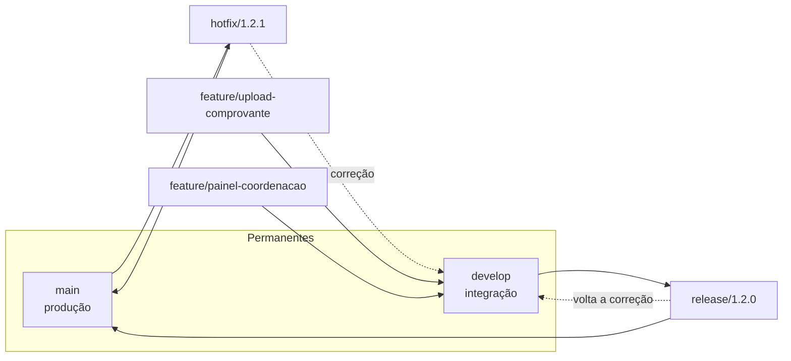

# Aula 07 — GitFlow, Versionamento Semântico e CI/CD com GitHub Actions

**Data:** 21/09/2026 | **Horário:** 11h20 às 13h00 | **Local:** Lab 207 | **Modalidade:** Presencial

[⬇️ Baixar / Copiar Código Fonte da Aula](https://raw.githubusercontent.com/paulossjunior/aula-extensao/main/docs/plano-de-aula/aulas/aula-07-2026-09-21.md)

---

## Introdução

Até aqui o trabalho foi de descoberta: entender o problema, mapear o mercado, prototipar, conversar com o cliente e validar a proposta. A partir de agora o grupo começa a **construir**, e construir em grupo cria dois problemas que não existiam enquanto o projeto era um documento.

O primeiro é de **convivência no repositório**. Três pessoas mexendo no mesmo código, ao mesmo tempo, sem combinar onde cada uma trabalha, produzem conflito, trabalho perdido e a frase clássica: *"na minha máquina funciona"*. A resposta para isso é uma **estratégia de ramificação** — um acordo explícito sobre quais branches existem, de onde nascem, para onde voltam e quem pode mexer em quê.

O segundo é de **rastreabilidade**. Quando o produto estiver no ar e alguém disser *"quebrou depois da última atualização"*, o grupo precisa responder três perguntas: qual versão está em produção, o que exatamente entrou nela, e como voltar para a anterior. Quem responde isso são as **tags** e o **versionamento semântico**.

E entre o commit e a produção existe um caminho que ninguém deveria percorrer na mão: testar, construir e publicar. Esse caminho automatizado é o que se chama **CI/CD**, e neste curso ele será feito com **GitHub Actions**.

!!! abstract "Onde esta aula se encaixa na nota"
    A [Avaliação](../../avaliacao/avaliacao.md) reserva **10 pontos para entrega em ambiente de produção** e **10 pontos para qualidade do código**. Esta aula é o mecanismo que liga o repositório do grupo ao produto no ar, e a [Aula 14](aula-14-2026-11-23.md) mede o que acontece depois do deploy. Sem pipeline, publicar vira tarefa manual que alguém esquece de fazer na semana da entrega.

**Ao final desta aula você deve saber:**

1. **Explicar e operar uma estratégia de ramificação** — GitFlow, GitHub Flow ou trunk-based — e justificar qual delas serve ao seu grupo.
2. **Marcar uma versão** com tag anotada seguindo o **Versionamento Semântico 2.0.0**, e decidir se uma mudança sobe *patch*, *minor* ou *major*.
3. **Escrever dois workflows de GitHub Actions**: um que valida todo *pull request* e outro que publica uma *release* quando uma tag é empurrada.

!!! warning "Pré-requisito"
    Traga o repositório do grupo funcionando, com Git configurado na máquina e acesso de escrita no GitHub. Se o grupo ainda não tem repositório, use o do portal MkDocs criado na [Aula 01](aula-01-2026-08-03.md).

---

## Materiais de Apoio

- **[Pro Git — Criando Tags (pt-BR)](https://git-scm.com/book/pt-br/v2/Fundamentos-do-Git-Criando-Tags):** capítulo curto, leia antes da aula.
- **[Versionamento Semântico 2.0.0 (pt-BR)](https://semver.org/lang/pt-BR/):** a especificação inteira cabe em uma página.
- **[Documentação do GitHub Actions (pt-BR)](https://docs.github.com/pt/actions):** referência para consultar durante as tarefas.
- **[Conventional Commits 1.0.0 (pt-BR)](https://www.conventionalcommits.org/pt-br/v1.0.0/):** a convenção de mensagem de commit usada na segunda metade da aula.

---

## Discovery do Projeto

### 1. O problema que uma estratégia de ramificação resolve

Imagine o produto de comprovantes de horas complementares que usamos como exemplo no curso. Três integrantes trabalham na mesma semana: um mexe no upload de arquivo, outro no painel da coordenação, o terceiro corrige um bug de login que já está no ar incomodando usuários.

Sem acordo nenhum, os três trabalham na `main`. O resultado previsível:

| Sintoma | Causa |
|---------|-------|
| Conflito grande e difícil de resolver | Duas pessoas editaram o mesmo arquivo por dias sem integrar |
| Código quebrado na `main` | Alguém empurrou uma feature pela metade |
| Correção urgente presa | O bug de login só pode ir ao ar junto com a feature incompleta de outra pessoa |
| Ninguém sabe o que está em produção | Não há marco que separe "o que está no ar" de "o que está em desenvolvimento" |

Uma estratégia de ramificação é o acordo que responde a quatro perguntas, e é só isso:

1. Quais branches existem e quanto tempo cada uma vive?
2. De onde uma branch nova nasce?
3. Para onde ela volta quando termina?
4. O que precisa acontecer antes de integrar — revisão, testes, aprovação?

---

### 2. GitFlow

O **GitFlow** foi proposto por Vincent Driessen em 2010 e é a estratégia mais estruturada das três que veremos. Ela organiza o trabalho em **cinco tipos de branch**, sendo duas permanentes e três temporárias.

| Branch | Vida | Nasce de | Volta para | Para que serve |
|--------|------|----------|------------|----------------|
| `main` | Permanente | — | — | Reflete exatamente o que está em produção. Todo commit aqui é uma versão publicável |
| `develop` | Permanente | `main` | — | Integração do que vai entrar na próxima versão |
| `feature/*` | Dias | `develop` | `develop` | Uma funcionalidade nova, isolada até ficar pronta |
| `release/*` | Dias | `develop` | `main` **e** `develop` | Estabilizar a versão: só correção, ajuste de número de versão e documentação |
| `hotfix/*` | Horas | `main` | `main` **e** `develop` | Corrigir em produção sem esperar o ciclo normal |



O ciclo de uma feature, na prática:

```bash
# nasce de develop
git switch develop
git pull origin develop
git switch -c feature/upload-comprovante

# trabalha e commita normalmente
git add .
git commit -m "feat: aceita PDF e imagem no upload de comprovante"
git push -u origin feature/upload-comprovante

# terminou: abre pull request de feature/upload-comprovante para develop
```

E o ciclo de uma release:

```bash
git switch develop
git switch -c release/1.2.0
# aqui só entram correções e o ajuste do número de versão
git switch main
git merge --no-ff release/1.2.0
git tag -a v1.2.0 -m "Versão 1.2.0: upload de comprovante e painel da coordenação"
git push origin main --follow-tags
git switch develop
git merge --no-ff release/1.2.0     # a correção feita na release volta para develop
```

!!! tip "Por que `--no-ff`"
    Sem `--no-ff`, quando a branch de destino não andou, o Git faz *fast-forward*: os commits são reescritos em linha reta e **o agrupamento da feature desaparece do histórico**. Com `--no-ff` existe um commit de merge que diz "estes commits vieram juntos, desta feature" — e isso é o que permite reverter a feature inteira depois com um comando só.

!!! warning "O próprio autor do GitFlow recomenda cautela"
    Em 2020, Driessen acrescentou uma nota ao artigo original: se o time faz **entrega contínua** — publica várias vezes por semana, tem uma única versão em produção e nunca precisa dar suporte a versões antigas — o GitFlow adiciona cerimônia sem benefício, e o mais indicado é um fluxo mais simples, como o GitHub Flow. O GitFlow foi desenhado para software **versionado**, com várias versões vivas ao mesmo tempo, como um aplicativo instalado que o usuário atualiza quando quer.

---

### 3. GitHub Flow e Trunk-Based Development

As alternativas partem da ideia oposta: **quanto menos branch de vida longa, menos integração dolorosa**.

O **GitHub Flow** tem seis passos e nenhuma branch permanente além da `main`:

1. Criar uma branch a partir da `main`
2. Fazer as alterações, com commits descritivos
3. Abrir um *pull request*
4. Responder aos comentários da revisão
5. Fazer o *merge* do pull request aprovado
6. Apagar a branch

O **Trunk-Based Development** aperta ainda mais: a branch dura **no máximo um ou dois dias**, e o que ainda não pode aparecer para o usuário é escondido por *feature flag* em vez de ficar guardado numa branch.

| | **GitFlow** | **GitHub Flow** | **Trunk-Based** |
|---|---|---|---|
| Branches permanentes | `main` + `develop` | `main` | `main` |
| Vida de uma branch | Dias a semanas | Dias | Horas a 2 dias |
| Quando a versão sai | Na branch de release | A cada merge na `main` | A cada merge, atrás de flag |
| Exige | Disciplina de processo | Revisão por PR | Testes automatizados fortes |
| Bom quando | Há várias versões em produção, release com data marcada, aprovação formal | Uma versão em produção, time pequeno, deploy frequente | Time maduro, pipeline rápido, deploy diário |
| Custo | Cerimônia alta, merges grandes | Pouca estrutura para release planejada | Sem rede de segurança se os testes forem fracos |

!!! tip "Recomendação para os grupos deste curso"
    Use **GitHub Flow**. Vocês têm uma única versão em produção, equipe de três a cinco pessoas e um semestre curto — exatamente o cenário em que o `develop` do GitFlow só adiciona um merge extra a cada entrega. O GitFlow entra na aula porque é o vocabulário que vocês vão encontrar em empresa e em vaga de estágio, e porque entender por que ele existe é o que permite decidir **não** usá-lo com argumento.

    Se o grupo escolher GitFlow assim mesmo, tudo bem — o que não vale é escolher sem justificar. A justificativa é parte do entregável da Tarefa 1.

---

### 4. Tags, versão e mensagem de commit

Resolvida a convivência no repositório, falta a segunda pergunta da introdução: **qual versão está em produção, e o que entrou nela**. Três convenções encadeadas respondem isso.

**Tag** é um ponteiro fixo. A branch avança sozinha a cada commit novo; a tag marca um commit e fica lá para sempre. É por isso que a tag, e não a branch, é o instrumento de versão: `v1.2.0` precisa significar o mesmo código hoje e daqui a seis meses. Detalhe que derruba todo mundo uma vez: `git push` **não envia tags** — é preciso `git push origin v0.1.0` ou `git push --follow-tags`.

**Versionamento Semântico** dá significado ao número. Em `MAJOR.MINOR.PATCH`, a palavra que carrega tudo é **compatibilidade**, não tamanho: renomear um campo que a API devolve é MAJOR mesmo tendo três linhas, e refatorar trinta arquivos sem mudar o comportamento visível é PATCH. A pergunta certa é sempre *quem usa o que eu publiquei precisa mudar alguma coisa para continuar funcionando?*

**Conventional Commits** põe o tipo da mudança na própria mensagem — `feat`, `fix`, `BREAKING CHANGE:` — e é isso que torna possível **calcular a versão a partir do histórico**, sem ninguém decidir na mão.

!!! abstract "Consulte durante a Tarefa 2"
    Comandos de tag, tabela de decisão MAJOR/MINOR/PATCH com casos reais do produto, regras de `0.y.z`, pré-lançamento e metadado de build, e o formato completo do commit estão em **[Referência — Tags, SemVer e Conventional Commits](../../referencia/versionamento.md)**.

    É material de consulta do semestre inteiro, não só desta aula: o grupo vai voltar nela a cada release.
### 5. CI, entrega contínua e implantação contínua

Três termos que viram "CI/CD" na conversa e são coisas diferentes:

| Termo | O que automatiza | Termina em |
|-------|------------------|------------|
| **Integração Contínua (CI)** | A cada push ou PR: instalar dependências, rodar lint, testes e build | Um sinal verde ou vermelho no pull request |
| **Entrega Contínua (CD — *delivery*)** | Deixar um artefato pronto e testado para publicar | Um pacote pronto, esperando **alguém apertar o botão** |
| **Implantação Contínua (CD — *deployment*)** | Publicar sozinho o que passou em todas as etapas | Código em produção, **sem intervenção humana** |

A diferença entre as duas últimas é uma só: **quem decide publicar**. Entrega contínua deixa a decisão com uma pessoa; implantação contínua tira a pessoa do caminho.

!!! tip "O que esperar do grupo de vocês"
    CI é obrigatório no bom senso: um PR que não roda não deveria ser integrado. Entre entrega e implantação contínua, comecem por **entrega** — o merge na `main` gera o artefato, e a publicação acontece quando o grupo empurra a tag. É o modelo dos dois workflows desta aula.

---

### 6. GitHub Actions: o caminho entre o commit e a produção

O GitHub Actions executa automações descritas em arquivos YAML dentro de **`.github/workflows/`**, no próprio repositório. Um arquivo desses é disparado por um **evento** — um push, um pull request, uma tag — e roda **jobs** numa máquina virtual que o GitHub liga só para isso.

Neste curso, dois arquivos bastam, e eles correspondem às duas linhas da tabela acima:

| Arquivo | Dispara em | Objetivo |
|---------|-----------|----------|
| `ci.yml` | todo pull request para a `main` | **Impedir que código quebrado entre.** Instala, roda lint, testes e build |
| `release.yml` | push de uma tag `v*.*.*` | **Publicar a versão.** Empacota o artefato e cria a release no GitHub |

A divisão é deliberada: o primeiro roda o tempo todo e é barato; o segundo roda só quando o grupo decide que aquilo é uma versão. É a entrega contínua da tabela anterior — a decisão de publicar continua sendo de uma pessoa, e essa decisão tem a forma de uma tag.

!!! warning "Workflow vermelho não impede merge sozinho"
    Um pipeline que ninguém é obrigado a respeitar é enfeite. Em **Settings → Branches → Add branch ruleset**, marque *Require status checks to pass* para a `main` e selecione o job de teste. Sem isso, todo mundo vê o X vermelho e integra assim mesmo.

!!! abstract "Consulte durante as Tarefas 3 e 4"
    Vocabulário completo, os dois YAML prontos para copiar, a tabela de equivalência por stack (Node, Python, .NET, Java), a automação de versão com `release-please` e as regras de segredo e permissão estão em **[Referência — GitHub Actions](../../referencia/github-actions.md)**.
### 7. O exemplo que está debaixo do nariz de vocês

Este site é publicado exatamente pelo mecanismo desta aula. O arquivo é [`.github/workflows/deploy.yml`](https://github.com/paulossjunior/aula-extensao/blob/main/.github/workflows/deploy.yml), e ele cabe em uma tabela:

| Bloco | O que faz |
|-------|-----------|
| `on: push: branches: [main]` | Qualquer merge na `main` dispara a publicação |
| `workflow_dispatch` | Permite rodar na mão pelo botão da aba Actions |
| `permissions: pages: write, id-token: write` | Autoriza a publicação no GitHub Pages |
| `concurrency: group: pages` | Impede dois deploys simultâneos brigando pelo mesmo destino |
| `job build` | Instala as dependências fixadas e roda `mkdocs build --strict` |
| `job deploy` com `needs: build` | Só publica se o build passou |

!!! example "O `--strict` é o teste deste repositório"
    O site não tem teste unitário, mas tem uma regra que o CI verifica: link interno quebrado ou âncora inexistente **derruba o build** e o deploy não acontece. É a versão mínima do princípio da seção 6 — o pipeline precisa ter o poder de dizer não.

    O produto de vocês tem o equivalente: se ainda não há teste automatizado, comece exigindo que o projeto **compile e suba** no CI. Já elimina a classe de erro mais comum na véspera da entrega.

---

## Tarefas

### Tarefa 1 — Definir e registrar a estratégia de ramificação do grupo

**Duração estimada:** 20 min
**Formato:** Grupos

Escolham a estratégia do grupo e **registrem a decisão no portal MkDocs do produto**, em uma página `docs/contribuindo.md` ou seção equivalente.

O registro precisa responder:

1. Qual estratégia — GitFlow, GitHub Flow ou trunk-based — e **por quê**, em dois ou três argumentos ligados à realidade do grupo: tamanho da equipe, frequência de publicação, existência de versões antigas em uso
2. Convenção de nome de branch, com exemplo real do produto de vocês
3. Regra de integração: PR obrigatório? Quantas aprovações? O que precisa estar verde antes do merge?
4. Quem pode empurrar direto na `main` — a resposta saudável costuma ser "ninguém"

**Entregável:** Seção "Como contribuir" publicada no portal do grupo, com a estratégia escolhida e a justificativa.

---

### Tarefa 2 — Primeira tag e o mapa de versões do produto

**Duração estimada:** 15 min
**Formato:** Grupos

1. Criem a tag anotada da versão atual do produto e publiquem no GitHub:

```bash
git tag -a v0.1.0 -m "Primeira versão navegável do produto"
git push origin v0.1.0
```

2. Confiram no GitHub que a tag apareceu em **Releases → Tags**. Se não apareceu, revejam o aviso sobre `git push` da seção 4.
3. Preencham a tabela abaixo com mudanças **reais e concretas** do produto de vocês — não use os exemplos da aula:

| Próxima versão | Que mudança do nosso produto levaria a ela |
|----------------|--------------------------------------------|
| `v0.1.1` | |
| `v0.2.0` | |
| `v1.0.0` | |

**Entregável:** Tag `v0.1.0` visível no GitHub e a tabela preenchida na página de contribuição do portal.

---

### Tarefa 3 — CI rodando em pull request

**Duração estimada:** 25 min
**Formato:** Grupos

1. Criem `.github/workflows/ci.yml` adaptado à stack do produto, usando a tabela de stacks da [Referência — GitHub Actions](../../referencia/github-actions.md).
2. Abram um PR com esse arquivo e acompanhem a execução na aba **Actions**.
3. **Quebrem de propósito:** num segundo commit do mesmo PR, introduzam um erro que o pipeline deva pegar — um teste falhando, um erro de sintaxe, uma dependência faltando. Confirmem que o check fica **vermelho**.
4. Corrijam e confirmem o verde.
5. Ativem a regra de branch que exige o check antes do merge, como descrito na seção 6.

**Entregável:** Link do pull request mostrando as duas execuções — a que falhou e a que passou.

---

### Tarefa 4 — Release disparada por tag

**Duração estimada:** 20 min
**Formato:** Grupos

1. Criem `.github/workflows/release.yml` a partir do exemplo da [Referência — GitHub Actions](../../referencia/github-actions.md), ajustando o passo de build e o empacotamento à stack do grupo.
2. Integrem na `main`.
3. Façam uma alteração pequena e visível no produto, integrem, e publiquem a versão seguinte:

```bash
git tag -a v0.1.1 -m "<descreva a correção>"
git push origin v0.1.1
```

4. Acompanhem o workflow disparando **pela tag**, e confiram a release criada na página de Releases do repositório.

**Entregável:** Release `v0.1.1` publicada no GitHub, com o artefato anexado e as notas geradas.

---

!!! tip "Orçamento de tempo"
    As quatro tarefas somam **80 minutos**, deixando cerca de 20 para a exposição dos conceitos. Se o tempo apertar, a Tarefa 4 pode ser concluída na sessão EaD de terça — mas a Tarefa 3 precisa terminar em aula, porque é onde a maior parte dos erros de configuração aparece e vale ter o professor na sala.

---

## Encerramento

Esta aula fechou o caminho entre escrever código e ter código em produção. A estratégia de ramificação organiza **quem mexe em quê**, a tag e o SemVer respondem **o que exatamente está no ar**, e os dois workflows do GitHub Actions tiram da mão de uma pessoa a tarefa de testar e publicar — que é justamente a tarefa que ninguém lembra de fazer na semana da entrega.

A partir daqui, toda entrega do grupo deveria passar por um PR verde, e toda publicação deveria carregar um número de versão que signifique alguma coisa.

O que vem em seguida, conferido no [Cronograma](../../cronograma/cronograma.md):

- **Ter, 22/09 — sessão EaD:** estudo guiado de [Scrum, features fim a fim e DSM](ead-07-2026-09-22.md), com as quatro tarefas de planejamento do produto. O exercício correspondente vence em **Seg, 28/09**.
- **Seg, 28/09 — Aula 08:** apresentação do trabalho e **Checkpoint Prático 2**, com entrevista individual sobre o repositório do grupo. Pipeline configurado e histórico limpo ajudam nessa conversa.

!!! note "Tarefa de Casa — Deixar o repositório pronto para a construção"
    Para a próxima semana:

    1. Concluir o que ficou pendente das Tarefas 3 e 4
    2. Publicar a página "Como contribuir" no portal, com a estratégia de ramificação e o mapa de versões
    3. Passar a escrever os commits do produto no formato `tipo: descrição` — `feat`, `fix`, `docs`, `chore`
    4. Verificar que o README do repositório do grupo diz **como rodar o projeto localmente**: quem for revisar o PR de outra pessoa precisa conseguir subir o produto

---

## Referências

- **[A successful Git branching model — Vincent Driessen](https://nvie.com/posts/a-successful-git-branching-model/):** o artigo original do GitFlow, com a nota de 2020 do autor sobre quando não usá-lo.
- **[Gitflow Workflow — Atlassian (pt-BR)](https://www.atlassian.com/br/git/tutorials/comparing-workflows/gitflow-workflow):** o passo a passo do GitFlow em português, com diagramas.
- **[GitHub flow — Documentação do GitHub](https://docs.github.com/en/get-started/using-github/github-flow):** os seis passos do fluxo recomendado para os grupos do curso.
- **[Trunk Based Development](https://trunkbaseddevelopment.com/):** o argumento completo a favor de branches de vida curta.
- **[Versionamento Semântico 2.0.0 (pt-BR)](https://semver.org/lang/pt-BR/):** a especificação, incluindo pré-lançamento, metadado e precedência.
- **[Pro Git — Criando Tags (pt-BR)](https://git-scm.com/book/pt-br/v2/Fundamentos-do-Git-Criando-Tags):** tags leves e anotadas, com os comandos.
- **[git tag — manual de referência](https://git-scm.com/docs/git-tag):** todas as opções do comando.
- **[Conventional Commits 1.0.0 (pt-BR)](https://www.conventionalcommits.org/pt-br/v1.0.0/):** a convenção de mensagem e o mapeamento para SemVer.
- **[Sintaxe de workflow do GitHub Actions (pt-BR)](https://docs.github.com/pt/actions/writing-workflows/workflow-syntax-for-github-actions):** referência de todas as chaves usadas nos exemplos.
- **[Acionar um workflow — GitHub Actions (pt-BR)](https://docs.github.com/pt/actions/how-tos/write-workflows/choose-when-workflows-run/trigger-a-workflow):** eventos, filtros de branch e de tag.
- **[Sobre versões (releases) — GitHub (pt-BR)](https://docs.github.com/pt/repositories/releasing-projects-on-github/about-releases):** o que é uma release e como ela se relaciona com a tag.
- **[Usar segredos no GitHub Actions](https://docs.github.com/en/actions/how-tos/write-workflows/choose-what-workflows-do/use-secrets):** onde guardar credencial e como referenciá-la.
- **[softprops/action-gh-release](https://github.com/softprops/action-gh-release):** a ação usada no workflow de release.
- **[googleapis/release-please-action](https://github.com/googleapis/release-please-action):** automação de versão e changelog a partir dos commits.
- Aula relacionada: [Aula 01 — Visão Geral do Processo de Software](aula-01-2026-08-03.md) — onde o portal MkDocs do grupo foi publicado pela primeira vez com GitHub Actions.
- Aula relacionada: [Aula 14 — Orquestração e Observabilidade](aula-14-2026-11-23.md) — o que medir depois que o pipeline colocou o produto no ar.
