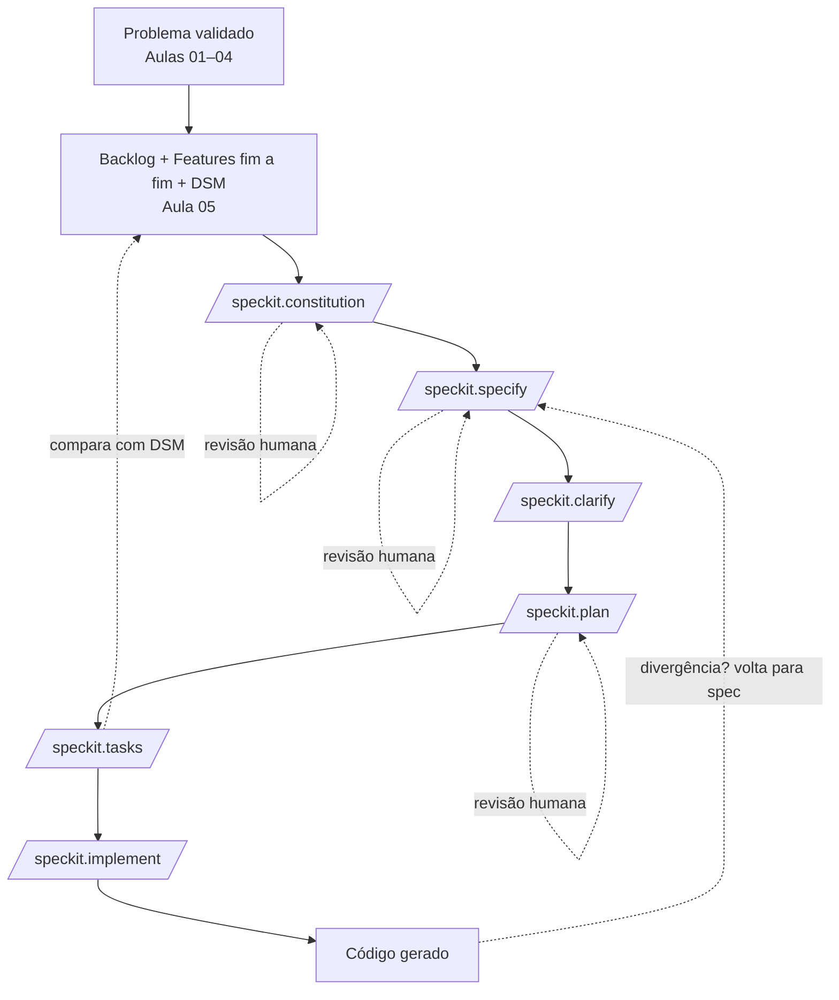

# Aula 09 — Desenvolvimento Orientado a Especificação (Spec-Driven Development)

**Data:** 04/05/2026 | **Horário:** 11h00 | **Local:** Sala 207

[⬇️ Baixar / Copiar Código Fonte da Aula](https://raw.githubusercontent.com/paulossjunior/aula-extensao/main/docs/plano-de-aula/aulas/aula-09-2026-05-04.md)

---

## Introdução

Na [Aula 05](../../plano-de-aula/aulas/aula-05-2026-04-06.md) cada grupo saiu com três artefatos importantes: um backlog inicial em formato Scrum, uma lista de **features fim a fim** e uma **DSM** que organiza dependências e ordem de implementação. Esses artefatos respondem bem a duas perguntas: *o que entregar primeiro* e *em que ordem construir*. Falta agora responder a uma terceira: *como descrever uma feature de modo que um agente de IA gere código previsível, e não algo aproximadamente parecido com o que o grupo imaginou*.

É aqui que entra o **Spec-Driven Development (SDD)**. A proposta é simples de enunciar e exigente de praticar: em vez de conversar com o agente por prompts soltos, escrevemos uma **especificação executável** que serve como fonte de verdade entre o time humano e a IA. O código passa a ser uma consequência da spec, e não o ponto de partida da conversa.

Isso se opõe ao chamado **vibe coding** — a prática de pedir trechos de código diretamente ao agente, refinando por tentativa e erro, sem registro do *porquê* de cada decisão. O vibe coding entrega resultado rápido em problemas pequenos, mas se desfaz em features fim a fim com várias dependências: o agente esquece o contexto, duplica regras, cria caminhos paralelos e o time perde rastreabilidade.

Nesta aula, vamos conhecer o **GitHub Spec-Kit**, um toolkit aberto que operacionaliza SDD por meio de slash-commands, e vamos olhar com olhos críticos para os limites dessa abordagem, usando como referência o artigo de Martin Fowler sobre ferramentas de SDD. Cada grupo vai instalar o spec-kit, escrever sua **constitution**, especificar uma feature do próprio backlog e comparar a ordem de tarefas proposta pelo agente com a DSM que já existe.

---

## Materiais de Apoio

- [GitHub Spec-Kit — Repositório oficial](https://github.com/github/spec-kit)
- [Spec-Kit — Documentação oficial](https://github.github.io/spec-kit/)
- [Martin Fowler — *Spec-Driven Development: The Tools*](https://martinfowler.com/articles/exploring-gen-ai/sdd-3-tools.html)
- [Aula 05 — Scrum, Features Fim a Fim e DSM](../../plano-de-aula/aulas/aula-05-2026-04-06.md)
- [Template de PRD](../../modelos/prd-template.md)
- [Template de DSM](../../modelos/dsm-template.md)
- [Exemplo de SDD com Spec-Kit (TODO List React + C# em arquitetura apartada)](../../modelos/sdd-exemplo-todo-react-csharp.md)

!!! note "Leitura recomendada"
    Antes da aula, leia o artigo de Fowler [*SDD: The Tools*](https://martinfowler.com/articles/exploring-gen-ai/sdd-3-tools.html). É um texto curto que ajuda a entender por que SDD é promissor e por que não é mágica.

---

## Discovery do Projeto

### O que é Spec-Driven Development

O **Spec-Driven Development** é uma forma de trabalhar com agentes de IA em que a **especificação** vem antes do código e funciona como o artefato principal da conversa entre pessoas e máquina. Em vez de descrever a feature por mensagens de chat, o time escreve um documento estruturado — com objetivo, escopo, user stories, regras, critérios de aceitação — e pede que o agente derive o restante a partir dele.

A ideia central é tratar a spec como **fonte de verdade**. Se algo precisa mudar, muda-se a spec primeiro. O código é consequência. Esse deslocamento parece pequeno, mas muda o papel da documentação: ela deixa de ser um relatório que envelhece e passa a ser um insumo de geração.

### SDD x vibe coding x prompt engineering

Vale separar três coisas que andam juntas:

- **Vibe coding** é pedir código direto ao agente, em linguagem livre, e ir corrigindo conforme o resultado aparece. Funciona para experimentos curtos, falha em produtos com várias features interligadas.
- **Prompt engineering** é a disciplina de escrever bons prompts. Ajuda muito, mas o prompt continua sendo descartável: depois que o código está pronto, ninguém volta no prompt.
- **SDD** é diferente em natureza: a spec é versionada, revisada e mantida. Ela não é um prompt grande; é um artefato do projeto, com o mesmo cuidado que se dá a um PRD ou a um diagrama de arquitetura.

### Os três níveis de maturidade segundo Fowler

No artigo *SDD: The Tools*, Fowler organiza a prática em três níveis de maturidade. Eles ajudam o grupo a saber em que degrau está pisando:

1. **Spec-first.** Escreve-se a spec, gera-se o código a partir dela e depois a spec é descartada. O ganho está só no momento da geração inicial.
2. **Spec-anchored.** A spec é mantida ao longo da evolução da feature. Muda-se a spec, regenera-se ou atualiza-se o código guiado por ela. Exige disciplina de equipe.
3. **Spec-as-source.** A spec é o artefato primário. O código tem cabeçalho do tipo "GENERATED FROM SPEC — DO NOT EDIT". O time só edita a spec; o agente cuida do código. É o nível mais ambicioso e o menos comum.

Esses três níveis **não são modos do spec-kit**, e sim categorias do artigo do Fowler para classificar abordagens diferentes. O spec-kit, segundo ele, *aspira* a ser spec-anchored, mas isso depende muito da disciplina do time.

### Como o Spec-Kit operacionaliza SDD

O **GitHub Spec-Kit** é um toolkit open source, em licença MIT, que implementa um fluxo de SDD por meio de **slash-commands** dentro do agente de IA escolhido (Claude Code, Copilot, Cursor, Gemini, Codex, entre outros — mais de trinta agentes suportados). Funciona em projetos novos (*greenfield*) e em projetos existentes (*brownfield*), e é independente da linguagem (.NET, JavaScript, Python e por aí vai).

A instalação típica usa o gerenciador `uv`:

```bash
uv tool install specify-cli --from git+https://github.com/github/spec-kit.git@vX.Y.Z
specify init meu-produto --integration claude
```

Também é possível rodar de forma efêmera com `uvx`, sem instalar globalmente. Depois do `init`, o projeto ganha uma pasta `.specify/` com os arquivos do toolkit.

A partir daí o trabalho acontece em fases, cada uma disparada por um slash-command dentro do agente:

1. **`/speckit.constitution`** — registra os **princípios do projeto**: padrões de qualidade, política de testes, expectativas de UX, restrições de performance. Gera `.specify/memory/constitution.md`. Pense nela como o "contrato" que o agente deve respeitar em todas as fases seguintes. Para o produto dos pescadores de Manguinhos, por exemplo, a constitution pode dizer "toda tela precisa funcionar offline em conexão fraca" e "prazo de resposta abaixo de 2 segundos em 3G".
2. **`/speckit.specify`** — descreve **o quê** e **por quê** da feature, sem decidir stack. Gera `specs/[FEATURE]/spec.md` com user stories e requisitos. Para a feature *"o pescador registra um pedido e acompanha seu status"*, esta fase produziria as histórias, os atores e os critérios de aceitação.
3. **`/speckit.clarify`** *(opcional, mas recomendado)* — faz perguntas estruturadas para reduzir ambiguidade antes do plano técnico. As respostas são registradas no próprio spec. É a parte que mais costuma puxar o time para fora do "achismo".
4. **`/speckit.plan`** — agora sim entra o **como**: stack, arquitetura, contratos, modelo de dados. Gera `plan.md`, `research.md`, `data-model.md` e uma pasta `contracts/`.
5. **`/speckit.tasks`** — quebra o plano em tarefas ordenadas, com dependências explícitas e marcadores `[P]` para o que pode rodar em paralelo, organizadas por user story e em estilo TDD.
6. **`/speckit.implement`** — executa as tarefas em ordem, gerando o código.
7. **Validação opcional** — `/speckit.analyze` checa consistência entre os artefatos gerados; `/speckit.checklist` aplica listas de qualidade sobre o conjunto.

Não é obrigatório usar todas as fases. Em features simples, ir direto de `/speckit.specify` para `/speckit.implement` pode ser suficiente. Em features grandes, pular fases costuma cobrar caro depois.

### Da DSM e features fim a fim para a especificação

O trabalho da Aula 05 alimenta diretamente o que vamos fazer hoje:

- as **features fim a fim** viram entradas naturais para o `/speckit.specify`. Cada feature já é, por construção, um recorte com usuário, valor e partes envolvidas — exatamente o que o spec-kit espera como user story.
- o **backlog priorizado** ajuda a escolher *qual* feature especificar primeiro. Não é necessário (nem recomendável) especificar tudo de uma vez.
- a **DSM** funciona como referência de comparação para a saída de `/speckit.tasks`. Quando o agente propuser uma ordem de tarefas, o time vai olhar a DSM e perguntar: "isso bate com o que mapeamos? onde diverge? quem tem razão?". Essa comparação é o ponto pedagógico mais rico da aula.

### Cuidados e limites do SDD

SDD não é bala de prata. O artigo do Fowler é honesto em apontar onde a abordagem custa caro:

- **Mismatch de tamanho.** Em features pequenas, a spec gerada pode ser desproporcional. Fowler relata um caso em que uma ferramenta SDD produziu **16 critérios de aceitação para um bug pequeno**. Para histórias de 3 ou 5 pontos, todo o ritual pode ser overkill.
- **Carga de revisão.** Os artefatos do spec-kit são vários arquivos markdown verbosos. Revisar tudo cansa. Birgitta Böckeler, citada no artigo, resume bem: *"I'd rather review code than all these markdown files."*
- **Falsa sensação de controle.** Mesmo com spec detalhada, o agente eventualmente **ignora instruções, superinterpreta requisitos e cria duplicatas**. A spec não garante obediência; ela só dá ao humano um lugar onde apontar a divergência.
- **Funcional vs. técnico.** Times historicamente têm dificuldade de separar requisito funcional de detalhe de implementação. SDD amplifica esse problema: se a spec já decide stack, ela vira um plano disfarçado de requisito.
- **Ecos do Model-Driven Development.** SDD lembra o velho MDD, que falhou por inflexibilidade e overhead. LLMs reduzem a rigidez, mas adicionam **não-determinismo**. O risco real é juntar o pior dos dois mundos.

!!! warning "Aviso crítico — leia antes de se entusiasmar"
    O Spec-Driven Development carrega o risco de combinar **a inflexibilidade do antigo Model-Driven Development com o não-determinismo dos LLMs**. Mesmo com specs detalhadas, agentes ignoram instruções, criam duplicatas e superinterpretam requisitos. Birgitta Böckeler resume o desconforto da revisão em uma frase: *"I'd rather review code than all these markdown files."* A spec ajuda — não substitui revisão humana ativa a cada fase.

Como Fowler conclui de forma cuidadosa: *"spec-first é valioso; spec-driven ainda é nebuloso"*. Iteração pequena costuma vencer design upfront elaborado, e a verificação a cada fase é tarefa humana ativa, não passiva. Esses três insights vão guiar nossas tarefas.

### Diagrama do fluxo



O loop tracejado é o ponto crítico: a revisão humana acontece **a cada fase**, e qualquer divergência entre o que o agente produziu e o que o time esperava deve voltar para a spec, não para o código.

!!! tip "Leitura Pedagógica da Aula"
    O objetivo não é dominar todos os comandos do spec-kit. É experimentar SDD em uma feature real do produto de vocês e perceber, na prática, onde ele ajuda e onde ele atrapalha — para que cada grupo decida com critério como (e se) vai usar essa abordagem nas próximas sprints.

---

## Tarefas

### Tarefa 1 — Instalar e Inicializar o Spec-Kit

**Duração estimada:** 15 min
**Formato:** Grupos

Cada grupo deve preparar o ambiente para usar o spec-kit no agente que já vem usando no curso (Claude Code, Copilot, Cursor — escolha uma).

Passos sugeridos:

1. Garantir que o `uv` está instalado (instruções em [astral.sh/uv](https://docs.astral.sh/uv/)).
2. Instalar o CLI: `uv tool install specify-cli --from git+https://github.com/github/spec-kit.git`.
3. Inicializar dentro do repositório do produto: `specify init <NOME_DO_PRODUTO> --integration <agente>`.
4. Conferir que a pasta `.specify/` foi criada e que os slash-commands aparecem no agente.

**Entregável:** repositório do grupo com o spec-kit inicializado, mais um print mostrando os slash-commands disponíveis no agente escolhido.

---

### Tarefa 2 — Redigir a Constitution do Produto

**Duração estimada:** 15 min
**Formato:** Grupos

Com o spec-kit inicializado, cada grupo deve rodar `/speckit.constitution` para gerar o arquivo de princípios do produto.

A constitution deve responder, ao menos:

1. **Qualidade** — quais práticas o time considera inegociáveis (revisão de PR, lint, padrão de commits)?
2. **Testes** — qual a política mínima (unitário, integração, cobertura mínima)?
3. **UX** — quais expectativas de experiência? Por exemplo: "telas precisam funcionar com conexão instável" no contexto de Manguinhos.
4. **Performance** — que limites são aceitáveis (tempo de resposta, tamanho de bundle)?
5. **Restrições do contexto** — orçamento, dispositivos-alvo, idioma, acessibilidade.

**Entregável:** `.specify/memory/constitution.md` preenchido com os princípios reais do grupo (não os do exemplo).

---

### Tarefa 3 — Especificar uma Feature Fim a Fim

**Duração estimada:** 30 min
**Formato:** Grupos

Cada grupo escolhe **uma única feature** do backlog produzido na Aula 05 — preferencialmente uma feature fim a fim de tamanho médio, nem trivial nem gigante.

Roteiro:

1. Rodar `/speckit.specify` descrevendo a feature em linguagem natural, sem mencionar stack. Foco no *o quê* e no *por quê*. Exemplo de entrada: *"o pescador registra um pedido de venda e consegue acompanhar seu status até a entrega"*.
2. Revisar o `spec.md` gerado: as user stories fazem sentido? os critérios de aceitação capturam o que o grupo quer? há algo inventado pelo agente?
3. Rodar `/speckit.clarify` e responder às perguntas. Registrar as respostas no próprio spec.
4. Anotar ao lado: *"o que o agente tentou empurrar de implementação que não cabia aqui?"*.

**Entregável:** `specs/[FEATURE]/spec.md` revisado pelo grupo, com user stories, requisitos e clarifications, e uma nota curta (3 a 5 linhas) com as decisões editoriais que o grupo fez sobre o que o agente sugeriu.

---

### Tarefa 4 — Plano, Tarefas e Comparação com a DSM

**Duração estimada:** 20 min
**Formato:** Grupos

Sobre a mesma feature da Tarefa 3, agora avançar para o plano técnico e a quebra em tarefas.

1. Rodar `/speckit.plan` indicando a stack que o grupo já decidiu (linguagem, framework, banco). O plano deve cobrir arquitetura, contratos e modelo de dados.
2. Rodar `/speckit.tasks` e revisar a lista produzida. Identificar:
   - quais tarefas estão marcadas como `[P]` (paralelizáveis)
   - qual a ordem proposta para as não paralelizáveis
3. Pegar a **DSM** da Aula 05 e comparar: a ordem que o agente propôs respeita as dependências mapeadas pelo grupo? Onde diverge?

**Entregável:** `plan.md` + `tasks.md` gerados, mais uma reflexão de meia página respondendo: *"em que pontos a ordem proposta pelo spec-kit divergiu da nossa DSM, e qual visão consideramos mais correta — a do agente ou a nossa? Por quê?"*.

!!! tip "Dica para a Tarefa 4"
    Não tente "consertar" a saída do agente sem antes entender por que ela diverge. Frequentemente a divergência revela algo que o grupo não tinha visto na DSM original — e às vezes mostra que o agente simplificou demais.

---

## Encerramento

Nesta aula passamos do *o que entregar* para o *como descrever para gerar*. Conhecemos o conceito de **Spec-Driven Development**, vimos os três níveis de maturidade propostos por Fowler (spec-first, spec-anchored, spec-as-source), instalamos o **Spec-Kit** e rodamos o fluxo completo em uma feature real do produto de cada grupo: constitution, spec, clarify, plan e tasks. Olhamos também, com honestidade, para os limites de SDD — o risco de overhead, a carga de revisão e os ecos do Model-Driven Development.

A próxima virada depende de uma coisa que ainda não fizemos: deixar o agente realmente escrever o código.

!!! note "Tarefa de Casa — Implementar e Observar"
    Para a próxima aula, cada grupo deve:

    1. Rodar `/speckit.implement` em pelo menos **uma user story** da feature especificada hoje.
    2. Comparar o código gerado com a spec: o que o agente respeitou? o que ele ignorou ou superinterpretou?
    3. Trazer uma reflexão curta (até uma página) sobre **dois acertos** e **duas divergências** entre a spec e o código gerado.
    4. Atualizar o MkDocs do grupo com os novos artefatos (`constitution.md`, `spec.md`, `plan.md`, `tasks.md`).
    5. Vir preparado para discutir: *vale a pena manter SDD na próxima sprint, ou voltar a uma abordagem mais leve?*

---

## Referências

- [GitHub Spec-Kit — Repositório oficial](https://github.com/github/spec-kit)
- [Spec-Kit — Site de documentação](https://github.github.io/spec-kit/)
- [GitHub Spec-Kit — Vídeo oficial de apresentação](https://www.youtube.com/watch?v=a9eR1xsfvHg)
- [Martin Fowler — *Spec-Driven Development: The Tools*](https://martinfowler.com/articles/exploring-gen-ai/sdd-3-tools.html)
- [Martin Fowler — Série *Exploring Gen AI*](https://martinfowler.com/articles/exploring-gen-ai.html)
- [Documentação do `uv`](https://docs.astral.sh/uv/)
- [Manifesto para Desenvolvimento Ágil de Software](https://agilemanifesto.org/iso/ptbr/manifesto.html)
- [The Scrum Guide](https://www.scrumguides.org/)
- [What is Scrum? | Scrum.org](https://www.scrum.org/resources/what-scrum-module)
