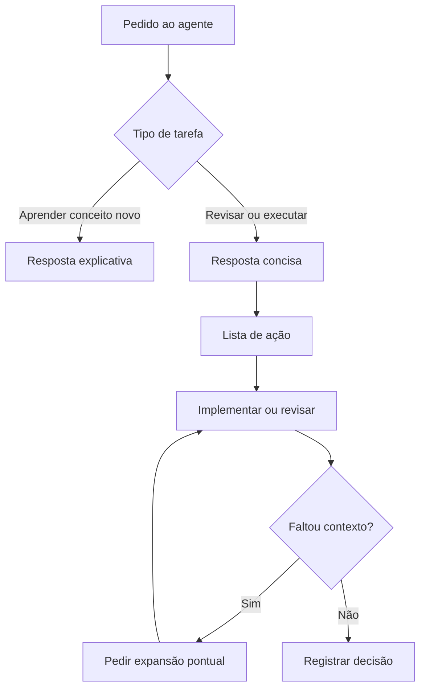

# Aula 10 — Caveman + Spec-Kit: Comunicação Enxuta no Desenvolvimento com IA

**Data:** 11/05/2026 | **Horário:** 11h00 | **Local:** Sala 207

[Baixar / Copiar Código Fonte da Aula](https://raw.githubusercontent.com/paulossjunior/aula-extensao/main/docs/plano-de-aula/aulas/aula-10-2026-05-11.md)

---

## Introdução

Na [Aula 09](../../plano-de-aula/aulas/aula-09-2026-05-04.md), trabalhamos com **Spec-Driven Development** para reduzir ambiguidade antes de pedir código a um agente de IA. A ideia era simples: se a especificação é melhor, o código gerado tende a ser mais previsível. Hoje vamos adicionar uma camada operacional ao fluxo: usar **Caveman** para revisar, resumir e controlar a verbosidade do agente em cada fase do **Spec-Kit**.

Agentes de IA costumam ser verbosos. Eles explicam demais, pedem desculpas, repetem contexto, antecipam riscos genéricos e misturam o que importa com texto de transição. Em uma conversa curta isso parece inofensivo. Em uma sprint real, com várias iterações, revisões de PR, specs, logs e mensagens de erro, essa verbosidade consome tempo, tokens e atenção.

O repositório **Caveman**, de Julius Brussee, transforma essa observação em uma ferramenta: um skill/plugin para agentes como Claude Code, Codex, Gemini, Cursor, Windsurf, Cline, Copilot e outros, cujo objetivo é comprimir a saída do agente mantendo a informação técnica essencial. O projeto relata reduções médias de saída próximas de 65% em benchmarks próprios, com variação por tipo de tarefa.

Nesta aula, vamos usar o Caveman como objeto de estudo para discutir **economia de tokens, legibilidade, revisão técnica e qualidade da comunicação com agentes** dentro de um fluxo real de SDD. A pergunta principal não é "como deixar a IA engraçada?", mas sim: *como revisar specs, plans, tasks e código gerado com menos ruído e mais ação?*

---

## Materiais de Apoio

- [Caveman — Repositório oficial](https://github.com/juliusbrussee/caveman)
- [Caveman — Guia de instalação](https://github.com/juliusbrussee/caveman/blob/main/INSTALL.md)
- [Caveman — Benchmarks](https://github.com/juliusbrussee/caveman/tree/main/benchmarks)
- [Caveman — Evals](https://github.com/juliusbrussee/caveman/tree/main/evals)
- [Artigo no arXiv — *Brevity Constraints Reverse Performance Hierarchies in Language Models*](https://arxiv.org/abs/2604.00025)
- [Aula 09 — Desenvolvimento Orientado a Especificação](../../plano-de-aula/aulas/aula-09-2026-05-04.md)
- [Exemplo — TODO List usando Caveman](../../modelos/caveman-exemplo-todo-list.md)

!!! note "Leitura recomendada"
    Antes da aula, abra o README do Caveman e observe duas coisas: quais tipos de resposta ele tenta encurtar e quais recursos ele oferece além do modo de fala curta, como compressão de arquivos de memória, commits concisos e revisões de PR em uma linha.

---

## Discovery do Projeto

### O problema: excesso de texto também é custo

Quando falamos de custo em IA, normalmente pensamos em dinheiro. Mas, em um projeto de software, existem pelo menos quatro custos ligados à verbosidade:

1. **Custo financeiro** — mais tokens de saída significam mais consumo em ferramentas pagas por uso.
2. **Custo de tempo** — respostas longas demoram mais para serem geradas e revisadas.
3. **Custo cognitivo** — o time precisa separar sinal de ruído a cada interação.
4. **Custo de contexto** — conversas longas ocupam mais janela de contexto e aumentam a chance de o agente perder informações importantes.

Esse problema aparece com força em três momentos do curso:

- ao revisar specs geradas pelo Spec-Kit
- ao pedir explicação de bugs ou decisões técnicas
- ao transformar feedback de revisão em mudanças pequenas de código

Em todos esses casos, uma resposta mais curta pode ajudar, desde que ela preserve o essencial: causa, decisão, consequência e próximo passo.

### O que é o Caveman

O **Caveman** é um plugin/skill open source em licença MIT que instrui agentes de IA a responderem de forma comprimida. A proposta do projeto é reduzir palavras de ligação, justificativas genéricas e texto ornamental, mantendo precisão técnica.

Na prática, ele oferece:

- modo de resposta curta, acionado por comando ou regra do agente
- níveis de compressão, como `lite`, `full` e `ultra`
- comandos auxiliares para commits e reviews mais concisos
- compressão de arquivos de memória, como `CLAUDE.md` ou notas de projeto
- um middleware chamado `caveman-shrink`, voltado a comprimir descrições de ferramentas MCP
- suporte a vários agentes, incluindo Claude Code, Codex, Gemini, Cursor, Windsurf, Cline e Copilot

O ponto pedagógico importante: Caveman não muda a capacidade de raciocínio do modelo. Ele muda o **formato da resposta**. A ferramenta é uma camada de comunicação, não uma garantia de qualidade.

### Instalação e uso básico

O README do projeto apresenta uma instalação por script:

```bash
# macOS / Linux / WSL / Git Bash
curl -fsSL https://raw.githubusercontent.com/JuliusBrussee/caveman/main/install.sh | bash
```

No Windows PowerShell:

```powershell
irm https://raw.githubusercontent.com/JuliusBrussee/caveman/main/install.ps1 | iex
```

Para instalação manual em vários agentes, o projeto também usa `npx skills add JuliusBrussee/caveman -a <agente>`. No Codex, o acionamento pode aparecer como `$caveman`; em outros agentes, como `/caveman` ou por instruções do tipo "responda em modo caveman".

!!! warning "Cuidado antes de rodar scripts remotos"
    Mesmo quando o repositório parece confiável, nunca execute `curl | bash` sem ler o script ou entender o que ele altera. Nesta aula, a instalação é opcional. Quem não quiser instalar pode simular o comportamento com prompts de concisão e ainda participar de todas as tarefas.

### Como usar na prática

Depois de instalado, o uso básico é conversar com o agente normalmente, mas ativando o modo de resposta curta antes da tarefa. A forma exata depende do agente:

| Ambiente | Como acionar |
|---|---|
| Claude Code | `/caveman`, `/caveman lite`, `/caveman full`, `/caveman ultra` |
| Codex | `$caveman` ou pedido em linguagem natural, dependendo da instalação |
| Gemini CLI | `/caveman` ou comando equivalente da extensão |
| Cursor, Windsurf, Cline, Copilot | regra instalada no projeto ou pedido manual de concisão |
| Sem instalar | prompt manual pedindo resposta curta com preservação de causa, ação, risco e teste |

Fluxo recomendado para os grupos:

1. **Ativar concisão** antes da tarefa: `/caveman lite` ou `$caveman`.
2. **Fazer um pedido concreto**: "revise este trecho", "resuma esta spec", "explique este erro".
3. **Verificar se perdeu informação**: causa, ação, teste e risco continuam claros?
4. **Pedir expansão pontual** apenas do que ficou ambíguo.
5. **Registrar a versão final** no MkDocs, issue, PR ou commit.

Exemplo de ativação:

```text
/caveman lite
Revise este tasks.md e liste apenas inconsistências entre tarefas, dependências e critérios da spec.
Formato: arquivo/linha — problema — correção sugerida.
```

No Codex, se o comando disponível for `$caveman`, o mesmo pedido ficaria assim:

```text
$caveman
Revise este tasks.md e liste apenas inconsistências entre tarefas, dependências e critérios da spec.
Formato: arquivo/linha — problema — correção sugerida.
```

Sem instalar nada, dá para simular:

```text
Responda de forma concisa.
Preserve: causa, ação, teste e risco.
Remova: cortesia, repetição, contexto óbvio e explicação genérica.

Tarefa: revise este tasks.md e liste inconsistências com a spec.
```

### Caveman no fluxo do Spec-Kit

O Caveman não substitui nenhum comando do Spec-Kit. Ele entra como uma camada de **revisão e síntese** ao redor dos comandos `/speckit.*`.

| Fase do Spec-Kit | O que o Spec-Kit gera | Como usar Caveman |
|---|---|---|
| `/speckit.constitution` | princípios do projeto | resumir princípios inegociáveis e detectar conflitos |
| `/speckit.specify` | `spec.md` | verificar escopo, ambiguidades e requisitos inventados |
| `/speckit.clarify` | perguntas e respostas | reduzir dúvidas a decisões objetivas |
| `/speckit.plan` | arquitetura, contratos, modelo de dados | listar trade-offs, riscos e decisões técnicas |
| `/speckit.tasks` | tarefas ordenadas | encontrar lacunas, dependências erradas e tarefas fora de escopo |
| `/speckit.implement` | código | revisar bugs, testes faltantes e divergências com a spec |

Fluxo recomendado:

```text
/speckit.specify
/caveman full
Revise o spec.md gerado.
Formato: problema — impacto — correção.
```

Depois:

```text
/speckit.plan
/caveman lite
Resuma o plano técnico em:
Decisões:
Contratos:
Dados:
Riscos:
Dúvidas:
```

Depois:

```text
/speckit.tasks
/caveman full
Compare tasks.md com spec.md e plan.md.
Liste apenas:
- tarefa faltante
- tarefa fora de escopo
- dependência errada
- teste ausente
```

E após implementar:

```text
/speckit.implement
/caveman-review
Revise o código gerado contra spec.md.
Formato: arquivo:linha — divergência — correção.
```

O ganho está no controle humano. O Spec-Kit gera artefatos detalhados; o Caveman ajuda o grupo a revisar esses artefatos sem se afogar em explicação.

### Comandos úteis

O Caveman traz comandos e habilidades auxiliares. Nem todos funcionam em todos os agentes, então a regra é conferir a matriz do README antes de usar em produção.

| Comando/Recurso | Para que serve | Exemplo de uso |
|---|---|---|
| `/caveman lite` | Reduz enrolação, mantendo escrita profissional | explicação curta para o grupo |
| `/caveman full` | Resposta fragmentada e direta | depuração, revisão, próximos passos |
| `/caveman ultra` | Máxima compressão | checklist rápido ou diagnóstico simples |
| `/caveman-commit` | Sugere mensagem de commit curta | `fix: block duplicate cpf` |
| `/caveman-review` | Produz comentários curtos de PR | `UserForm.tsx:42 — CPF sem validação. Adicionar schema.` |
| `/caveman-stats` | Mostra economia de tokens em ambientes suportados | acompanhar redução de saída |
| `/caveman:compress <arquivo>` | Comprime arquivo de memória ou notas | reduzir tamanho de `CLAUDE.md` |
| `caveman-shrink` | Comprime descrições de ferramentas MCP | diminuir custo de contexto de ferramentas |

Para a aula, os comandos principais são os três níveis de resposta (`lite`, `full`, `ultra`) e a simulação manual por prompt. Os recursos de commit, review, stats e compressão entram como extensão para quem quiser experimentar no projeto.

### Níveis de concisão

O Caveman organiza a concisão em níveis. Para a aula, vamos usar estes três:

1. **Lite** — remove enrolação, mas mantém gramática normal. Bom para respostas profissionais.
2. **Full** — usa frases curtas e fragmentos. Bom para depuração rápida e revisão técnica.
3. **Ultra** — resposta telegráfica. Bom para comandos, diagnósticos simples e listas de ação.

O desafio é perceber que "mais curto" não é sempre "melhor". Uma resposta ultra curta pode ser excelente para um bug óbvio e ruim para uma decisão arquitetural com trade-offs.

### Concisão não é superficialidade

Uma resposta curta de boa qualidade precisa preservar quatro elementos:

- **Fato** — o que está acontecendo?
- **Causa** — por que está acontecendo?
- **Ação** — o que fazer agora?
- **Risco** — o que pode dar errado se a ação for incompleta?

Compare:

```text
Ruim:
Erro no login. Corrigir auth.

Melhor:
Token expira, mas middleware aceita `exp == now`. Trocar `<=` por `<`. Testar token expirado e token válido.
```

A segunda resposta é curta, mas ainda dá diagnóstico, mudança e teste. Esse é o tipo de concisão que nos interessa.

### Exemplos de uso

#### Exemplo 1 — Explicação de bug

Pedido:

```text
/caveman full
Explique por que este componente React está renderizando muitas vezes e sugira correção.
```

Resposta longa típica:

```text
O componente provavelmente está renderizando muitas vezes porque você está criando um novo objeto dentro do corpo do componente a cada renderização. Como objetos em JavaScript são comparados por referência, o React entende que a prop mudou mesmo quando os valores internos são iguais. Uma forma de resolver isso é memorizar o objeto com useMemo ou mover a criação para fora do componente, dependendo do caso.
```

Resposta concisa:

```text
Objeto novo a cada render. Prop compara por referência. React vê mudança sempre. Use `useMemo` ou mova objeto para fora.
```

O que foi preservado:

- causa: objeto novo a cada render
- mecanismo: comparação por referência
- ação: `useMemo` ou mover objeto

O que foi cortado:

- introdução
- repetição
- explicação genérica sobre JavaScript

#### Exemplo 2 — Revisão de PR

Pedido:

```text
/caveman-review
Revise este PR procurando bugs de validação e segurança.
```

Saída esperada:

```text
UserController.cs:38 — senha aceita vazia. Validar antes de criar usuário.
AuthService.cs:52 — token expirado passa no limite. Usar `expiresAt <= now`.
PedidoForm.tsx:91 — valor negativo permitido. Bloquear no schema e no input.
```

Por que funciona:

- aponta arquivo e linha
- descreve o problema
- indica correção
- evita comentários genéricos como "melhore a segurança"

#### Exemplo 3 — Commit

Pedido:

```text
/caveman-commit
Gere uma mensagem Conventional Commit para esta mudança:
- adiciona validação de CPF duplicado
- cria teste para cadastro com CPF repetido
- ajusta mensagem de erro no formulário
```

Saída possível:

```text
fix: block duplicate cpf signup
```

Versão com corpo, se o time quiser registrar contexto:

```text
fix: block duplicate cpf signup

Adds database constraint, form validation, and regression test.
```

#### Exemplo 4 — Resumo de spec

Pedido:

```text
/caveman lite
Resuma esta spec em até 8 linhas.
Formato:
Objetivo:
Atores:
Fluxo:
Regras:
Dados:
Riscos:
```

Saída possível:

```text
Objetivo: permitir que pescador registre pedido e acompanhe status.
Atores: pescador, comprador, administrador.
Fluxo: criar pedido, validar dados, salvar, atualizar status, notificar usuário.
Regras: pedido exige item, quantidade, preço e contato.
Dados: usuário, pedido, item, status, histórico.
Riscos: conexão instável, pedido duplicado, status divergente.
```

Uso pedagógico: esse resumo ajuda o grupo a revisar a spec antes de pedir `/speckit.plan`.

#### Exemplo 5 — Quando pedir mais detalhe

Resposta curta recebida:

```text
Use fila para processar notificações. Evita travar checkout.
```

Boa continuação:

```text
Expanda apenas os trade-offs dessa decisão.
Compare fila assíncrona vs envio síncrono.
Inclua riscos, custo de implementação e impacto na UX.
```

Aqui a concisão ajudou a chegar rápido na decisão, mas a decisão arquitetural ainda precisa de explicação antes de virar plano técnico.

### Relação com SDD

Na Aula 09, vimos que specs extensas podem virar um novo tipo de ruído. O time ganha rastreabilidade, mas passa a revisar muitos arquivos Markdown. O Caveman entra como contraponto: ele força a pergunta "qual é a menor quantidade de texto que ainda mantém a decisão verificável?"

Aplicado ao SDD, isso pode aparecer em três práticas:

1. Pedir ao agente um **resumo executivo** da spec em até 10 linhas.
2. Pedir uma **lista de divergências** entre `spec.md`, `plan.md` e `tasks.md`, sem explicações longas.
3. Pedir comentários de revisão no formato `arquivo:linha — problema — correção`.

Assim, a concisão vira ferramenta de revisão, não apenas economia de tokens.

### Prompts prontos para Spec-Kit + Caveman

Use estes prompts depois de cada fase do Spec-Kit.

#### Revisar constitution

```text
/caveman lite
Revise .specify/memory/constitution.md.
Liste apenas:
- princípio ambíguo
- princípio impossível de verificar
- conflito entre princípios
- princípio faltante para este projeto
Formato: problema — correção sugerida.
```

#### Revisar spec

```text
/caveman full
Compare spec.md com o backlog/epic original.
Liste apenas divergências.
Formato:
Tipo: inventado | faltante | ambíguo | fora de escopo
Item:
Correção:
```

#### Revisar plano técnico

```text
/caveman lite
Revise plan.md.
Separe:
Decisões técnicas:
Trade-offs:
Riscos:
Dependências externas:
Perguntas antes de codar:
```

#### Revisar tasks

```text
/caveman full
Compare tasks.md com spec.md e plan.md.
Liste:
- tasks faltantes
- tasks fora de escopo
- tasks sem teste
- dependências em ordem errada
- tarefas que podem ser paralelas
Não explique além do necessário.
```

#### Revisar implementação

```text
/caveman-review
Compare o código implementado com spec.md.
Formato: arquivo:linha — divergência — teste necessário.
Priorize bugs e critérios de aceitação não atendidos.
```

#### Relatório final da feature

```text
/caveman ultra
Gere relatório final da feature.
Formato:
Feito:
Faltando:
Riscos:
Testes:
Próximo passo:
```

### Quando usar e quando evitar

Use respostas curtas quando:

- a tarefa é operacional
- o time já conhece o contexto
- a saída esperada é lista de ação
- você está revisando PR, commit, bug ou checklist
- o objetivo é decidir o próximo passo

Evite compressão extrema quando:

- o tema é novo para a equipe
- há trade-offs importantes
- a decisão envolve segurança, privacidade, acessibilidade ou dados sensíveis
- o grupo precisa aprender o raciocínio, não apenas aplicar a resposta
- a resposta precisa ser auditável por alguém que não participou da conversa

!!! tip "Regra prática"
    Use concisão para **executar melhor**. Use explicação longa para **aprender melhor**. Em projeto real, as duas coisas se alternam o tempo todo.

### Diagrama do fluxo de trabalho



O ponto central é o ajuste de granulação. Não precisamos escolher entre "resposta enorme" e "resposta mínima" para sempre. Podemos pedir concisão primeiro e expandir apenas os pontos ambíguos.

!!! tip "Leitura Pedagógica da Aula"
    O objetivo não é transformar todo agente em modo comprimido permanente. É ensinar o grupo a controlar densidade de informação: curto quando a equipe precisa agir, detalhado quando a equipe precisa entender.

---

## Tarefas

### Tarefa 1 — Diagnóstico de Verbosidade no Spec-Kit

**Duração estimada:** 20 min
**Formato:** Grupos

Cada grupo deve escolher uma saída real do Spec-Kit gerada na Aula 09 ou na tarefa de casa. Pode ser:

- `.specify/memory/constitution.md`
- `spec.md`
- `plan.md`
- `tasks.md`
- resposta do `/speckit.implement`

Copiem o trecho escolhido e marquem:

1. trechos que ajudaram a tomar decisão
2. trechos que eram apenas transição, cortesia ou repetição
3. trechos que pareciam úteis, mas não eram acionáveis
4. informações que precisariam ficar mesmo em uma versão curta

**Entregável:** artefato do Spec-Kit anotado, com pelo menos cinco marcações de corte ou preservação.

---

### Tarefa 2 — Reescrever o Artefato em Três Níveis

**Duração estimada:** 25 min
**Formato:** Grupos

Usando o mesmo trecho da Tarefa 1, reescrevam o conteúdo em três versões:

1. **Lite:** profissional, sem enrolação, mas ainda explicativo.
2. **Full:** frases curtas, foco em diagnóstico e ação.
3. **Ultra:** máximo de concisão, apenas pontos necessários para agir.

Quem tiver instalado o Caveman pode usar `/caveman lite`, `/caveman full` e `/caveman ultra` ou o comando equivalente do agente. Quem não instalou pode pedir manualmente:

```text
Reescreva esta resposta em modo conciso.
Preserve causa, ação, risco e teste.
Remova cortesia, justificativa genérica e repetição.
```

**Entregável:** três versões da mesma resposta, com contagem aproximada de palavras ou tokens em cada uma.

---

### Tarefa 3 — Revisar o Ciclo Spec-Kit com Caveman

**Duração estimada:** 30 min
**Formato:** Grupos

Cada grupo deve escolher **duas fases** do Spec-Kit e aplicar Caveman ou a simulação manual:

1. **Spec:** revisar `spec.md` contra o epic/backlog original.
2. **Plan:** resumir decisões, riscos e dúvidas de `plan.md`.
3. **Tasks:** comparar `tasks.md` com `spec.md` e `plan.md`.
4. **Implement:** revisar código gerado contra critérios de aceitação.

Prompts sugeridos:

```text
/caveman full
Compare spec.md com o epic original.
Liste apenas requisitos inventados, faltantes, ambíguos ou fora de escopo.
```

```text
/caveman lite
Resuma plan.md em:
Decisões:
Contratos:
Dados:
Riscos:
Dúvidas:
```

```text
/caveman full
Compare tasks.md com spec.md e plan.md.
Liste tasks faltantes, fora de escopo, sem teste ou em ordem errada.
```

```text
/caveman-review
Compare o código implementado com spec.md.
Formato: arquivo:linha — divergência — teste necessário.
```

**Entregável:** duas revisões reais do fluxo Spec-Kit com: pedido feito, resposta concisa e decisão do grupo.

---

### Tarefa 4 — Teste de Perda de Informação

**Duração estimada:** 20 min
**Formato:** Troca entre grupos

Um grupo entrega sua versão `ultra` para outro grupo, sem mostrar a resposta original. O grupo receptor deve responder:

1. qual problema está sendo tratado?
2. qual ação precisa ser feita?
3. quais testes ou validações são necessários?
4. qual risco ficou claro?
5. que informação faltou?

Depois, os grupos comparam a interpretação com a resposta original.

**Entregável:** uma tabela curta com duas colunas: **informação preservada** e **informação perdida**.

---

### Tarefa 5 — Aplicar no Fluxo do Projeto

**Duração estimada:** 25 min
**Formato:** Grupos

Cada grupo deve aplicar concisão ao fluxo inteiro de uma feature:

1. escolher uma feature especificada com Spec-Kit
2. gerar um resumo curto de `spec.md`
3. gerar uma revisão curta de `plan.md`
4. gerar uma revisão curta de `tasks.md`
5. gerar um checklist curto para validar `/speckit.implement`

Formato sugerido para saída:

```text
Spec:
Plano:
Tasks:
Implementação:
Riscos:
Próximo passo:
```

Exemplo:

```text
Spec: cadastro exige CPF único e senha mínima.
Plano: validar CPF no front e garantir unicidade no banco.
Tasks: falta teste de CPF duplicado na API.
Implementação: revisar migration antes do deploy.
Riscos: dados existentes duplicados quebram constraint.
Próximo passo: criar teste de integração e rodar migration local.
```

**Entregável:** relatório conciso da feature e uma nota dizendo onde Caveman ajudou ou atrapalhou a revisão.

---

## Encerramento

Nesta aula usamos o Caveman dentro do fluxo do Spec-Kit. O ponto não foi deixar o agente "falar bonito e curto", mas tornar mais fácil revisar `constitution.md`, `spec.md`, `plan.md`, `tasks.md` e o código gerado. Vimos que respostas concisas podem acelerar revisão, reduzir tokens, melhorar leitura e tornar decisões mais visíveis. Também vimos o limite: compressão demais pode apagar contexto, trade-offs e justificativas importantes.

A prática recomendada para as próximas sprints é simples: usar Spec-Kit para gerar artefatos rastreáveis e Caveman para revisar esses artefatos em formato acionável. Quando o grupo estiver aprendendo, tomando decisões arquiteturais ou lidando com risco alto, peça expansão pontual.

!!! note "Tarefa de Casa — Guia de Comunicação com IA"
    Para a próxima aula, cada grupo deve criar uma seção no MkDocs chamada **Guia Spec-Kit + Caveman do Grupo** contendo:

    1. quando usar Caveman em `spec.md`, `plan.md`, `tasks.md` e implementação
    2. quando pedir explicação detalhada
    3. formato padrão para revisar divergências entre spec e código
    4. formato padrão para revisar tasks
    5. três exemplos reais do projeto: saída original do Spec-Kit, versão Caveman e decisão do grupo

---

## Referências

- [Julius Brussee — Caveman](https://github.com/juliusbrussee/caveman)
- [Caveman — INSTALL.md](https://github.com/juliusbrussee/caveman/blob/main/INSTALL.md)
- [Caveman — benchmarks](https://github.com/juliusbrussee/caveman/tree/main/benchmarks)
- [Caveman — evals](https://github.com/juliusbrussee/caveman/tree/main/evals)
- [MD Azizul Hakim — *Brevity Constraints Reverse Performance Hierarchies in Language Models*](https://arxiv.org/abs/2604.00025)
- [Aula 09 — Desenvolvimento Orientado a Especificação](../../plano-de-aula/aulas/aula-09-2026-05-04.md)
