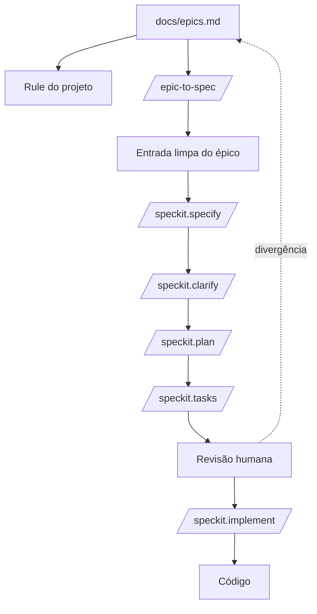

# Aula 11 — Epics, User Stories e Gherkin como Fonte do Spec-Kit

**Data:** 18/05/2026 | **Horário:** 11h00 | **Local:** Sala 207

[Baixar / Copiar Código Fonte da Aula](https://raw.githubusercontent.com/paulossjunior/aula-extensao/main/docs/plano-de-aula/aulas/aula-11-2026-05-18.md)

---

## Introdução

Na [Aula 09](../../plano-de-aula/aulas/aula-09-2026-05-04.md), vimos como o **Spec-Kit** transforma uma descrição de feature em spec, plano, tarefas e implementação. Na [Aula 10](../../plano-de-aula/aulas/aula-10-2026-05-11.md), vimos como o **Caveman** ajuda a reduzir ruído nas respostas do agente. Agora vamos juntar essas duas ideias em um fluxo mais realista de desenvolvimento: usar um arquivo `epics.md` com **épicos, user stories e cenários em Gherkin** como fonte de produto para orientar o agente.

Muitos grupos já têm backlog, histórias, features fim a fim e épicos em Markdown. O problema é que jogar esse arquivo inteiro no agente e pedir "implemente tudo" costuma dar errado: o escopo mistura, o agente puxa requisitos de épicos diferentes, pula dúvidas importantes e começa a codar antes de separar o que é regra de negócio, critério de aceitação e detalhe técnico.

A proposta desta aula é criar um fluxo mais controlado:

1. escrever ou organizar `docs/epics.md` com épicos, user stories e Gherkin
2. criar uma rule para o agente sempre consultar esse arquivo
3. criar um comando reutilizável, como `/epic-to-spec`
4. transformar **um épico por vez** em entrada para `/speckit.specify`
5. seguir o fluxo do Spec-Kit até `/speckit.implement`

O objetivo é fazer o agente trabalhar com mais rastreabilidade: cada spec, plano e tarefa deve nascer de um épico explícito, e não de uma conversa solta.

---

## Materiais de Apoio

- [Aula 09 — Desenvolvimento Orientado a Especificação](../../plano-de-aula/aulas/aula-09-2026-05-04.md)
- [Aula 10 — Comunicação Enxuta com Agentes de IA](../../plano-de-aula/aulas/aula-10-2026-05-11.md)
- [GitHub Spec-Kit — Repositório oficial](https://github.com/github/spec-kit)
- [Spec-Kit — Documentação oficial](https://github.github.io/spec-kit/)
- [Template de Planejamento Scrum](../../modelos/scrum-planejamento-template.md)
- [Template de DSM](../../modelos/dsm-template.md)
- [Exemplo de SDD com Spec-Kit (TODO List React + C#)](../../modelos/sdd-exemplo-todo-react-csharp.md)

!!! note "Leitura recomendada"
    Revise a Aula 09 antes desta aula. A diferença é que agora a entrada do Spec-Kit não será uma ideia escrita no chat, mas um épico retirado de um arquivo versionado do projeto.

---

## Discovery do Projeto

### Por que criar um `epics.md`

Um arquivo `epics.md` funciona como uma ponte entre planejamento de produto e implementação assistida por IA. Ele não substitui PRD, backlog ou DSM. Ele organiza o recorte de produto em blocos grandes o suficiente para expressar valor e pequenos o suficiente para virar specs.

Um bom `epics.md` ajuda o grupo a responder:

- qual parte do produto estamos desenvolvendo agora?
- quem é o usuário afetado?
- que histórias pertencem a esse épico?
- quais regras de negócio já estão decididas?
- quais cenários em Gherkin tornam a entrega aceitável?
- o que está fora de escopo?
- que dúvidas precisam ser resolvidas antes do código?

Sem isso, o agente tende a completar lacunas com suposições. Às vezes ele acerta. Muitas vezes ele inventa.

### Estrutura recomendada do arquivo

Use uma estrutura previsível. O agente lê melhor quando os títulos e seções se repetem. Nesta aula, a estrutura padrão será:

```text
Epic -> User Story -> Cenários Gherkin
```

O épico descreve o bloco de valor. A user story descreve uma necessidade do usuário. O Gherkin transforma critérios de aceitação em exemplos verificáveis usando `Given`, `When` e `Then`.

```markdown
# Epics

## Epic 01 — Cadastro e autenticação

### Objetivo
Permitir que usuários criem conta e acessem o sistema.

### Atores
- visitante
- usuário cadastrado

### Regras de negócio
- e-mail deve ser único
- senha deve ter no mínimo 8 caracteres

### User Stories

#### US-01 — Criar conta

**Como** visitante  
**Quero** criar uma conta com nome, e-mail e senha  
**Para** acessar as funcionalidades do sistema

##### Critérios de aceitação — Gherkin

```gherkin
Feature: Cadastro de usuário

Scenario: Cadastro com dados válidos
  Given que sou um visitante na tela de cadastro
  When preencho nome, e-mail único e senha válida
  And envio o formulário
  Then minha conta deve ser criada
  And devo ser redirecionado para o painel

Scenario: Cadastro com e-mail já usado
  Given que existe um usuário cadastrado com o e-mail "ana@email.com"
  When tento criar uma conta com o e-mail "ana@email.com"
  Then o cadastro deve ser bloqueado
  And devo ver a mensagem "E-mail já cadastrado"

Scenario: Cadastro com senha curta
  Given que sou um visitante na tela de cadastro
  When preencho uma senha com menos de 8 caracteres
  Then o cadastro deve ser bloqueado
  And devo ver a mensagem "Senha deve ter no mínimo 8 caracteres"
```

#### US-02 — Entrar no sistema

**Como** usuário cadastrado  
**Quero** entrar com e-mail e senha  
**Para** acessar minha área autenticada

##### Critérios de aceitação — Gherkin

```gherkin
Feature: Login de usuário

Scenario: Login com credenciais válidas
  Given que tenho uma conta cadastrada
  When informo e-mail e senha corretos
  Then devo entrar no sistema
  And devo ser redirecionado para o painel

Scenario: Login com senha incorreta
  Given que tenho uma conta cadastrada
  When informo a senha incorreta
  Then o acesso deve ser negado
  And devo ver a mensagem "E-mail ou senha inválidos"
```

### Fora de escopo
- login social
- recuperação de senha

### Dúvidas
- haverá confirmação de e-mail?
```

Essa estrutura tem um efeito importante: ela separa decisão de produto de decisão técnica. O épico diz **o que** precisa existir e **por quê**. As user stories dizem **para quem** aquilo existe. Os cenários Gherkin dizem **como saber se funcionou**. O `/speckit.plan` decide **como** implementar.

### Como escrever bons cenários Gherkin

O Gherkin deve ser concreto, observável e testável. Ele não deve descrever componente, tabela, framework ou endpoint, a menos que o épico seja explicitamente técnico.

Formato básico:

```gherkin
Scenario: Nome do comportamento esperado
  Given contexto inicial
  When ação do usuário ou evento do sistema
  Then resultado observável
  And consequência adicional, se houver
```

Bom exemplo:

```gherkin
Scenario: Bloquear tarefa sem título
  Given que estou na tela de criação de tarefa
  When tento salvar uma tarefa sem título
  Then a tarefa não deve ser criada
  And devo ver a mensagem "Informe um título"
```

Exemplo fraco:

```gherkin
Scenario: Validar input
  Given componente TodoForm
  When chama handleSubmit
  Then retorna erro
```

O segundo exemplo é técnico demais para uma user story. Ele pode virar teste unitário depois, mas não é uma boa descrição de comportamento de produto.

!!! tip "Regra prática"
    Se uma pessoa não técnica consegue ler o cenário e dizer "sim, é isso que o usuário espera", o Gherkin está no nível certo.

### Rule de projeto: lembrar o agente da fonte

Uma **rule** é uma instrução persistente do projeto. Dependendo da ferramenta, ela pode viver em `AGENTS.md`, `CLAUDE.md`, `.cursor/rules/`, `.github/copilot-instructions.md` ou outro arquivo equivalente.

Exemplo de rule:

```markdown
# Project Rule — Epics como Fonte de Produto

Antes de especificar, planejar ou implementar uma feature, leia `docs/epics.md`.

Regras:
- Use `docs/epics.md` como fonte primária de escopo de produto.
- Trabalhe em apenas um épico por vez.
- Não implemente requisitos de outros épicos.
- Se o épico estiver ambíguo, marque como `[NEEDS CLARIFICATION]`.
- Não invente regra de negócio fora do épico sem pedir confirmação.
- Preserve rastreabilidade citando o ID/nome do épico na spec.
- Separe requisito funcional de detalhe técnico.
- Preserve os cenários Gherkin como critérios de aceitação.
- Não converta `Given/When/Then` em detalhes de implementação.
```

Essa rule não executa nada sozinha. Ela muda o comportamento padrão do agente. Pense nela como um lembrete permanente: antes de codar, olhe a fonte de produto.

### Comando `/epic-to-spec`: recortar antes de especificar

O comando `/epic-to-spec` é um pré-processador. Ele lê `docs/epics.md`, encontra um único épico e transforma esse trecho em uma entrada limpa para o Spec-Kit.

Ele deve fazer:

1. localizar o épico solicitado
2. ignorar todos os outros épicos
3. extrair objetivo, atores, user stories, regras, cenários Gherkin e fora de escopo
4. marcar lacunas com `[NEEDS CLARIFICATION]`
5. gerar um texto pronto para `/speckit.specify`

Exemplo de comando em Markdown:

```markdown
# /epic-to-spec

Leia `docs/epics.md`.

Entrada esperada:
- ID ou nome do épico

Tarefa:
- Localizar o épico solicitado.
- Ignorar todos os outros épicos.
- Converter o épico em entrada para `/speckit.specify`.
- Separar requisitos funcionais de detalhes técnicos.
- Preservar user stories e cenários Gherkin.
- Marcar lacunas com `[NEEDS CLARIFICATION]`.
- Criar uma spec pequena, revisável e rastreável.

Formato da saída:
Epic:
Objetivo:
Atores:
User Stories:
Regras de negócio:
Cenários Gherkin:
Fora de escopo:
Dúvidas:
Prompt sugerido para /speckit.specify:
```

Uso esperado:

```text
/epic-to-spec Epic 01 — Cadastro e autenticação
```

Saída esperada:

```markdown
Epic: Epic 01 — Cadastro e autenticação

Objetivo:
Permitir que usuários criem conta e acessem o sistema.

Atores:
- visitante
- usuário cadastrado

User Stories:
- US-01 — Como visitante, quero criar conta com nome, e-mail e senha, para acessar o sistema.
- US-02 — Como usuário cadastrado, quero entrar com e-mail e senha, para acessar minha área autenticada.

Regras de negócio:
- e-mail deve ser único
- senha deve ter no mínimo 8 caracteres

Cenários Gherkin:

```gherkin
Feature: Cadastro de usuário

Scenario: Cadastro com dados válidos
  Given que sou um visitante na tela de cadastro
  When preencho nome, e-mail único e senha válida
  And envio o formulário
  Then minha conta deve ser criada
  And devo ser redirecionado para o painel

Scenario: Cadastro com e-mail já usado
  Given que existe um usuário cadastrado com o e-mail "ana@email.com"
  When tento criar uma conta com o e-mail "ana@email.com"
  Then o cadastro deve ser bloqueado
  And devo ver a mensagem "E-mail já cadastrado"
```

Fora de escopo:
- login social
- recuperação de senha

Dúvidas:
- [NEEDS CLARIFICATION] haverá confirmação de e-mail?

Prompt sugerido para /speckit.specify:
Crie uma spec para o Epic 01 — Cadastro e autenticação usando apenas as informações acima. Preserve as user stories e os cenários Gherkin como critérios de aceitação. Não implemente. Marque ambiguidades como [NEEDS CLARIFICATION].
```

### Fluxo completo com Spec-Kit

Depois que o épico foi recortado, o grupo segue o fluxo normal:

```text
/speckit.specify
```

Revisar `spec.md`. Se houver dúvidas:

```text
/speckit.clarify
```

Depois:

```text
/speckit.plan
```

Neste ponto, o grupo informa stack e restrições:

```text
Use React + Vite no front, ASP.NET Core no back e PostgreSQL.
Planeje apenas o Epic 01.
Não inclua recuperação de senha nem login social.
```

Então:

```text
/speckit.tasks
```

Só depois de revisar tarefas e dependências:

```text
/speckit.implement
```

### Diagrama do fluxo



O ponto mais importante está no loop: quando o agente diverge, a correção deve voltar para `epics.md` ou para a spec, não ficar escondida em uma conversa.

### Cuidados importantes

- Não peça para o agente implementar todos os épicos de uma vez.
- Não deixe o agente misturar "fora de escopo" com backlog futuro.
- Não transforme regra de negócio em decisão técnica cedo demais.
- Não aceite uma spec sem rastreabilidade para o épico original.
- Não rode `/speckit.implement` antes de revisar `tasks.md`.

!!! tip "Regra prática"
    Um épico grande pode virar várias specs. Se o `/epic-to-spec` gerar uma entrada muito longa, peça ao agente para sugerir cortes por user story antes de chamar `/speckit.specify`.

---

## Tarefas

### Tarefa 1 — Criar ou revisar `epics.md`

**Duração estimada:** 25 min
**Formato:** Grupos

Cada grupo deve criar ou revisar `docs/epics.md` no repositório do produto.

O arquivo deve conter pelo menos dois épicos, cada um com:

1. objetivo
2. atores
3. user stories no formato "Como / Quero / Para"
4. regras de negócio
5. critérios de aceitação em Gherkin
6. fora de escopo
7. dúvidas

Cada user story deve ter pelo menos dois cenários:

- um cenário de sucesso
- um cenário de erro, exceção ou limite

**Entregável:** `docs/epics.md` versionado no repositório do grupo.

---

### Tarefa 2 — Criar a rule do projeto

**Duração estimada:** 15 min
**Formato:** Grupos

Cada grupo deve criar uma rule para o agente usado no projeto.

Sugestões:

- Codex ou agentes genéricos: `AGENTS.md`
- Claude Code: `CLAUDE.md`
- Cursor: `.cursor/rules/epics.md`
- GitHub Copilot: `.github/copilot-instructions.md`

A rule deve instruir o agente a ler `docs/epics.md` antes de especificar, planejar ou implementar, preservando user stories e cenários Gherkin como fonte dos critérios de aceitação.

**Entregável:** arquivo de rule criado no repositório.

---

### Tarefa 3 — Criar o comando `/epic-to-spec`

**Duração estimada:** 20 min
**Formato:** Grupos

Cada grupo deve criar um comando reutilizável chamado `/epic-to-spec`, ou um prompt salvo equivalente, com a estrutura apresentada na aula.

O comando deve:

- receber ID ou nome do épico
- ler `docs/epics.md`
- recortar apenas o épico solicitado
- gerar uma entrada limpa para `/speckit.specify`
- preservar user stories e cenários Gherkin
- marcar dúvidas com `[NEEDS CLARIFICATION]`

**Entregável:** arquivo do comando ou prompt salvo no MkDocs do grupo.

---

### Tarefa 4 — Gerar a primeira spec a partir de um épico

**Duração estimada:** 30 min
**Formato:** Grupos

Escolham um épico médio. Rodem:

```text
/epic-to-spec <ID ou nome do épico>
```

Depois usem a saída como entrada para:

```text
/speckit.specify
```

Revisem o `spec.md` gerado e respondam:

1. a spec respeitou o escopo do épico?
2. o agente inventou regra?
3. o que ficou como `[NEEDS CLARIFICATION]`?
4. os cenários Gherkin foram preservados como critérios de aceitação?
5. existe algo no épico que precisa ser reescrito?

**Entregável:** `spec.md` gerado e uma nota curta com as correções feitas.

---

### Tarefa 5 — Planejar, quebrar tarefas e comparar com DSM

**Duração estimada:** 25 min
**Formato:** Grupos

Com a spec revisada, rodem:

```text
/speckit.plan
/speckit.tasks
```

Depois comparem `tasks.md` com a DSM da Aula 05.

Perguntas:

1. a ordem proposta respeita as dependências?
2. alguma task pertence a outro épico?
3. há tarefas paralelizáveis?
4. cada cenário Gherkin tem pelo menos uma task ou teste correspondente?
5. a DSM precisa ser atualizada?

**Entregável:** `plan.md`, `tasks.md` e uma reflexão curta sobre divergências entre agente, épico e DSM.

---

## Encerramento

Nesta aula transformamos `epics.md` em um artefato ativo de desenvolvimento. Criamos uma estrutura de épicos com user stories e cenários Gherkin, escrevemos uma rule para lembrar o agente da fonte de produto, desenhamos um comando `/epic-to-spec` para recortar um épico por vez e conectamos esse recorte ao fluxo do Spec-Kit.

A ideia principal é simples: IA trabalha melhor quando o escopo é explícito, pequeno e verificável. O `epics.md` dá direção; o Gherkin dá exemplos testáveis; a rule dá disciplina; o comando dá repetição; o Spec-Kit dá o fluxo de implementação.

!!! note "Tarefa de Casa — Um épico completo até implementação"
    Para a próxima aula, cada grupo deve:

    1. escolher um épico do `docs/epics.md`
    2. rodar `/epic-to-spec`
    3. gerar e revisar `/speckit.specify`
    4. rodar `/speckit.plan` e `/speckit.tasks`
    5. implementar pelo menos uma user story com `/speckit.implement`
    6. conferir se cada cenário Gherkin virou teste, task ou validação manual
    7. registrar no MkDocs: épico original, spec, tasks e divergências encontradas

---

## Referências

- [GitHub Spec-Kit — Repositório oficial](https://github.com/github/spec-kit)
- [Spec-Kit — Documentação oficial](https://github.github.io/spec-kit/)
- [Aula 09 — Desenvolvimento Orientado a Especificação](../../plano-de-aula/aulas/aula-09-2026-05-04.md)
- [Aula 10 — Comunicação Enxuta com Agentes de IA](../../plano-de-aula/aulas/aula-10-2026-05-11.md)
- [Template de Planejamento Scrum](../../modelos/scrum-planejamento-template.md)
- [Template de DSM](../../modelos/dsm-template.md)
