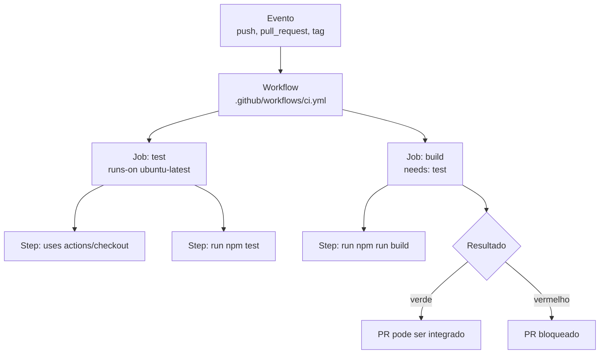
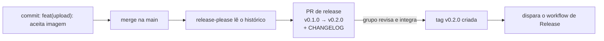

# Referência — GitHub Actions

Página de consulta. Descreve o vocabulário do GitHub Actions, os dois workflows usados no curso — validação de pull request e publicação de release —, a automação de versão e o tratamento de segredos.

O ensino deste tema acontece na [Aula 07](../plano-de-aula/aulas/aula-07-2026-09-21.md). As convenções de tag e versão que disparam estes workflows estão em [Referência — Tags, SemVer e Conventional Commits](versionamento.md).

---

## Anatomia do GitHub Actions

O GitHub Actions executa automações descritas em arquivos YAML dentro de **`.github/workflows/`** no próprio repositório. Seis termos bastam para ler qualquer workflow:

| Termo | O que é |
|-------|---------|
| **Workflow** | Um arquivo `.yml` em `.github/workflows/`. Um repositório pode ter vários |
| **Event** (`on`) | O que dispara: `push`, `pull_request`, `schedule`, `workflow_dispatch` (botão manual) |
| **Job** (`jobs`) | Um bloco de trabalho. Jobs rodam **em paralelo** por padrão; `needs` cria ordem |
| **Step** (`steps`) | Um passo dentro do job: ou `run` (um comando de shell) ou `uses` (uma ação pronta) |
| **Action** (`uses`) | Código reutilizável publicado por alguém, referenciado por versão: `actions/checkout@v7` |
| **Runner** (`runs-on`) | A máquina virtual onde o job roda: `ubuntu-latest`, `windows-latest`, `macos-latest` |



---

## Workflow de CI — validar todo pull request

Este é o workflow de CI. Ele roda a cada PR aberto para a `main` e a cada push na `main`, e o objetivo dele é simples: **impedir que código quebrado entre**.

Arquivo `.github/workflows/ci.yml`:

```yaml
name: CI

on:
  pull_request:
    branches: [main]
  push:
    branches: [main]

permissions:
  contents: read

jobs:
  test:
    runs-on: ubuntu-latest
    steps:
      - name: Baixar o código do repositório
        uses: actions/checkout@v7

      - name: Preparar o ambiente
        uses: actions/setup-node@v7
        with:
          node-version: '24'
          cache: npm

      - name: Instalar dependências
        run: npm ci

      - name: Verificar o estilo do código
        run: npm run lint

      - name: Rodar os testes
        run: npm test

      - name: Construir o projeto
        run: npm run build
```

Para outras stacks, mudam as três primeiras etapas; a estrutura é a mesma:

| Stack | Preparar ambiente | Instalar | Testar |
|-------|-------------------|----------|--------|
| Node.js | `actions/setup-node@v7` | `npm ci` | `npm test` |
| Python | `actions/setup-python@v7` | `pip install -r requirements.txt` | `pytest` |
| .NET | `actions/setup-dotnet@v6` | `dotnet restore` | `dotnet test` |
| Java | `actions/setup-java@v6` | `mvn -B verify -DskipTests` | `mvn test` |

!!! tip "Torne o check obrigatório, senão ele é decorativo"
    Um workflow vermelho não impede o merge sozinho. Em **Settings → Branches → Add branch ruleset**, marque a regra *Require status checks to pass* para a `main` e selecione o job `test`. Sem isso, o pipeline vira enfeite: todo mundo vê o X vermelho e integra assim mesmo.

---

## Workflow de release — publicar quando a tag chega

O disparo não é mais um push qualquer, é **uma tag no formato de versão**.

Arquivo `.github/workflows/release.yml`:

```yaml
name: Release

on:
  push:
    tags:
      - 'v*.*.*'

permissions:
  contents: write     # necessário para criar a release no repositório

jobs:
  release:
    runs-on: ubuntu-latest
    steps:
      - name: Baixar o código, com histórico completo
        uses: actions/checkout@v7
        with:
          fetch-depth: 0     # sem isso o histórico vem cortado e o changelog sai vazio

      - name: Preparar o ambiente
        uses: actions/setup-node@v7
        with:
          node-version: '24'
          cache: npm

      - name: Instalar e construir
        run: |
          npm ci
          npm run build

      - name: Empacotar o artefato
        run: tar -czf produto-${{ github.ref_name }}.tar.gz dist/

      - name: Criar a release no GitHub
        uses: softprops/action-gh-release@v3
        with:
          files: produto-${{ github.ref_name }}.tar.gz
          generate_release_notes: true
```

Três detalhes que fazem esse arquivo funcionar:

- **`tags: ['v*.*.*']`** casa com `v1.2.0` e ignora `v1` ou `rascunho`. É o filtro que garante que só versão de verdade dispara publicação.
- **`${{ github.ref_name }}`** é o nome da tag que disparou o workflow — `v1.2.0`. Use isso para nomear o artefato em vez de digitar a versão à mão.
- **`permissions: contents: write`** é o que autoriza o `GITHUB_TOKEN` a criar a release. Sem isso o job falha no último passo, com erro 403.

E o uso, do lado de quem publica, é de duas linhas:

```bash
git tag -a v0.2.0 -m "Painel da coordenação e filtro por período"
git push origin v0.2.0
```

---

## Automatizar o número da versão

Se o grupo adotar Conventional Commits, dá para não decidir a versão na mão. O **release-please** lê os commits desde a última versão, calcula o próximo número pelas regras do SemVer e **abre um pull request de release** com o `CHANGELOG.md` atualizado. Quando esse PR é integrado, ele cria a tag e a release sozinho.

```yaml
name: Release Please

on:
  push:
    branches: [main]

permissions:
  contents: write
  pull-requests: write

jobs:
  release-please:
    runs-on: ubuntu-latest
    steps:
      - uses: googleapis/release-please-action@v5
        with:
          release-type: simple
```



!!! note "Por que isso é opcional aqui"
    O ganho aparece quando o histórico é disciplinado. Se metade dos commits do grupo for `ajustes` e `update`, a automação calcula versão errada com a mesma confiança com que calcularia certo. Adotem primeiro a convenção de commit; a automação vem depois, quando a convenção já for hábito.

---

## Segredos e permissões

Pipeline precisa de credencial para publicar, e credencial em arquivo versionado é incidente de segurança — inclusive em repositório privado, porque o histórico do Git guarda o que foi apagado.

- **Nunca** coloque token, senha ou chave de API no YAML nem em `.env` versionado.
- Guarde em **Settings → Secrets and variables → Actions**, e use no workflow como `${{ secrets.NOME_DO_SEGREDO }}`.
- O **`GITHUB_TOKEN`** é criado automaticamente a cada execução e expira ao final dela. Para a maior parte dos casos, ele basta — não crie token pessoal sem necessidade.
- Declare **`permissions`** explicitamente, com o mínimo necessário: `contents: read` para CI, `contents: write` só onde publica.
- **Fixe a versão da action** que você usa (`@v7`, e não `@main`): assim uma alteração no repositório de terceiro não muda o comportamento do seu pipeline sem aviso.

!!! danger "Se um segredo vazar"
    Apagar o commit não resolve: o valor já está no histórico e possivelmente em clones e caches. O procedimento é **revogar a credencial na origem** — GitHub, provedor de nuvem, banco — e gerar uma nova. Só depois limpe o histórico.

---
