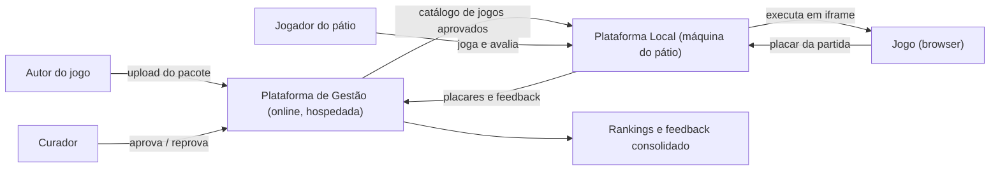
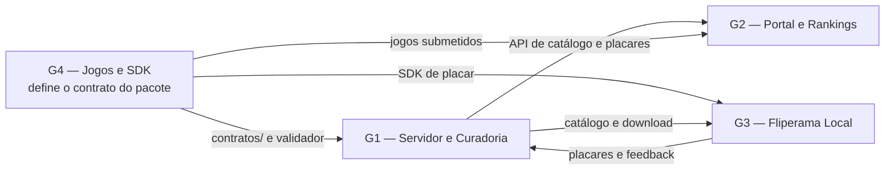
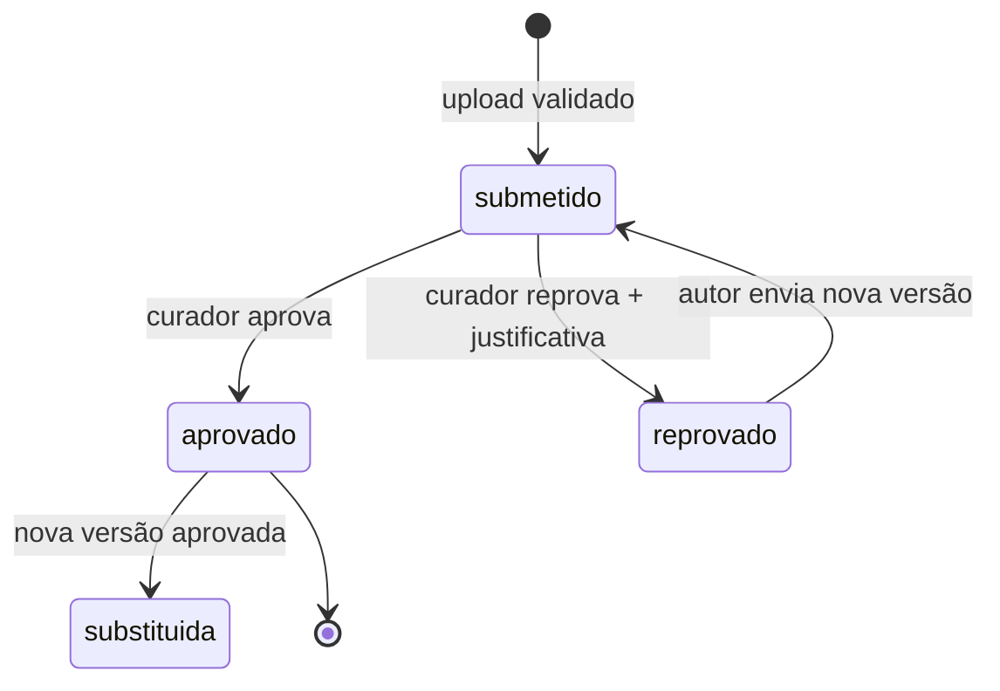
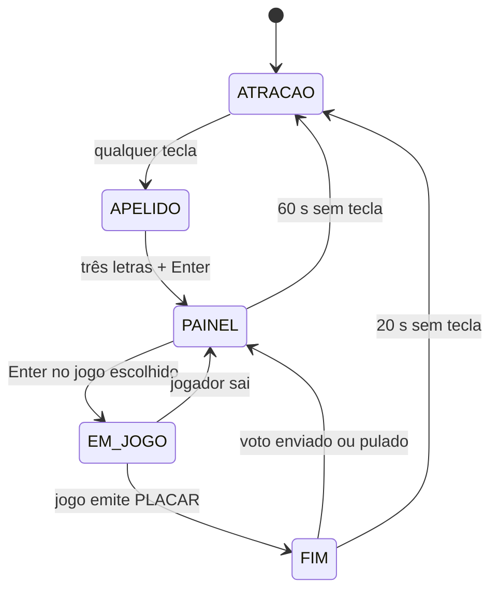
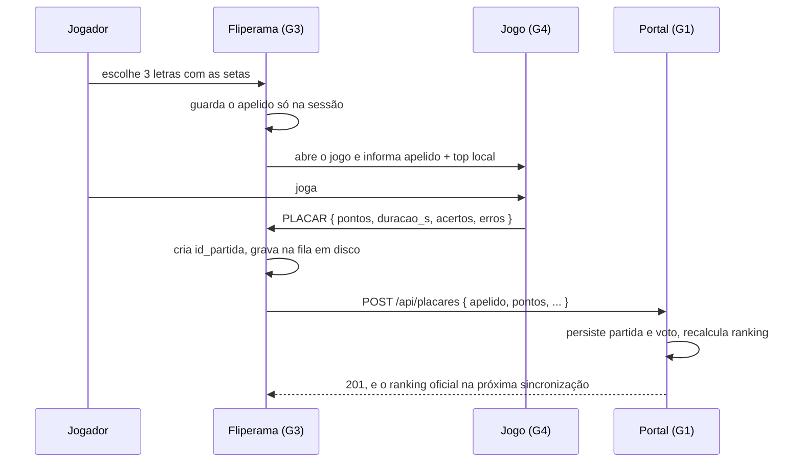

# Recreio Arcade — Especificação do Trabalho

**Data de proposta:** 24/08/2026 | **Horário:** 11h20 às 13h00 | **Local:** Lab 207 | **Modalidade:** Presencial, **sem professor em sala**

**Entregas mensais**, nas quatro apresentações do trabalho: **31/08** projeto · **28/09** ciclo fechando · **26/10** fliperama no pátio · **30/11** acerto das melhorias

[⬇️ Baixar / Copiar Código Fonte da Especificação](https://raw.githubusercontent.com/paulossjunior/aula-extensao/main/docs/trabalho/recreio-arcade.md)

---

## Por que este trabalho

Este é um curso de **extensão**. Extensão não é o software que fica bonito no repositório: é o software que sai da sala e encontra gente que não tem nada a ver com a disciplina.

Esta página é a **especificação do trabalho**: o que construir, com que restrições, em quantas entregas e como cada uma é avaliada.

O produto tem nome, e o nome é o lugar e a hora: **Recreio Arcade** — um fliperama de jogos feitos pela turma, que nasce online e termina ligado no pátio da escola, no horário em que ele enche.

!!! note "O nome é provisório — proponham um melhor"
    "Recreio Arcade" é o nome de trabalho, e a turma pode trocá-lo. Quem quiser propor outro apresenta a proposta junto com a **Entrega 1**, e a régua é a de qualquer marca:

    - **Diz o que é** para quem nunca ouviu falar, sem precisar de explicação;
    - **Cabe na boca** — curto, fácil de falar em voz alta no pátio e de escrever sem erro;
    - **Cabe na tela** — vira logo em pixel art e caber no topo de uma tela de 320×180;
    - **É seu** — não é uma palavra genérica de games nem nome de produto que já existe;
    - **Não assusta a escola** — quem autoriza o computador no pátio precisa ler o nome e ficar tranquilo.

    Nome escolhido pela turma passa a valer no PRD, no protótipo e no repositório. Nome não é enfeite: é a primeira coisa que o jogador lê na tela de atração. E ele tem uma diferença em relação a tudo o que o curso fez até aqui: **não é um produto por grupo, é um produto da turma inteira**, dividido em quatro partes que só valem alguma coisa quando se encaixam.

Até aqui o curso trabalhou problema, protótipo e público — tudo dentro do Lab 207, entre pessoas que sabem o que é um PRD. Este trabalho termina em outro lugar: **um computador no pátio da escola, com o Recreio Arcade rodando e desconhecidos jogando**. Não é uma banca avaliando; é alguém que passou, sentou, jogou e vai embora. Essa pessoa não sabe o que vocês pretendiam. Ela só sabe se funcionou.

É aí que o trabalho fica sério. No pátio ninguém lê README. Se o painel de seleção não se explica em três segundos, a pessoa levanta. Se o jogo não abre na primeira tentativa, ninguém tenta a segunda. Se o nome dela não aparecer no ranking depois da partida, você acabou de perder a única recompensa que o seu produto oferecia. Todo defeito que passaria despercebido em uma demo controlada aparece em dez minutos de pátio.

E a máquina é a que existe, não a que vocês queriam: [**Linux, 4 GB de RAM, 200 GB de disco, teclado velho e uma tela simples**](#restricoes-da-maquina-e-contrato-do-jogo). É o mesmo orçamento de memória com que uma geração inteira de consoles fez história — e é justamente a restrição que obriga a decidir. Quem tem recurso infinito não precisa escolher o que cortar, o que guardar em disco, o que carregar sob demanda. Vocês precisam, e é decidindo isso que se aprende engenharia de software.

E os jogos não são só jogos: cada um **ensina alguma coisa**. Um clássico relido em pixel art, em que o poder do chefe só cai se a pessoa acertar uma questão de história, e a conta que ela odeia fazer no caderno vira o que separa ela da próxima fase. É extensão em estado bruto — a escola inteira passa pelo pátio, e o que fica na tela é conteúdo dela.

O que vocês vão levar para 31/08 não é um print de tela. É **o que aconteceu quando gente de verdade jogou**: quantos jogaram, onde travaram, o que pediram, o que vocês mudariam. Esse é o ciclo completo de um produto de extensão — especificar, prototipar, construir, publicar, colocar na frente das pessoas e ouvir — em três semanas e em escala pequena o bastante para caber inteiro na cabeça da turma.

!!! quote "A régua do trabalho"
    Uma pessoa que nunca ouviu falar de vocês jogou, se divertiu, e o apelido dela está no ranking. Se isso aconteceu, o ciclo inteiro funcionou — e funcionou com código de quatro grupos diferentes: upload, curadoria, download, execução, medição e feedback.

---

## O que construir

O **Recreio Arcade** é uma plataforma de games em duas partes que conversam entre si:

- uma **plataforma de gestão**, online e hospedada, que recebe os jogos, aprova ou reprova, guarda os rankings e o feedback;
- uma **plataforma local**, instalada na máquina onde se joga, que baixa os jogos aprovados, oferece um painel de seleção, executa o jogo e devolve placar e feedback para o site.



O **contrato entre as partes** é o coração do trabalho: gestão e plataforma local podem ser feitas em linguagens diferentes, por pessoas diferentes, desde que respeitem o mesmo formato de pacote, a mesma API e o mesmo protocolo de placar.

---

## As quatro entregas mensais

O trabalho acompanha o ritmo do curso: **uma entrega por mês, na apresentação da última segunda-feira**, nas datas que o [Cronograma](../cronograma/cronograma.md) já reserva para isso.

| | **E1 — Seg, 31/08** | **E2 — Seg, 28/09** | **E3 — Seg, 26/10** | **E4 — Seg, 30/11** |
|---|---|---|---|---|
| **O que é** | Projeto | O ciclo fechando | O fliperama no pátio | Acerto das melhorias |
| **Estado do produto** | Especificado e prototipado | Funcionando fim a fim e **no ar** | Testado com gente de verdade | Corrigido e documentado |
| **Entregáveis** | PRD · protótipo no Figma Maker · stack com exemplos que rodam | Quatro partes integradas · gestão em produção · **um jogo** completo · placar chegando ao ranking | Campo no pátio · votos e rankings · **dois jogos** · relatório de campo | Correções do que o campo apontou · documentação final |
| **Requisito novo?** | Sim | Sim | Sim | **Nenhum** |
| **Como se apresenta** | Clicando o protótipo e rodando os quatro exemplos | Demo do ciclo completo na máquina-alvo | Demo com os números do campo | O antes e o depois de cada correção |

!!! abstract "Por que essa ordem"
    O curso defende a mesma sequência sempre: entender, especificar, prototipar, construir, medir, corrigir. As quatro entregas são exatamente isso, uma por mês. **E1** evita construir no escuro. **E2** prova que as quatro partes se encaixam antes de qualquer plateia. **E3** submete o produto a quem não tem obrigação de gostar dele. **E4** é o mês de fazer o que o campo mandou.

!!! tip "A Entrega 4 não aceita requisito novo"
    A última entrega é **só acerto**: o que o pátio, o professor e a turma apontaram nas apresentações anteriores. Nada de funcionalidade nova em novembro — quem deixar requisito obrigatório para a E4 chega em dezembro com produto inacabado e sem tempo de arrumar.

    A melhor forma de provar que a correção funcionou é **voltar ao pátio uma segunda vez**, em novembro. Não é obrigatório, mas é o que separa "corrigimos" de "está corrigido".

---

## Entrega 1 — PRD, Protótipo e Stack

Vence em **segunda, 31/08/2026**, e é o que a turma apresenta nesse dia.

| ID | Requisito da Entrega 1 | Grupo |
|----|-------------------------|-------|
| **RE-01** | **PRD do Recreio Arcade** completo, nas seis seções do [Template de PRD](../modelos/prd-template.md): problema, público-alvo, soluções existentes, concorrentes, indicadores de sucesso e oportunidade | **Turma** |
| **RE-02** | **Protótipo funcionando** da plataforma de gestão no Figma Maker, com as seis telas de [Telas](#telas-layout-no-figma-maker) navegáveis entre si | **G2** |
| **RE-03** | **Protótipo funcionando** do fliperama local no Figma Maker, com as sete telas navegáveis, incluindo o mapa de teclas | **G3** |
| **RE-04** | Dois **fluxos clicáveis de ponta a ponta**: submissão → validação → aprovação → catálogo, e atração → três letras → painel → jogo → placar → voto | **G2 · G3** |
| **RE-05** | **Proposta de stack com exemplo que roda** para cada camada — não basta nomear a ferramenta, é preciso mostrá-la funcionando | **Todos** |
| **RE-06** | Identidade visual do fliperama: **uma tela de jogo em pixel art**, dentro das regras de RJ-11, e uma questão de exemplo com fonte | **G4** |
| **RE-07** | `ARQUITETURA.md` com os contratos fechados em plenária — pacote, API, placar e feedback | **Turma** |

### Os exemplos que precisam rodar (RE-05)

Um por camada, mínimo, feio e funcionando. É a prova de que a stack escolhida não é chute:

| Grupo | Exemplo mínimo | Prova o quê |
|-------|----------------|-------------|
| **G1** | Endpoint `GET /api/jogos?status=aprovado` devolvendo dois jogos de mentira, mais o upload de um `.zip` que responde o motivo da rejeição | Que o servidor sobe, recebe arquivo e fala o contrato |
| **G2** | Uma tela real consumindo esse endpoint e listando o catálogo | Que o portal conversa com a API, e não com um JSON colado no código |
| **G3** | Página que abre um jogo em `<iframe sandbox>` e imprime na tela o `postMessage` de placar recebido | Que o protocolo de placar funciona antes de existir jogo |
| **G4** | Esquema Zod do `game.json` **rejeitando** um pacote inválido, e uma cena com um sprite se movendo pelas setas que emite `PLACAR` ao terminar | Que o contrato é código e que o jogo cabe na engine escolhida |

!!! tip "Exemplo que roda vale mais que tabela de stack"
    A tabela de [Proposta de Stack](#proposta-de-stack) é ponto de partida, não resposta. O que a turma apresenta em 31/08 é a stack **testada nos quatro pontos mais arriscados**: upload de arquivo, consumo de API, `postMessage` entre iframe e página, e engine de jogo dentro do orçamento. Se algum desses quatro não rodar até 31/08, a stack está errada e ainda dá tempo de trocar.

---

## Entrega 2 — O Ciclo Fechando

Vence em **segunda, 28/09/2026**. É a construção do que a Entrega 1 especificou, com uma régua única: **o ciclo tem de fechar sem intervenção manual**.

| ID | Requisito da Entrega 2 | Grupo |
|----|-------------------------|-------|
| **RE-08** | Submissão, validação e curadoria funcionando: RF-G01 a RF-G05 e RF-G09 | **G1 · G2** |
| **RE-09** | Plataforma de gestão **publicada em produção**, com URL pública (RF-G11) | **G1** |
| **RE-10** | Fliperama sincronizando, executando e devolvendo placar: RF-L01 a RF-L08 | **G3** |
| **RE-11** | **Um jogo completo** cumprindo RJ-01 a RJ-17, com banco de 20 questões | **G4** |
| **RE-12** | Ranking de jogadores recebendo pontos de partida jogada no fliperama (RF-G06, RF-G07) | **G1 · G2** |
| **RE-13** | Teste de queda de rede: partida jogada offline com placar reenviado depois, sem duplicar | **G3 · G1** |

!!! warning "O que 'sem intervenção manual' quer dizer"
    Nada de inserir linha no banco na hora da demo, nada de copiar o `.zip` na mão para a máquina do pátio, nada de ajustar JSON com editor de texto. Se o caminho precisa de alguém digitando comando para funcionar, ele não fecha — e em outubro, no pátio, não vai ter ninguém disponível para digitar.

---

## Entrega 3 — O Fliperama no Pátio

Vence em **segunda, 26/10/2026**, e é a entrega em que o produto encontra o público.

| ID | Requisito da Entrega 3 | Grupo |
|----|-------------------------|-------|
| **RE-14** | **Campo cumprido** no pátio da escola entre **06 e 16/10**, atendendo RF-P01 a RF-P08 | **Turma** |
| **RE-15** | **Dois jogos** educativos de gêneros diferentes no catálogo, ambos jogados no campo | **G4** |
| **RE-16** | Voto do jogador e **ranking de jogos** completos: RF-L07, RF-G10, RF-G13, RF-G14 | **G1 · G2 · G3** |
| **RE-17** | Kiosk blindado e operação sem operador: RF-L09, RF-L11 a RF-L15 | **G3** |
| **RE-18** | Catálogo exibindo tema, nível e taxa de acerto por tema (RF-G12) | **G2** |
| **RE-19** | `docs/campo.md`: números, votos, comentários, onde as pessoas travaram e as **três mudanças** que a turma faria | **Turma** |

---

## Entrega 4 — Acerto das Melhorias

Vence em **segunda, 30/11/2026**. **Não entra requisito novo.** O mês é para transformar o que o campo apontou em produto corrigido.

| ID | Requisito da Entrega 4 | Grupo |
|----|-------------------------|-------|
| **RE-20** | As **três mudanças** de `docs/campo.md` implementadas — ou justificadas por escrito, se a turma decidiu não fazer | **Turma** |
| **RE-21** | Pendências das apresentações de 28/09 e 26/10 fechadas, item por item | **Turma** |
| **RE-22** | Documentação final coerente com o que o código faz: `README.md`, `ARQUITETURA.md`, `docs/stack.md` e o PRD atualizado | **Turma** |
| **RE-23** | Recomendado: **segunda rodada de campo** em novembro, comparando os números com os de outubro | **Turma** |

!!! tip "O antes e o depois é a apresentação"
    Em 30/11 não se apresenta funcionalidade: apresenta-se **evidência de correção**. Para cada uma das três mudanças, mostre o que acontecia antes, o que acontece agora e, se voltaram ao pátio, o que mudou no número.

---

## Divisão da Turma — Quatro Grupos

A turma se divide em **quatro grupos**, cada um dono de uma parte do Recreio Arcade. Ninguém entrega o produto sozinho e ninguém pode esconder atraso: a parte que falta aparece na hora da integração.

| Grupo | Parte do Recreio Arcade | Do que é dono | Requisitos |
|-------|---------------------|---------------|------------|
| **G1 — Servidor e Curadoria** | Núcleo da plataforma de gestão | API, banco, recepção do pacote, estados de aprovação, endpoints de catálogo, placares e votos, **publicação em produção** | RF-G01 a RF-G06, RF-G09, RF-G11, RF-G13, RF-G14 |
| **G2 — Portal e Rankings** | Interface web da gestão | Catálogo público, tela de envio, fila de moderação, ranking de jogadores e ranking de jogos por votos, exibição do feedback | RF-G01, RF-G04, RF-G07, RF-G08, RF-G10, RF-G12, RF-G14 |
| **G3 — Fliperama Local** | Plataforma local do pátio | Sincronização, cache em disco, painel de seleção, execução do jogo, captura de placar e voto, fila de reenvio, kiosk blindado | RF-L01 a RF-L15 |
| **G4 — Jogos e SDK** | Contratos e conteúdo | Pacote `contratos/` (tipos e validação), SDK de placar usado pelos jogos, validador de pacote e **pelo menos dois jogos educativos em pixel art** | RJ-01 a RJ-17, apoio em RF-G02 e RF-L06 |



### Regras de integração

- **O contrato é decidido em plenária, não por um grupo.** Na Tarefa 1 os quatro grupos fecham juntos o formato do pacote, a API, o placar e o feedback. G4 escreve isso como código no pacote `contratos/`.
- **Mudança de contrato não é unilateral.** Quem precisar mudar avisa os outros três antes de fazer o commit. Contrato alterado sem aviso é o defeito mais caro desta semana.
- **Cada grupo entrega mock do que ainda não existe.** G2 não espera a API de G1: consome dados falsos com os tipos do contrato até a API subir. Mesma coisa para G3 com os jogos de G4.
- **Checkpoint de integração na terça 01/09.** Meia hora da primeira sessão EaD depois da Entrega 1 é para juntar as quatro partes, não para cada um seguir na sua. Na EaD de 25/08 o alvo é outro: fechar protótipo, PRD e os exemplos da stack.
- **O campo é da turma.** No pátio, os quatro grupos estão presentes: um opera, os outros observam e anotam.

!!! danger "O risco real desta divisão"
    Quatro partes que funcionam isoladas e não funcionam juntas valem zero no pátio. A pergunta que cada grupo deve responder na terça não é "a minha parte está pronta?", e sim **"a parte do outro conversa com a minha?"**.

---

## Componente A — Plataforma de Gestão (online)

Aplicação web **hospedada e acessível pela internet** — não roda em `localhost`.

| ID | Requisito | Grupo |
|----|-----------|-------|
| **RF-G01** | Permitir que um **autor** faça upload de um jogo como pacote `.zip`, informando nome, descrição, autores e controles | **G1 · G2** |
| **RF-G02** | Validar o pacote no upload: existe `index.html` na raiz, existe `game.json` válido e o `.zip` tem **até 20 MB** (RJ-03). Pacote inválido é rejeitado com a **mensagem do motivo** | **G1 (+G4)** |
| **RF-G03** | Manter o jogo em um dos estados **`submetido`**, **`aprovado`** ou **`reprovado`**, com histórico de quem mudou o estado e quando | **G1** |
| **RF-G04** | Oferecer ao **curador** uma fila de moderação com **preview jogável** antes de decidir, exigir justificativa na reprovação e permitir reprovar por **conteúdo**, seguindo os [critérios de curadoria](#curadoria-criterios-para-aprovar-ou-reprovar-um-jogo) | **G1 · G2** |
| **RF-G05** | Publicar o **catálogo de jogos aprovados** e o download do pacote via API, para consumo da plataforma local | **G1** |
| **RF-G06** | Receber placares enviados pela plataforma local e armazená-los por jogador, jogo e partida | **G1** |
| **RF-G07** | Exibir o **ranking de jogadores**: geral e por jogo | **G1 · G2** |
| **RF-G08** | Exibir o **ranking de jogos**, ordenado pelos **votos dos jogadores** combinados com partidas jogadas e jogadores distintos, com a métrica **documentada e explicada na tela** | **G1 · G2** |
| **RF-G09** | Aceitar **nova versão** de um jogo já publicado; a versão nova entra como `submetido` e não derruba a versão aprovada em uso | **G1** |
| **RF-G10** | Receber e exibir o **feedback dos jogadores** coletado no pátio, agregado por jogo: nota média, número de avaliações e comentários | **G1 · G2** |
| **RF-G11** | Estar **publicada em ambiente de produção**, com URL pública informada no `README.md` | **G1** |
| **RF-G12** | Exibir no catálogo o **tema, o nível de ensino e o clássico de referência** de cada jogo, e a **taxa de acerto** por tema recebida dos placares | **G1 · G2** |
| **RF-G13** | Registrar o **voto do jogador** em cada jogo: um voto por jogador por jogo, o último substituindo o anterior, e **recusar voto que não venha de uma partida jogada** | **G1** |
| **RF-G14** | Calcular o ranking de jogos de modo que **jogo com poucos votos não lidere** — mínimo de votos ou média ponderada —, exibindo quantos votos cada jogo tem | **G1 · G2** |
| **RF-G15** | **Impedir que o autor decida sobre a própria submissão**: a curadoria de um jogo é sempre de alguém de outro grupo | **G1 · G2** |

!!! warning "Reprovar é requisito, não detalhe"
    A parte mais fácil de esquecer é o caminho negativo: pacote quebrado, jogo que não abre, jogo reprovado que **não pode** aparecer no catálogo. Se o catálogo público listar um jogo `submetido`, o requisito RF-G05 está furado.

### Detalhamento do Portal (G1 e G2)

**Fronteira.** O portal é a **única fonte de verdade**: só ele persiste jogo, versão, partida, voto e ranking. Ele não executa jogo — exceto o preview de curadoria, em iframe — e não sabe nada sobre teclado, tela ou pátio.

#### Módulos internos

| Módulo | Responsabilidade | Dono |
|--------|------------------|------|
| **Recepção de pacote** | Receber o `.zip`, validar com o validador de `contratos/`, extrair o `game.json` e guardar o arquivo | G1 |
| **Repositório de pacotes** | Guardar um arquivo por jogo + versão e servi-lo para download | G1 |
| **Curadoria** | Fila, preview jogável, decisão com justificativa, histórico | G1 · G2 |
| **Catálogo** | Publicar os aprovados com metadados e agregados | G1 · G2 |
| **Ingestão de partidas** | Receber placar e voto, autenticar a estação, garantir idempotência | G1 |
| **Rankings** | Calcular ranking de jogadores e de jogos | G1 |
| **Portal público** | Catálogo, detalhe do jogo, rankings, tela de envio | G2 |
| **Painel do curador** | Fila de moderação e decisão | G2 |

#### Modelo de dados mínimo

| Entidade | Campos | Regras |
|----------|--------|--------|
| **jogo** | `id` (slug), `nome`, `descricao`, `classico_referencia`, `mecanica`, `tema`, `nivel`, `autores[]`, `criado_em` | `id` único; vem do `game.json` |
| **versao** | `id`, `jogo_id`, `versao` (semver), `arquivo`, `tamanho_bytes`, `estado`, `submetido_em`, `decidido_em`, `decidido_por`, `justificativa` | Uma versão `aprovada` por jogo é a **vigente** |
| **estacao** | `id`, `nome`, `token_hash`, `ultima_sync` | Identifica o fliperama que envia partidas |
| **partida** | `id_partida` (UUID, chave), `jogo_id`, `versao_id`, `jogador` (3 letras), `pontos`, `duracao_s`, `acertos`, `erros`, `tema`, `jogado_em`, `recebido_em`, `estacao_id` | `id_partida` repetido é **descartado**, não duplicado |
| **voto** | `partida_id`, `jogo_id`, `jogador`, `nota` (1–5), `comentario`, `criado_em` | Único por (`jogo_id`, `jogador`): o novo substitui o anterior |
| **evento_curadoria** | `id`, `versao_id`, `de_estado`, `para_estado`, `quem`, `quando`, `justificativa` | Append-only: é o histórico de RF-G03 |

#### Estados da versão de um jogo



Só versão `aprovada` aparece no catálogo e é baixável. Aprovar a versão 1.1 **não apaga** a 1.0: ela passa a `substituida` e continua servível, para o fliperama não perder o jogo em uso (RF-G09).

#### API

| Método | Rota | Autenticação | Resposta |
|--------|------|--------------|----------|
| `POST` | `/api/jogos` | autor | Recebe `multipart` com o `.zip`; `201` com o jogo criado em `submetido`, ou `422` com a lista de erros |
| `GET` | `/api/jogos?status=aprovado` | pública | Catálogo: `id`, `nome`, `versao`, `autores`, `tema`, `nivel`, `controles`, `capa`, `tamanho_bytes`, `sha256`, `nota_media`, `votos` |
| `GET` | `/api/jogos/{id}` | pública | Detalhe: versões, estado, comentários, nota, taxa de acerto por tema |
| `GET` | `/api/jogos/{id}/pacote?versao=` | pública | O `.zip`, com `ETag` e `sha256` no cabeçalho |
| `POST` | `/api/versoes/{id}/decisao` | curador | `{decisao: "aprovado"\|"reprovado", justificativa}`; `409` se já decidida |
| `POST` | `/api/placares` | **token da estação** | Placar + voto; `201` se novo, `200` se `id_partida` já conhecido — nunca duplica |
| `GET` | `/api/ranking/jogadores?jogo=` | pública | Posição, apelido, pontos, jogo |
| `GET` | `/api/ranking/jogos` | pública | Posição, jogo, nota, **contagem de votos**, partidas, jogadores distintos |
| `POST` | `/api/estacoes` | curador | Cadastra um fliperama e devolve o **token uma única vez** — o servidor guarda só o hash |
| `GET` | `/api/estacoes` | curador | Lista estações com nome e data da última sincronização, sem expor token |

!!! warning "Erro de validação precisa dizer o que fazer"
    `422` com "pacote inválido" não ensina nada a quem submeteu. A resposta traz um código e uma frase acionável — a mesma lista que o validador de `contratos/` produz:

    | Código | Quando | Mensagem ao autor |
    |--------|--------|-------------------|
    | `SEM_INDEX` | não há `index.html` na raiz | "O `.zip` precisa ter `index.html` na raiz, e não dentro de uma pasta." |
    | `MAIS_DE_UM_HTML` | há outro arquivo `.html` no pacote | "O jogo precisa caber em um único `index.html`; encontrei também `{arquivo}`." |
    | `SEM_MANIFESTO` | não há `game.json` | "Falta o `game.json` na raiz do pacote." |
    | `MANIFESTO_INVALIDO` | campo obrigatório ausente | "O campo `{campo}` do `game.json` está ausente ou inválido." |
    | `PACOTE_GRANDE` | acima de 20 MB | "O pacote tem {tamanho}; o limite é 20 MB." |
    | `POUCAS_QUESTOES` | menos de 20 questões | "O banco tem {n} questões; o mínimo é 20." |
    | `QUESTAO_SEM_FONTE` | questão sem `fonte` | "A questão `{id}` está sem fonte." |
    | `ID_EM_USO` | `id` de outro autor | "Já existe jogo com o id `{id}`." |

#### Como cada ranking é calculado

**Ranking de jogadores.** Por jogo, vale a **melhor partida** de cada apelido — não a soma, senão quem joga muito ganha de quem joga bem. No geral, soma-se a melhor partida de cada jogo, o que premia quem circula pelo catálogo em vez de repetir o mesmo jogo.

**Ranking de jogos.** Combina nota e volume, de modo que jogo pouco votado não lidere (RF-G14). A média ponderada resolve com uma linha:

```text
nota_ajustada = (v / (v + m)) * R  +  (m / (v + m)) * C

v = votos do jogo        R = nota média do jogo
m = mínimo de votos      C = nota média de todos os jogos
    (sugestão: 5)
```

Com `m = 5`, um jogo com **um voto 5** fica em 4,08 e perde de um com **quarenta votos 4,8**, que fica em 4,72. Empate se desfaz por jogadores distintos, depois por partidas. A tela mostra nota, `v` e a explicação da fórmula.

#### Fora do escopo do portal

Executar jogo em produção, guardar qualquer dado pessoal além do apelido de três letras, decidir mapeamento de teclas e saber o que é o pátio.

### O voto e o ranking de jogos

Há **dois rankings** no Recreio Arcade, e eles medem coisas diferentes:

| Ranking | O que ordena | De onde vem |
|---------|--------------|-------------|
| **Ranking de jogadores** | Quem joga melhor | Pontos do placar de cada partida |
| **Ranking de jogos** | Quais jogos a escola gostou | **Votos dos jogadores**, mais partidas e jogadores distintos |

O voto é dado **ao fim da partida**, no próprio fliperama (RF-L07): nota de 1 a 5 e comentário opcional, puláveis. Quem jogou vota; quem não jogou não opina.

- **Um voto por jogador por jogo.** Votar de novo substitui o voto anterior, não soma outro.
- **Voto sem partida não conta.** O `id_partida` é o comprovante: sem ele, o servidor recusa (RF-G13).
- **Voto é anônimo por apelido**, como o ranking — nada de dado pessoal.

!!! question "Decisão pendente — ranking por pessoa ou por partida?"
    O apelido tem **três letras e nenhuma senha**: em um pátio de escola, duas pessoas escolhendo `ABC` é questão de minutos. Isso afeta duas regras desta especificação, que hoje tratam o apelido como identidade de pessoa: "melhor partida **de cada jogador**" e "um voto por **jogador** por jogo".

    Há dois caminhos, e o professor decide antes de 24/08:

    | Caminho | Como fica |
    |---------|-----------|
    | **Por partida** (tradição arcade) | O ranking é uma lista das **melhores partidas**, e cada partida carrega um voto. Colisão de apelido deixa de ser problema, e a regra de "voto que substitui o anterior" desaparece |
    | **Por pessoa** | O apelido passa a ser identidade, e o sistema precisa de algo que o torne único — apelido mais um PIN de quatro dígitos, por exemplo |

    Até a decisão, vale o **por partida**: é o que exige menos do jogador no pátio.

!!! danger "Média simples produz ranking mentiroso"
    Um jogo com **um voto 5** ficaria na frente de um jogo com **quarenta votos 4,8** — e o primeiro lugar do recreio seria decidido pelo amigo do autor. Ordenação por média crua é o erro clássico de sistema de votos.

    A saída é tratar volume junto com nota: **mínimo de votos** para entrar no ranking, ou **média ponderada** que puxa jogo pouco votado para a média geral até ele juntar votos. Qualquer uma das duas serve, desde que o grupo **explique a escolha na própria tela** e mostre a contagem de votos ao lado da nota (RF-G14).

---

## Componente B — Plataforma Local

Aplicação que roda na máquina do pátio — com as restrições da seção seguinte.

| ID | Requisito | Grupo |
|----|-----------|-------|
| **RF-L01** | Sincronizar com a plataforma de gestão: baixar **todos** os pacotes aprovados e guardá-los descompactados em **cache local** no disco — com 200 GB, o catálogo inteiro cabe | **G3** |
| **RF-L02** | Funcionar **sem internet** depois da sincronização: os jogos já baixados continuam jogáveis | **G3** |
| **RF-L03** | Apresentar um **painel de seleção** com os jogos disponíveis: nome, autores, controles e capa, com busca ou filtro | **G3** |
| **RF-L04** | Identificar o jogador por **três letras escolhidas com as setas**, à moda dos fliperamas — sem digitação livre, sem senha e sem dado pessoal | **G3** |
| **RF-L05** | **Executar o jogo** a partir do cache local, em tela cheia, com saída visível para voltar ao painel | **G3** |
| **RF-L06** | Capturar o **placar ao fim da partida** pelo protocolo de [Contrato de Mensagens](#contrato-de-mensagens-entre-fliperama-e-jogo) | **G3 (+G4)** |
| **RF-L07** | Pedir o **voto do jogador ao fim da partida**: nota de 1 a 5 e comentário opcional, ambos puláveis com **uma tecla**, enviados junto do placar | **G3** |
| **RF-L08** | Enviar placares e votos para a plataforma de gestão e manter **fila local de reenvio** em disco para quando a rede estiver fora — sem duplicar registro já enviado | **G3 (+G1)** |
| **RF-L09** | Voltar ao painel sozinho depois de um tempo sem interação, pronta para o próximo jogador — o pátio não tem operador | **G3** |
| **RF-L10** | Encerrar o jogo de forma limpa ao sair, liberando memória antes de abrir o próximo | **G3** |
| **RF-L11** | Ser operável **100% por teclado**, sem mouse: navegação por setas e Enter, com foco sempre visível na tela | **G3** |
| **RF-L12** | **Blindar o kiosk**: nenhum atalho de teclado pode fechar a aba, sair da tela cheia, trocar de janela ou revelar o sistema | **G3** |
| **RF-L13** | Oferecer **mapa visual das teclas** na tela de atração e **remapeamento** para quando uma tecla do teclado velho estiver morta | **G3** |
| **RF-L14** | Funcionar em **1024×768** e em tela 4:3, com contraste alto — a tela do pátio é simples e pega luz | **G3** |
| **RF-L15** | Manter **em disco, em arquivos JSON**, o que não pode viver na RAM: pacotes descompactados, fila de placares e votos, histórico de partidas e o **log da sessão de campo** — com escrita atômica, para não corromper se a máquina for desligada na tomada | **G3** |
| **RF-L16** | Entregar ao jogo, pelo SDK e **somente para leitura**, o apelido da sessão e as melhores pontuações daquele jogo — para o jogo poder mostrar a tela de recordes sem guardar nada | **G3** |
| **RF-L17** | Manter **em disco, em JSON**, o histórico de partidas daquela máquina — inclusive as ainda não enviadas — e a cópia do ranking oficial da última sincronização, calculando o ranking local a partir deles | **G3** |
| **RF-L18** | Exibir ranking **mesmo sem rede**, deixando claro na tela se é o **oficial** (com a data da última sincronização) ou o **desta máquina** | **G3** |
| **RF-L19** | **Subir sozinho no boot** da máquina, já na tela de atração: ligar na tomada tem de ser suficiente para o fliperama funcionar | **G3** |
| **RF-L20** | Ler de um **arquivo de configuração** a URL do portal, o token da estação (emitido em `POST /api/estacoes`) e o intervalo de sincronização — nada disso fica escrito no código nem chega ao browser do jogador | **G3** |
| **RF-L21** | Oferecer uma **tela de diagnóstico**, aberta por combinação de teclas conhecida só pela turma: estado da rede, última sincronização, pendências na fila e espaço em disco | **G3** |
| **RF-L22** | Encerrar por conta própria **jogo que não abre** em 15 segundos ou **partida que passa de 5 minutos**, voltando ao painel e registrando o motivo no log | **G3** |
| **RF-L23** | Ter **mudo global**, ligado por uma tecla e lembrado entre partidas — o pátio pode exigir silêncio a qualquer momento | **G3** |
| **RF-L24** | Mostrar **erro em linguagem de jogador**: nada de mensagem técnica, código de exceção ou tela em branco na frente de quem passou no pátio | **G3** |
| **RF-L25** | **Exportar o relatório da sessão** em JSON e CSV — partidas, votos, abandonos e duração —, que é o insumo do `docs/campo.md` da Entrega 3 | **G3** |

!!! tip "A fila de reenvio é o que separa demo de produto"
    O pátio provavelmente não tem Wi-Fi confiável. Placar e voto perdidos por queda de rede são o bug mais provável desta entrega — e o mais fácil de evitar guardando local e reenviando por `id_partida`.

### Detalhamento do Fliperama Local (G3)

**Fronteira.** O fliperama é dono da **sessão e do teclado**, e nunca é fonte de verdade: ele acumula e envia. Se o servidor discordar dele, o servidor está certo. Precisa funcionar com a tomada como única dependência garantida.

#### Módulos internos

| Módulo | Responsabilidade |
|--------|------------------|
| **Sincronizador** | Comparar catálogo remoto com o local, baixar o que falta, verificar `sha256`, descompactar |
| **Armazém em disco** | Guardar pacotes descompactados, versões anteriores, fila e logs (RF-L15) |
| **Índice local** | **Arquivos JSON** em disco: catálogo disponível, partidas, ranking oficial, fila e mapa de teclas |
| **Runner** | Abrir o jogo em `<iframe sandbox>`, servi-lo do disco, matá-lo ao sair |
| **Sessão** | Máquina de estados da experiência: atração, apelido, painel, jogo, fim |
| **Captura de placar** | Ouvir `postMessage`, **validar a origem**, montar a partida com `id_partida` |
| **Fila de envio** | Persistir, tentar enviar, aplicar espera crescente, marcar enviado |
| **Teclado** | Normalizar teclas, ignorar auto-repeat, aplicar remapeamento |
| **Supervisor kiosk** | Impedir saída, reabrir em caso de queda, voltar à atração por inatividade |
| **Log de sessão** | Registrar eventos do campo em `jsonl`, para o relatório da Entrega 3 |

#### Máquina de estados da sessão



Nenhum estado exige operador: todo caminho volta sozinho para ATRAÇÃO (RF-L09). O apelido é descartado ao voltar para a atração — o próximo jogador não herda a identidade do anterior.

#### Layout em disco

```text
/var/lib/recreio-arcade/
├── jogos/<jogo-id>/<versao>/       # pacote já descompactado, pronto para servir
├── catalogo.json                   # jogos disponíveis, versão e sha256
├── partidas.jsonl                  # uma partida por linha, append-only
├── ranking-oficial.json            # cópia do ranking do portal + data da sincronização
├── teclas.json                     # mapeamento de teclas, com remapeamentos
├── fila/<id_partida>.json          # uma pendência por arquivo
├── enviadas/<id_partida>.json      # pendência confirmada, movida para cá
└── logs/sessao-AAAA-MM-DD.jsonl    # eventos do campo
```

!!! warning "JSON em disco tem duas regras, e as duas evitam corrupção"
    A máquina do pátio pode ser desligada na tomada no meio de uma escrita. Então:

    **1. Estado se escreve com arquivo temporário e rename.** Nunca abra `catalogo.json` e escreva por cima: escreva `catalogo.json.tmp` e renomeie ao final. Rename no mesmo disco é atômico — ou vale o arquivo antigo inteiro, ou o novo inteiro, nunca metade dos dois.

    **2. Histórico se escreve acrescentando linha.** `partidas.jsonl` é **JSON Lines**: uma partida por linha, só append, sem reescrever o arquivo. Queda de energia estraga no máximo a última linha, e uma linha ilegível é descartada na leitura.

    Fila usa **um arquivo por partida**: criar é atômico, confirmar é mover para `enviadas/`. Nada de reescrever uma lista inteira a cada envio.

#### Sincronização, passo a passo

1. `GET /api/jogos?status=aprovado`; se a rede falhar, seguir com o que está em disco e avisar na tela de sincronização.
2. Comparar por (`jogo`, `versao`): baixar só o que falta.
3. Conferir o `sha256` do `.zip`; pacote com hash diferente é descartado.
4. Descompactar em pasta temporária e **renomear ao final** — assim o jogo nunca aparece no painel pela metade.
5. Marcar disponível no índice. **Nunca apagar** a versão anterior nem um jogo em execução.

#### Ranking em disco

O fliperama **guarda ranking**, e isso não conflita com o portal ser a fonte de verdade — são dois arquivos com papéis diferentes:

| Arquivo | O que guarda | Para que serve |
|---------|--------------|----------------|
| `partidas.jsonl` | Toda partida jogada nesta máquina, uma por linha: apelido, jogo, pontos, acertos, se já foi enviada | Ranking na hora, sem depender de rede, e histórico da sessão de campo |
| `ranking-oficial.json` | Cópia do ranking que o portal devolveu na última sincronização, com a data | Mostrar a posição real, que inclui partidas de outras máquinas |

```json
// uma linha de partidas.jsonl
{"id_partida":"e3c1a0f2-...","jogo":"invasores-do-lab-207","jogador":"ANA","pontos":1840,
 "duracao_s":96,"acertos":4,"erros":2,"tema":"História do Brasil","jogado_em":"2026-10-14T14:02:11Z",
 "voto":{"nota":4,"comentario":"faltou explicar o controle"},"enviada":false}
```

O **ranking local não é um arquivo**: é calculado ao subir, lendo `partidas.jsonl` e agrupando por apelido. São poucos dados — uma sessão de campo produz umas 20 linhas de ~250 bytes, e 10.000 partidas ocupariam 2,5 MB —, então recalcular é mais simples e mais seguro do que manter um ranking salvo que pode divergir do histórico.

**Como as duas convivem sem inflar número:**

- A partida é acrescentada a `partidas.jsonl` **e** criada em `fila/`, no mesmo instante.
- Enviada e confirmada, o arquivo sai de `fila/` para `enviadas/` — a linha continua no histórico, agora contada no oficial.
- Ao receber o ranking oficial, o fliperama **substitui** a cópia; nunca soma o oficial com o local, senão a mesma partida conta duas vezes.
- Na tela, partida ainda não enviada aparece com marca de pendente. Melhor mostrar "pendente" do que mentir que já valeu.

!!! tip "O disco de 200 GB é o que torna isso barato"
    Guardar todas as partidas do campo em disco custa alguns megabytes e resolve três coisas de uma vez: ranking funcionando offline, tela de recordes para os jogos (RF-L16) e o histórico que alimenta o relatório da Entrega 3 sem precisar exportar nada do portal.

#### Fila de envio

Append-only em disco, uma entrada por `id_partida`. Tenta enviar na hora; falhando, repete com espera crescente — 5 s, 15 s, 1 min, 5 min — e continua tentando na próxima sincronização. Só marca como enviado com resposta `200` ou `201`. Como o servidor descarta `id_partida` conhecido, reenviar é sempre seguro (RF-L08).

#### Execução do jogo com segurança

- `<iframe sandbox="allow-scripts">`, servindo o jogo do disco local — sem `allow-same-origin`, para o jogo não alcançar o índice nem a fila.
- Ao receber mensagem: aceitar **somente** se `event.source === iframe.contentWindow` e se `event.data.jogo` for o jogo em execução. Qualquer outra mensagem é descartada e registrada no log.
- Ao sair, **remover o elemento iframe** — não apenas esconder — para devolver a memória antes do próximo jogo (RF-L10).
- Partida sem `PLACAR` por mais de cinco minutos é encerrada pelo fliperama e registrada como abandonada.

#### Teclado e kiosk

Só as teclas canônicas de RJ-15 chegam ao jogo; `event.repeat` é ignorado; no máximo duas simultâneas. O remapeamento fica no índice e sobrevive a reinício. O bloqueio de saída **não se resolve só no browser**: `--kiosk` mais a desativação dos atalhos do ambiente gráfico, e um supervisor que reabre o Chromium se ele cair (RF-L12).

#### Requisitos não funcionais

| ID | Requisito não funcional | Número que vale |
|----|--------------------------|-----------------|
| **RNF-L01** | **Desempenho de tela**: o painel de seleção responde à tecla sem atraso perceptível | Resposta em até **150 ms**; painel pronto em até **2 s** ao ligar |
| **RNF-L02** | **Desempenho de carga**: o jogo começa rápido, mesmo em HD velho | Do Enter à primeira tela do jogo, até **5 s** |
| **RNF-L03** | **Memória**: o fliperama não pode disputar RAM com o jogo | Processo local até **150 MB**; total com Chromium e jogo até **1,5 GB** |
| **RNF-L04** | **Robustez**: desligar na tomada não corrompe nem perde partida | Reinício recupera a fila **sem perder nenhuma** partida gravada |
| **RNF-L05** | **Disponibilidade**: opera sem operador durante o campo | **60 minutos** sem intervenção humana; browser que cai reabre sozinho |
| **RNF-L06** | **Segurança**: o jogo é código de terceiro | `sandbox` sem `allow-same-origin`, origem do `postMessage` validada, token **fora** do que o browser entrega |
| **RNF-L07** | **Usabilidade de pátio**: alguém de pé, sem mouse, sem instrução | Legível a **2 m**, tudo em setas e Enter, nenhuma digitação além das 3 letras |
| **RNF-L08** | **Observabilidade**: dá para reconstruir a sessão depois | Log `jsonl` com início, fim, abandono, sincronização e falha de envio |
| **RNF-L09** | **Instalação**: sobe em máquina Linux limpa | **Um comando documentado**, sem depender da máquina de quem escreveu |
| **RNF-L10** | **Privacidade**: nada além das três letras | Log e arquivos **sem** nome, matrícula, IP ou qualquer identificador |

#### Critérios de aceitação

Como se testa cada bloco. Se não passa aqui, não está pronto:

| Cenário de teste | Passa quando |
|------------------|--------------|
| **Sincronizar** — apagar um jogo do disco e sincronizar | O jogo volta, com `sha256` conferido, e aparece no painel sem reiniciar |
| **Operar offline** — desligar a rede e usar o fliperama | Painel, partida, voto e ranking local funcionam; a tela avisa que está offline |
| **Queda de rede na partida** — desligar a rede durante o jogo | O placar entra na fila; ao voltar a rede, é enviado uma vez só e sai de `fila/` |
| **Queda de energia** — desligar na tomada durante uma partida | Ao ligar, sobe na atração; nenhuma partida gravada foi perdida e nenhum arquivo está corrompido |
| **Reenvio duplicado** — reenviar a fila duas vezes de propósito | O ranking do portal não muda no segundo envio |
| **Tecla morta** — desconectar a seta esquerda no mapa de teclas | O remapeamento funciona e sobrevive a reinício |
| **Fuga do kiosk** — tentar `Ctrl+W`, `Alt+F4`, `F11`, `Alt+Tab` | Nada tira o jogador do fliperama |
| **Jogo quebrado** — instalar um jogo que não abre | Em 15 s volta ao painel, com mensagem de jogador e motivo no log |
| **Abandono** — sair no meio da partida | Registra abandono, sem enviar placar, e volta ao painel |
| **Ninguém por perto** — deixar parado no painel | Em 60 s volta à atração e esquece o apelido |
| **Memória** — jogar três jogos em sequência | O consumo volta ao patamar inicial entre partidas |
| **Máquina limpa** — instalar em outro Linux com o README | Sobe com o comando documentado, sem ajuste manual |

#### Fora do escopo do fliperama

Decidir aprovação, **ser a autoridade do ranking** e guardar dado pessoal além das três letras. Guardar ranking em disco ele pode e deve (RF-L17); o que ele não pode é apresentar o número dele como se fosse o oficial (RF-L18).

---

## Curadoria — Critérios para Aprovar ou Reprovar um Jogo

Aprovar é o que coloca o jogo na frente de gente que não escolheu estar ali. Por isso a curadoria tem critério escrito: o autor precisa saber por que caiu, e o curador não pode decidir por gosto.

São **cinco famílias de motivo**, em ordem de quem barra primeiro.

### 1. Barreira automática — o validador nem deixa chegar ao curador

Aplicada por `validarPacote()` no upload, com o código e a mensagem da [tabela de erros](#api):

`SEM_INDEX` · `SEM_MANIFESTO` · `MANIFESTO_INVALIDO` · `PACOTE_GRANDE` (acima de 20 MB) · `POUCAS_QUESTOES` (menos de 20) · `QUESTAO_SEM_FONTE` · `ID_EM_USO`

### 2. Reprovação técnica — o curador testa no preview

| Checagem | Como testar | Reprova quando |
|----------|-------------|----------------|
| **Abre** | Abrir o preview e esperar 10 s | Tela branca, erro no console, jogo que não inicia |
| **Uma página só** | Procurar `.html` no pacote e jogar até o fim | Existe segunda página, ou o jogo navega para fora do `index.html` (RJ-01) |
| **Emite placar** | Jogar até o fim | A partida termina e nenhum `PLACAR` chega (RJ-06) |
| **Teclas canônicas** | Jogar só com setas, espaço, `Z`, `X` e Enter | Precisa de mouse, numpad, `Esc` ou tecla de função (RJ-15) |
| **Duas teclas** | Andar e agir ao mesmo tempo | Exige três teclas simultâneas para jogar (RJ-16) |
| **Auto-repeat** | Segurar a tecla de ação | Segurar equivale a apertar cem vezes (RJ-16) |
| **Offline** | Rodar com a rede desligada | Busca asset ou CDN externo (RJ-02) |
| **Memória** | Olhar o consumo da aba após três partidas | Passa de 400 MB, ou cresce sem parar (RJ-03) |
| **Tela do pátio** | Abrir em 1024×768 | Texto ilegível, elemento cortado, exige rolagem (RJ-17) |
| **Partida curta** | Cronometrar | Não termina em até três minutos (RJ-08) |

### 3. Reprovação de conteúdo educativo

| Checagem | Reprova quando |
|----------|----------------|
| **Resposta correta** | Qualquer questão do banco tem gabarito errado |
| **Fonte real** | A `fonte` não existe, não confere ou é genérica demais para ser verificada |
| **Tema declarado** | O banco não corresponde ao `tema` e ao `nivel` do `game.json` |
| **Conhecimento acoplado** | A pergunta é pop-up que interrompe, sem efeito na mecânica (RJ-10) |
| **Erro que não pune demais** | Resposta errada causa game over ou volta ao início (RJ-10) |
| **Ensina no erro** | Errar não mostra a resposta certa e a explicação (RJ-14) |
| **Enunciado de fliperama** | Passa de duas linhas ou exige mais de 15 segundos de leitura |

### 4. Reprovação de forma

| Checagem | Reprova quando |
|----------|----------------|
| **Pixel art** | Gradiente, anti-aliasing, arte em alta resolução, paleta acima de 32 cores (RJ-11) |
| **Releitura reconhecível** | Não dá para dizer de qual clássico veio, ou a `mecanica` declarada não é a que o jogo tem (RJ-09) |
| **Áudio** | Som alto sem botão de mudo visível |
| **Legibilidade a dois metros** | Fonte que não se lê de pé, a dois passos da tela |

### 5. Reprovação sem exceção — direito autoral e adequação

!!! danger "Estas duas não têm negociação nem 'só nesta versão'"
    **Direito autoral.** Sprite, trilha ou som extraídos de jogo comercial; nome, personagem ou marca registrada usados como se fossem do grupo; asset de terceiro sem licença declarada em `CREDITOS.md`.

    **Adequação ao pátio de uma escola.** Violência gráfica, conteúdo sexual, discriminação, apologia a qualquer prática ilegal, e **exposição de pessoa real** — colega, professor, funcionário — como personagem, piada ou resposta de questão, sem consentimento.

    Um jogo assim não é "aprovado com ressalva": é reprovado, e o motivo vai por escrito. O fliperama fica em local público com o nome da instituição ao lado.

### Como a decisão é registrada

- **Toda reprovação carrega três coisas:** o código do motivo, a frase do que está errado e **o que fazer para passar**. "Reprovado" sem instrução não cumpre RF-G04.
- **Reprovar não é banir.** O autor corrige e envia nova versão, que entra na fila como `submetido` (RF-G09).
- **Ninguém decide sobre o próprio jogo.** A curadoria de um jogo é sempre exercida por alguém de outro grupo (RF-G15).

!!! question "Decisão pendente — RF-G15 depende de autenticação"
    "Ninguém decide sobre o próprio jogo" só é **verificável pelo software** se ele souber quem submeteu e quem está decidindo — e autenticação de autores e curadores está hoje no **bônus** da Entrega 2.

    Duas saídas: subir uma identificação mínima para o obrigatório (quem envia e quem decide se identificam, mesmo sem senha forte), ou tratar RF-G15 como **regra de conduta**, registrada no histórico de curadoria e conferida na apresentação. O professor decide antes de 24/08.
- **Não existe "aprovado com ressalva".** Ou o jogo entra no catálogo, ou volta com motivo — meia aprovação é o que faz jogo quebrado chegar ao pátio.
- **Prazo de decisão:** até a próxima sessão EaD. Jogo parado na fila trava o grupo que depende dele.

!!! tip "A pergunta que resume a curadoria"
    *Se esse jogo abrir agora, no pátio, para alguém que nunca viu o Recreio Arcade — eu ficaria tranquilo?* Se a resposta tem "mas", é reprovação com motivo escrito.

---

## Componente C — SDK e Contratos (G4)

O pacote `contratos/` é o **componente que ninguém vê e todos usam**. Ele não tem tela, não sobe servidor e não roda no pátio: é a peça que faz as outras três concordarem. G4 é dono dele — e por isso G4 é o grupo que mais conversa com os outros.

### O que o pacote exporta

| Export | O que é | Quem consome |
|--------|---------|--------------|
| `GameManifest` | Esquema e tipo do `game.json` | G1 na validação, G3 no painel, G4 no jogo |
| `QuestionBank` | Esquema e tipo do `questoes.json` | G1 na curadoria, G4 no jogo |
| `ScoreMessage` | Esquema da mensagem `PLACAR` que o jogo emite | G3 na captura, G4 no envio |
| `MatchPayload` | Esquema do corpo de `POST /api/placares` | G1 na ingestão, G3 no envio |
| `CatalogItem` | Esquema do item de catálogo devolvido pela API | G1, G2 e G3 |
| `LIMITES` | Constantes: 20 MB de pacote, 400 MB de aba, 20 questões, teclas canônicas | Todos |
| `validarPacote(zip)` | Função que devolve `{ok, erros[]}` com os códigos da tabela de erros do portal | G1 e o CLI |
| `Arcade` | O **SDK do jogo** | G4 |
| `Runner` | O **executor do jogo**: cria o iframe com `sandbox`, manda `ARCADE_INIT`, valida a origem das mensagens e devolve o `PLACAR` | G3 no pátio e **G1 no preview de curadoria** |
| `validar-pacote` | CLI para conferir um `.zip` antes de submeter | Qualquer autor |

### O SDK do jogo

O jogo não conhece a API do servidor, não faz rede e não monta `id_partida`. Ele fala com o SDK, e o SDK fala com o fliperama:

```ts
import { Arcade } from "@recreio/contratos";

const arcade = Arcade.iniciar({ jogo: "invasores-do-lab-207", versao: "1.0.0" });

// teclado normalizado: só as teclas canônicas, sem auto-repeat, máximo duas juntas
arcade.teclas.ao("esquerda", () => nave.mover(-1));
arcade.teclas.ao("acao",     () => nave.atirar());

// o conhecimento como moeda: pede questão, aplica o resultado na mecânica
const q = arcade.proximaQuestao({ tema: "historia" });
const r = arcade.responder(q.id, indiceEscolhido);
if (r.correta) nave.ganharArma(); else nave.perderVida();
mostrar(r.explicacao);          // ensina no erro (RJ-14)

// fim de partida: o SDK emite o postMessage no formato de ScoreMessage
arcade.terminarPartida({ pontos: 1840, duracao_s: 96 });
```

| Método | Contrato |
|--------|----------|
| `Arcade.iniciar({jogo, versao})` | Abre a sessão, carrega `questoes.json` do próprio pacote e instala o teclado |
| `arcade.teclas.ao(tecla, fn)` | Só aceita `esquerda`, `direita`, `cima`, `baixo`, `acao`, `acao2`, `enter`; ignora `event.repeat` |
| `arcade.proximaQuestao({tema?})` | Sorteia sem repetir na mesma partida; lança erro se o banco tiver menos de 20 questões |
| `arcade.responder(id, escolha)` | Devolve `{correta, explicacao, fonte}` e contabiliza acertos e erros |
| `arcade.terminarPartida({pontos, duracao_s})` | Emite `PLACAR` com acertos, erros e tema — **o único ponto do jogo que fala com fora** |
| `arcade.mudo` | Estado do som, para o botão de mudo exigido em RJ-11 |

!!! abstract "Por que o SDK existe"
    Sem ele, cada jogo reescreveria sorteio de questão, tratamento de teclado velho e formato de placar — e cada um erraria de um jeito diferente. Com ele, um jogo novo cumpre RJ-05, RJ-12, RJ-14, RJ-15 e RJ-16 **de graça**, e o contrato só existe em um lugar.

### Um runner, dois lugares

O jogo é executado em **dois** contextos: no fliperama, no pátio, e no **preview de curadoria**, dentro do portal. Se cada um escrever o seu executor, os dois se comportam diferente — e a turma aprova no portal um jogo que quebra no pátio, que é o pior erro possível neste fluxo.

Por isso o `Runner` mora em `contratos/`, sob o G4, e é importado pelos dois:

```ts
import { Runner } from "@recreio/contratos";

const runner = Runner.abrir(elemento, {
  pacote: "/jogos/invasores-do-lab-207/1.0.0/",
  jogador: "ANA",              // no preview, use "CUR"
  mudo: true,                  // no preview, som desligado
  melhores: topLocal,          // no preview, lista vazia
  aoPlacar: (placar) => { ... }
});
runner.fechar();               // remove o iframe e devolve a memória
```

O que o `Runner` garante nos dois lugares: `sandbox="allow-scripts"` sem `allow-same-origin` e sem `allow-top-navigation`, `ARCADE_INIT` enviado na abertura, mensagem aceita só do `contentWindow` correto e do jogo correto, **detecção de navegação para fora do `index.html`** — que encerra a partida e registra o motivo, porque a sessão do SDK morre ali —, encerramento por tempo (RF-L22) e remoção do iframe ao fechar (RF-L10).

!!! tip "A curadoria testa o que o pátio vai rodar"
    Com o runner compartilhado, "funcionou no preview" passa a significar alguma coisa. Sem ele, significa apenas que funcionou no navegador do curador.

### Quem guarda o placar e o apelido

Esta é a pergunta que decide a arquitetura, e a resposta é curta: **o jogo não guarda nada**. Ele recebe o apelido para exibir, emite a pontuação e esquece.



| Quem | Sabe o apelido? | Guarda o placar? | Onde |
|------|-----------------|------------------|------|
| **Jogo** | Sim, **só para exibir** na tela | **Não** | Em nenhum lugar (RJ-18) |
| **Fliperama** | Sim, durante a sessão; descarta ao voltar à atração | Sim: a fila até o envio **e o histórico de partidas em disco** (RF-L17) | `fila/`, `partidas.jsonl`, `ranking-oficial.json` |
| **Portal** | Sim, é o registro | Sim, definitivo | Tabelas `partida` e `voto` |

O que o SDK oferece ao jogo, somente leitura:

```ts
arcade.jogador            // "ANA" — três letras, para escrever na tela
arcade.melhoresPontuacoes({ limite: 5 })
// [{ jogador: "BIA", pontos: 2310, pendente: false }, ...]
// vem do ranking em disco do fliperama — funciona sem rede
```

Com isso um jogo consegue a tela clássica de recordes — `HIGH SCORES / 1. BIA 2310` — sem guardar nem enviar nada.

!!! danger "Por que o jogo não pode guardar placar"
    Três motivos, todos práticos:

    - **O ranking tem um só dono por camada.** O fliperama pode guardar ranking em disco, porque ele é um só e conhece todas as partidas da máquina (RF-L17). Se **cada jogo** mantivesse a sua lista, haveria uma lista por jogo, todas parciais e todas divergindo do portal.
    - **`localStorage` mente.** Ele é por origem e por navegador: perde-se ao limpar o kiosk, não existe no preview de curadoria e não chega ao portal. Recorde que só existe naquela aba não é recorde.
    - **O apelido não é dado do jogo.** O jogo é substituível: entra e sai do catálogo por decisão de curadoria. Identidade de jogador é assunto da sessão (fliperama) e do registro (portal).

!!! tip "A regra em uma linha"
    O jogo **produz** pontuação; o fliperama **transporta**; o portal **decide** o ranking. Cada componente toca o placar uma vez, e em um só sentido.

### Versionamento do contrato

- O pacote segue **semver**, e a versão aparece no `game.json` gerado.
- Mudança que quebra compatibilidade exige **aviso aos quatro grupos** antes do commit — é a regra de integração, aqui virada em código.
- O validador roda **no CI do monorepo**: contrato alterado sem atualizar os consumidores derruba o build, e é assim que a turma descobre a divergência em minutos, não na apresentação.

### Fora do escopo do SDK

Fazer requisição de rede, saber a URL do servidor, gerar `id_partida`, decidir aprovação, guardar placar. Se o jogo consegue falar direto com o servidor, o contrato foi desenhado errado.

---

## Restrições da Máquina e Contrato do Jogo

A plataforma local e **todos os jogos** precisam rodar no computador que vai para o pátio:

!!! danger "Ambiente-alvo (não negociável)"
    - **Sistema operacional:** Linux
    - **Memória:** máquina com **até 4 GB de RAM** — contando sistema, browser e plataforma local
    - **Execução:** o jogo roda **no browser** (Chromium ou Firefox), sem plugin e sem instalação
    - **Disco:** **200 GB de HD** — espaço não é restrição; memória é
    - **Entrada:** **um teclado de computador velho** — sem mouse, sem joystick, sem toque
    - **Vídeo:** **tela simples**, a partir de 1024×768, possivelmente 4:3, sob a luz do pátio

### O gabinete é um PC velho com um teclado velho

Não existe cabine de fliperama nem controle arcade: o Recreio Arcade é **um computador velho, um teclado velho e uma tela simples** sobre uma mesa. Isso não é um detalhe de logística — é a especificação da interface.

| Realidade do equipamento | O que ela obriga |
|--------------------------|------------------|
| Teclado velho tem **teclas gastas ou mortas** | Usar poucas teclas, e permitir **remapear** quando uma falhar |
| Teclado barato **perde tecla simultânea** (*ghosting*) | Jogo precisa ser jogável com **no máximo duas teclas ao mesmo tempo** |
| O sistema **repete a tecla** quando ela fica presa | Ignorar o auto-repeat: pulo é um evento, não uma metralhadora |
| **Não há mouse** | Toda a plataforma local navega por setas e Enter, com foco visível |
| Qualquer um aperta qualquer coisa | Atalho de browser não pode fechar a aba nem sair do kiosk |
| Tela simples, luz de pátio, sem GPU | Contraste alto, 1024×768, sem efeito que dependa de placa de vídeo |
| Disco velho, leitura lenta | Carregar tudo antes de a partida começar, não durante |
| **200 GB livres** e só 4 GB de RAM | Trocar memória por disco sempre que der: descompactar o pacote **para o disco**, não para a RAM |

!!! abstract "Disco sobra, memória não"
    Com 200 GB, o catálogo inteiro cabe milhares de vezes: um jogo ocupa no máximo 20 MB (RJ-03), então **10.000 jogos** caberiam no disco. Espaço, aqui, é recurso barato — e é isso que permite ao fliperama guardar tudo em vez de buscar na rede.

    Use o disco para aliviar a RAM: pacotes já **descompactados** em pasta, versões anteriores para voltar atrás, fila de placares e votos, e o log da sessão de campo — que depois vira dado do relatório. Nada disso precisa estar em memória, e a memória é o único recurso que falta.

!!! tip "Etiquete as teclas que valem"
    Em um teclado com 104 teclas, quatro fazem alguma coisa. Marque essas quatro com fita colorida antes de levar ao pátio: quem chega descobre o controle **olhando o teclado**, sem precisar ler a tela. É o truque mais barato de usabilidade que vocês vão aplicar neste curso.

| ID | Requisito do jogo | Grupo |
|----|-------------------|-------|
| **RJ-01** | Rodar **no browser** a partir de **um único arquivo HTML**: `index.html` na raiz do pacote, e nenhuma outra página `.html` no pacote. O jogo inteiro vive nessa página — sem navegação para outra, sem iframe interno | **G4** |
| **RJ-02** | **Não depender de rede**: todos os assets vêm dentro do pacote, sem CDN e sem chamada externa | **G4** |
| **RJ-03** | Caber no orçamento de recursos: pacote de **até 20 MB** e uso de memória da aba de **até 400 MB** | **G4** |
| **RJ-04** | Manter jogabilidade fluida **na tela do pátio, a partir de 1024×768**, com vídeo integrado e sem GPU dedicada | **G4** |
| **RJ-05** | Ser jogável por **teclado**, com os controles declarados no `game.json` | **G4** |
| **RJ-06** | Publicar o placar da partida pelo protocolo de [Contrato de Mensagens](#contrato-de-mensagens-entre-fliperama-e-jogo) | **G4** |
| **RJ-07** | Trazer `game.json` válido na raiz do pacote | **G4** |
| **RJ-08** | Ter **partida curta** — até três minutos — e ser entendível sem tutorial: no pátio, ninguém lê instruções | **G4** |
| **RJ-15** | Usar somente o **conjunto canônico de teclas**: setas, espaço, `Z`, `X` e Enter. Sem numpad, sem teclas de função, sem `Esc` | **G4** |
| **RJ-16** | Ser jogável com **no máximo duas teclas simultâneas** e **ignorar o auto-repeat** do sistema | **G4** |
| **RJ-17** | Ser legível em **1024×768**, em proporção 4:3, com contraste que sobreviva à luz do pátio | **G4** |
| **RJ-18** | **Não guardar placar nem apelido**: o jogo emite a pontuação e esquece. Sem `localStorage`, sem `IndexedDB`, sem arquivo | **G4** |

### Manifesto do jogo — `game.json`

```json
{
  "id": "invasores-do-lab-207",
  "nome": "Invasores do Lab 207",
  "versao": "1.0.0",
  "autores": ["Nome Sobrenome", "Nome Sobrenome"],
  "descricao": "Arcade de nave em uma tela.",
  "controles": "Setas para mover, espaço para atirar",
  "entrada": "index.html",
  "capa": "capa.png",
  "classico_referencia": "Mega Man",
  "mecanica": "plataforma",
  "tema": "História do Brasil",
  "nivel": "ensino médio",
  "questoes": "questoes.json"
}
```

### Contrato de Mensagens entre Fliperama e Jogo

São **três mensagens**, e só elas. O jogo roda isolado no iframe e nunca fala com o servidor.

!!! danger "Um jogo, uma página"
    O pacote tem **um único HTML**: `index.html` na raiz (RJ-01). Menu, fases, tela de recordes e fim de partida são estados dentro dessa mesma página — nunca `menu.html` e `jogo.html`.

    Não é preciosismo, é consequência do contrato: `ARCADE_INIT` chega **uma vez**, na abertura, e a sessão do SDK — apelido, mudo, questões já sorteadas, acertos e erros — vive na memória daquela página. Navegar para outro HTML descarta tudo isso: o jogo perde o apelido, o contador de acertos zera e o `PLACAR` sai errado ou não sai. O fliperama também deixa de saber se o jogo está vivo ou travado.

    Scripts, estilos, sprites e sons podem ser arquivos ao lado ou embutidos — o que não pode é uma **segunda página**.

**1. `ARCADE_INIT` — fliperama → jogo, ao abrir.** É por aqui que o jogo recebe o que só o fliperama sabe:

```js
{
  tipo: "ARCADE_INIT",
  jogo: "invasores-do-lab-207",
  versao: "1.0.0",
  jogador: "ANA",                 // três letras, só para exibir
  mudo: false,
  melhores: [{ jogador: "BIA", pontos: 2310, pendente: false }]
}
```

**2. `ARCADE_MUDO` — fliperama → jogo, quando o mudo global muda** (RF-L23): `{ tipo: "ARCADE_MUDO", mudo: true }`.

**3. `PLACAR` — jogo → fliperama, ao terminar a partida.** Quem monta é o SDK, com o que ele contabilizou:

```js
window.parent.postMessage({
  tipo: "PLACAR",
  jogo: "invasores-do-lab-207",
  versao: "1.0.0",
  pontos: 1840,
  duracao_s: 96,
  acertos: 4,
  erros: 2,
  tema: "História do Brasil"
}, "*");
```

A plataforma local recebe, confere a origem, acrescenta o jogador e um `id_partida` único, e envia ao servidor:

```json
{
  "id_partida": "e3c1a0f2-...",
  "jogo": "invasores-do-lab-207",
  "jogador": "ana",
  "pontos": 1840,
  "duracao_s": 96,
  "jogado_em": "2026-08-27T14:02:11Z",
  "acertos": 4,
  "erros": 2,
  "tema": "História do Brasil",
  "feedback": { "nota": 4, "comentario": "faltou explicar o controle" }
}
```

!!! warning "Aceitar placar de qualquer origem é aceitar placar inventado"
    A plataforma local precisa **conferir quem mandou a mensagem** antes de acreditar nela: `event.source` tem de ser o iframe do jogo que está em execução, e o campo `jogo` tem de ser o jogo aberto naquele momento. Sem essa checagem, qualquer conteúdo dentro do iframe injeta pontuação e o ranking vira ficção.

    No mesmo espírito, `POST /api/placares` não pode ser aberto: use um **token da máquina do fliperama**, guardado nela e conhecido pelo servidor. Sem isso, qualquer pessoa com a URL infla o ranking pelo terminal.

!!! note "Por que `id_partida` vem da plataforma local"
    É ele que torna o reenvio seguro: o servidor descarta um `id_partida` que já conhece, então a fila pode reenviar quantas vezes for preciso sem inflar o ranking. Jogo nenhum precisa saber disso.

A API completa está especificada em [Detalhamento do Portal](#detalhamento-do-portal-g1-e-g2).

---

## Os Jogos — Educativos, Pixel Art e Releitura de Clássicos

Os jogos do Recreio Arcade têm identidade definida, e ela não é livre: **jogo educativo, em pixel art, construído como releitura de um clássico conhecido**.

A ideia é simples e velha: se a pessoa já sabe jogar, ela não perde tempo aprendendo controle — o cérebro sobra para o conteúdo. Mega Man todo mundo entende em cinco segundos. Agora, para arrancar o poder do chefe, ela precisa acertar uma questão de história. Ou de cálculo. O conhecimento deixa de ser interrupção e passa a ser **a moeda do jogo**.

| ID | Requisito de conteúdo | Grupo |
|----|------------------------|-------|
| **RJ-09** | Ser **releitura de um clássico** reconhecível, com a mecânica declarada no `game.json` (plataforma, labirinto, tiro, encaixe, corrida) | **G4** |
| **RJ-10** | Ter **conteúdo educativo acoplado à mecânica**: o conhecimento libera poder, caminho, item ou fase — nunca é um pop-up que interrompe | **G4** |
| **RJ-11** | Ser **pixel art**, nas regras da seção [Pixel art no orçamento](#pixel-art-no-orcamento-de-4-gb) | **G4** |
| **RJ-12** | Trazer o banco de questões **na raiz do pacote e fora do código** — `questoes.json` por padrão, ou o caminho declarado no campo `questoes` do manifesto —, com no mínimo **20 questões**, sorteadas sem repetir na mesma partida | **G4** |
| **RJ-13** | Declarar **tema, nível de ensino e fonte** das questões, para o catálogo e para a escola | **G4** |
| **RJ-14** | Dar **feedback imediato** ao erro, mostrando a resposta correta e a explicação em uma linha | **G4** |

### Exemplos de releitura

| Clássico | Mecânica original | Conhecimento acoplado |
|----------|-------------------|------------------------|
| **Mega Man** | Derrotar o chefe e absorver o poder dele | O poder só é absorvido se a questão de história for respondida — errar deixa você passar de fase, mas sem a arma nova |
| **Space Invaders** | Atirar nas naves que descem | Cada fileira mostra resultados de operações; atirar no resultado errado devolve o tiro em forma de dano |
| **Pac-Man** | Comer as pastilhas fugindo dos fantasmas | A pastilha de poder pede a fatoração de um número antes de ativar os segundos de perseguição |
| **Tetris** | Encaixar peças e limpar linhas | A peça seguinte é escolhida por uma questão de classificação — acertou, você escolhe; errou, o jogo escolhe |
| **Snake** | Crescer comendo | Só o número que satisfaz a condição da rodada — múltiplo de 3, número primo, substantivo coletivo — pode ser comido |
| **Frogger** | Atravessar a pista | Cada faixa da pista abre ao acertar um termo em outra língua, ou um evento na linha do tempo |

### Como acoplar conhecimento sem estragar o jogo

1. **A pergunta é recompensa, não pedágio.** Ela dá poder; não é a catraca que impede de brincar.
2. **Errar custa recurso, não a partida.** Sem game over por resposta errada — perde-se vida, tempo, arma ou pontos.
3. **Quinze segundos, duas linhas.** Enunciado que não cabe nisso não cabe em um fliperama.
4. **Não interrompa o clímax.** Pergunte antes do chefe, entre fases, na coleta do item — nunca no meio da perseguição.
5. **Ensine no erro.** A resposta certa aparece na hora, com uma linha de explicação. É aí que o jogo educa.
6. **Banco separado do código.** `questoes.json` fora do bundle permite que um professor troque as questões sem recompilar nada — e é o que faz o jogo servir a mais de uma turma.

!!! danger "Homenagem sim, cópia não"
    A **mecânica** de um clássico é livre; o **nome, o personagem, os sprites e a trilha** não são. "Mega Man" é marca da Capcom: faça o seu robô azul, com outro nome e arte própria. Nada de sprite extraído de ROM, nada de trilha ripada.

    Asset de terceiro entra somente com **licença livre declarada** em `CREDITOS.md` — [Kenney](https://kenney.nl/assets), [OpenGameArt](https://opengameart.org/) e coleções CC0 do [itch.io](https://itch.io/game-assets/free) resolvem. O Recreio Arcade vai ficar exposto em local público, e é o nome da escola que aparece junto.

### Pixel art no orçamento de 4 GB

Pixel art aqui não é nostalgia: é a estética que **cabe** em 20 MB de pacote e 400 MB de aba.

| Regra | Valor |
|-------|-------|
| Resolução interna | **320×180**, escalada **3×** para 960×540, com tarja no 4:3 do pátio — ou **256×224 escalada 3×** para 768×672, que preenche melhor a tela 4:3 |
| Renderização | `image-rendering: pixelated`, sem suavização |
| Paleta | até **32 cores**, sem gradiente e sem anti-aliasing |
| Sprites | múltiplos de 8 px — 16×16 ou 32×32 |
| Tipografia | fonte bitmap legível **a dois metros da tela** |
| Áudio | efeitos curtos, volume moderado e **botão de mudo visível** |

!!! tip "A restrição trabalha a favor"
    Uma tela de 320×180 com 32 cores desenha rápido, ocupa quase nada de memória e roda liso em vídeo integrado. O grupo que tentar arte em alta resolução vai estourar RJ-03 antes de terminar a segunda fase.

### O banco de questões — `questoes.json`

```json
{
  "tema": "História do Brasil",
  "nivel": "ensino médio",
  "questoes": [
    {
      "id": "hb-012",
      "enunciado": "Em que ano foi assinada a Lei Áurea?",
      "alternativas": ["1822", "1888", "1889", "1891"],
      "correta": 1,
      "explicacao": "13 de maio de 1888, pela princesa Isabel.",
      "fonte": "Livro didático de História, 8º ano"
    }
  ]
}
```

!!! warning "Curadoria de conteúdo é curadoria de verdade"
    A fila de moderação (RF-G04) não checa só se o pacote abre: checa se a **questão está certa**. Jogo com resposta errada no banco é reprovado por conteúdo, com a mesma justificativa que um pacote quebrado — e o motivo aparece para o autor.

    Questão sem `fonte` não passa. No pátio, alguém vai aprender o que estiver escrito ali.

---

## Telas — Layout no Figma Maker

Antes de escrever tela, desenhe tela. O layout das duas aplicações é feito no **Figma Maker**, com as telas navegáveis entre si:

- **G2** desenha as telas da plataforma de gestão;
- **G3** desenha as telas da plataforma local;
- **G1** e **G4** revisam os dois conjuntos contra os requisitos e o contrato, apontando o que a tela promete e a API não entrega.

### Plataforma de gestão (online) — desenho de G2

| Tela | O que precisa estar visível | Atende |
|------|------------------------------|--------|
| **Catálogo público** | Jogos aprovados com capa, autores e nota média | RF-G05, RF-G10 |
| **Envio de jogo** | Área de upload do `.zip`, campos do jogo e **mensagem de erro de validação** | RF-G01, RF-G02 |
| **Fila de moderação** | Jogos `submetido`, preview jogável, botões aprovar e reprovar com campo de justificativa | RF-G03, RF-G04 |
| **Detalhe do jogo** | Estado atual, versões, comentários e notas recebidas | RF-G09, RF-G10 |
| **Ranking de jogadores** | Posição, apelido, pontos, filtro por jogo | RF-G07 |
| **Ranking de jogos** | Nota, **número de votos** de cada jogo e a métrica explicada na própria tela | RF-G08, RF-G14 |

### Plataforma local (pátio) — desenho de G3

| Tela | O que precisa estar visível | Atende |
|------|------------------------------|--------|
| **Atração (idle)** | Chamada para quem passa e instrução única: aperte uma tecla | RF-L09 |
| **Identificação** | Três letras escolhidas com as setas, à moda arcade, e aviso de que aparecem no ranking público | RF-L04 |
| **Painel de seleção** | Grade de jogos com capa, autores, tema, nível e controles, navegável por setas | RF-L03, RF-L11 |
| **Em jogo** | Jogo em tela cheia e como sair, sem poluir a tela | RF-L05 |
| **Fim de partida** | Pontos, posição no ranking, **voto de 1 a 5**, comentário opcional e **botão de pular** | RF-L06, RF-L07 |
| **Sincronização** | Jogos em cache, estado da rede e placares na fila de reenvio | RF-L01, RF-L02, RF-L08 |
| **Mapa de teclas** | Desenho do teclado com as quatro teclas que valem, e o caminho para remapear uma tecla morta | RF-L13 |

!!! warning "Desenhe para quem está de pé no pátio, com um teclado velho"
    A plataforma local não é um app de escritório: a pessoa está em pé, de passagem, **sem mouse nenhum**, batendo em um teclado gasto, com sol na tela. Fonte grande, contraste alto, texto curto, foco visível, tudo em setas e Enter. Tela que precisa de explicação já falhou — e tela que precisa de mouse não funciona.

**Entregável:** um único arquivo do Figma Maker do Recreio Arcade, com link público e prints em `docs/telas.md`, e um parágrafo apontando **o que mudou entre a tela desenhada e a tela implementada** — e por quê.

---

## Proposta de Stack

O grupo escolhe a stack, mas precisa **justificar a escolha por escrito**. A sugestão do curso é **TypeScript de ponta a ponta**: um único idioma no servidor, na plataforma local, no jogo e nos contratos — o que permite que o mesmo tipo descreva o `game.json` no upload, no download e dentro do jogo.

| Camada | Sugestão em TypeScript | Por quê |
|--------|------------------------|---------|
| **Contratos** | Pacote `contratos/` com tipos TS + validação [Zod](https://zod.dev/) | O contrato deixa de ser combinado de boca e passa a quebrar o build quando divergir |
| **Gestão — API** | Node + [Fastify](https://fastify.dev/) (ou [NestJS](https://nestjs.com/), se o grupo quiser estrutura pronta) | Leve, TS nativo, upload de arquivo resolvido |
| **Gestão — UI** | [React](https://react.dev/) + [Vite](https://vite.dev/), ou [Next.js](https://nextjs.org/) para UI e API juntas | Mesmo ecossistema do jogo e da plataforma local |
| **Persistência** | [Prisma](https://www.prisma.io/) com SQLite em desenvolvimento e Postgres em produção | Migração de banco sem escrever SQL na mão |
| **Hospedagem** | Camada gratuita de [Render](https://render.com/), [Fly.io](https://fly.io/) ou [Railway](https://railway.com/) | Atende RF-G11 sem custo |
| **Plataforma local** | Node + Fastify servindo a UI, aberta em **Chromium em modo kiosk** com atalhos bloqueados | Roda no browser como manda RJ-01, cabe no orçamento de memória e não deixa o jogador cair no sistema (RF-L12) |
| **Cache local** | Pasta no disco + **arquivos JSON** (`catalogo.json`, `partidas.jsonl`), com os 200 GB à disposição | Sobrevive a reinício sem banco para administrar, e permite operar offline (RF-L02, RF-L15, RF-L17) |
| **Jogo** | [Phaser 3](https://phaser.io/) ou [Kaplay](https://kaplayjs.com/) em TS, empacotado com Vite | Gera bundle estático que cabe nos 20 MB de RJ-03 |
| **Testes** | [Vitest](https://vitest.dev/) | Cobre a validação de pacote e a idempotência da fila |
| **Organização** | Monorepo com [pnpm workspaces](https://pnpm.io/workspaces) | `contratos/` importado pelas três pontas sem publicar pacote |

### O orçamento de memória decide a plataforma local

Com 4 GB de RAM, a escolha do invólucro da plataforma local não é estética:

| Item | Consumo aproximado |
|------|--------------------|
| Linux com ambiente gráfico enxuto | ~700 MB |
| Chromium em modo kiosk | ~400 MB |
| Processo Node da plataforma local | ~100 MB |
| Aba do jogo (teto de RJ-03) | 400 MB |
| **Sobra** | **~2 GB** |

!!! danger "Cuidado com Electron"
    Electron sobe um Chromium inteiro **além** do que já roda, e come o orçamento antes de o jogo abrir. Se o grupo quiser aplicação de desktop empacotada, [Tauri](https://tauri.app/) é o caminho leve — mas exige toolchain Rust, o que sai do "tudo em TypeScript". Servir a UI local e abrir o Chromium em kiosk resolve com o que o grupo já tem.

**Entregável:** `docs/stack.md` com a stack escolhida, o motivo de cada camada e o que foi descartado. Grupo que **não** usar TypeScript precisa justificar a escolha — não é proibido, é uma decisão que exige argumento.

---

## O Fliperama no Pátio — Campo da Entrega 3

Entre **terça 06/10 e sexta 16/10**, com o ciclo da Entrega 2 já fechado, a turma monta o fliperama em um computador no pátio da escola e deixa as pessoas jogarem. A semana de **13 a 16/10** é a preferencial: 12/10 é feriado, e a segunda seguinte já é a apresentação.

| ID | Requisito de campo | Grupo |
|----|--------------------|-------|
| **RF-P01** | **Combinar antes** com a coordenação: dia, horário, local do computador e tomada. Sem autorização, não há campo | **Turma** |
| **RF-P02** | Rodar por no mínimo **60 minutos corridos** com a plataforma disponível ao público | **Turma** |
| **RF-P03** | Registrar pelo menos **10 jogadores de fora da turma** e **15 partidas** — com partidas de até três minutos (RJ-08), 15 partidas ocupam ~45 minutos de jogo, e é por isso que a janela é de 60 | **Turma** |
| **RF-P04** | Coletar o **voto** de quem jogou pela plataforma (RF-L07) e a observação anotada pelo grupo | **Turma** |
| **RF-P05** | Registrar as **métricas automáticas**: partidas iniciadas, partidas concluídas, duração média e jogo mais escolhido | **Turma** |
| **RF-P06** | Anotar, para cada jogador observado, **onde ele travou** — sem interferir e sem explicar o jogo antes | **Turma** |
| **RF-P07** | Montar a estação com cuidado físico: mesa firme, cabos presos, tela virada contra a luz direta e **teclas úteis etiquetadas** | **Turma** |
| **RF-P08** | Nunca deixar o equipamento sozinho, e testar o computador **ligado no local** antes de abrir ao público | **Turma** |

### Como coletar sem enviesar

O feedback do pátio só vale se não for induzido. Vale a mesma régua do [The Mom Test](http://momtestbook.com/) usada no discovery:

- **Não explique o jogo antes.** Se a pessoa precisa de explicação para começar, isso é o achado.
- **Não pergunte "gostou?".** Pergunte o que ela faria de novo e o que ela não entendeu.
- **Observe mais do que pergunte.** Onde a mão hesitou vale mais que qualquer resposta gentil.
- **Anote na hora.** Memória de pátio não sobrevive até segunda.

### Dados dos jogadores

!!! danger "Feedback anônimo, sem dado pessoal"
    O ranking é público, então o apelido também é. Colete **apelido e nada mais**: sem nome completo, sem matrícula, sem telefone, sem e-mail e sem foto. Avise o jogador que o apelido aparece no ranking.

    Se houver menores de idade envolvidos, siga o que a coordenação da escola orientar. Feedback é opinião anônima sobre um jogo — não é cadastro de pessoas.

---

## Escopo da Construção — E2 e E3

O mínimo de cada grupo entre setembro e outubro, e o que fica como extra. A coluna do meio é a Entrega 2; a da direita, a Entrega 3:

| Grupo | Entrega 2 — até 28/09 | Entrega 3 — até 26/10 | Bônus |
|-------|------------------------|------------------------|-------|
| **G1** | Recepção e validação do pacote, estados de aprovação, API de catálogo e download, placar idempotente, **produção no ar** | Voto, feedback agregado e o cálculo do ranking de jogos que não premia jogo pouco votado | Autenticação de autores e curadores; rollback de versão |
| **G2** | Tela de envio com erro visível, fila de moderação com preview, catálogo e ranking de jogadores | **Ranking de jogos por votos** com métrica explicada e contagem visível, tema, nível e taxa de acerto no catálogo | Painel de acertos por tema; votação pelo portal para quem já jogou |
| **G3** | Sincronização, cache em disco, painel de seleção, execução do jogo, captura e envio do placar, fila de reenvio | Voto ao fim da partida, kiosk blindado, mapa de teclas, retorno automático ao painel, log da sessão | Modo torneio ou placar da sessão; instalação empacotada |
| **G4** | `contratos/` no monorepo, validador de pacote, SDK de placar e **um jogo** completo cumprindo RJ-01 a RJ-17 | **Segundo jogo**, de gênero diferente, e banco de questões revisado com fonte | Terceiro jogo; **jogo enviado por alguém de fora da turma**, aceito sem ajuste no código |
| **Turma** | Integração das quatro partes e teste de queda de rede | **Campo no pátio** entre 06 e 16/10 (RF-P01 a RF-P08) e o relatório | Segunda rodada de campo em novembro, na Entrega 4 |

!!! tip "Os jogos de G4 são o teste do contrato"
    Os jogos não são conteúdo decorativo: são o que prova que o contrato do pacote está escrito e não combinado de boca. Valem arcades de uma tela — o mérito está no pacote válido e no placar chegando ao ranking, não no game design.

    O bônus mais valioso da lista é aceitar um jogo **de fora da turma**: quem nunca ouviu a conversa de plenária só consegue submeter se o contrato estiver documentado de verdade.

---

## Tarefas

### Tarefa 1 — Fechar os contratos em plenária

**Duração estimada:** 25 min
**Formato:** Turma inteira

Antes de qualquer tela ou código, os quatro grupos decidem **juntos**: formato do pacote, campos do `game.json`, rotas da API, formato do placar e do feedback, e a métrica do ranking de jogos.

**Entregável:** `ARQUITETURA.md` com os contratos e a fronteira de cada grupo (RE-07).

---

### Tarefa 2 — Escrever o PRD do Recreio Arcade

**Duração estimada:** 20 min
**Formato:** Turma inteira

Preencham as seis seções do [Template de PRD](../modelos/prd-template.md) para o Recreio Arcade. O público-alvo aqui **não é a turma**: é quem passa no pátio no recreio, e quem na escola decide se aquele computador pode ficar ligado ali.

Nos indicadores de sucesso, escolham o que dá para medir no campo: partidas por sessão, taxa de conclusão, jogadores que voltam, acerto por tema.

**Entregável:** PRD completo no portal da turma (RE-01).

---

### Tarefa 3 — Escolher a stack e formar os grupos

**Duração estimada:** 15 min
**Formato:** Turma inteira

Fechem a stack a partir de [Proposta de Stack](#proposta-de-stack), distribuam os quatro papéis — G1, G2, G3 e G4 — e combinem **quem faz qual exemplo** dos quatro de RE-05.

**Entregável:** `docs/stack.md` iniciado e composição dos grupos no `README.md`.

---

### Tarefa 4 — Prototipar e provar a stack, em paralelo

**Duração estimada:** 40 min
**Formato:** Por grupo

- **G2 e G3** montam no Figma Maker os protótipos **navegáveis** das telas de [Telas](#telas-layout-no-figma-maker) — RE-02, RE-03, RE-04.
- **G1** sobe o endpoint de catálogo e o upload que rejeita com motivo.
- **G4** escreve o esquema Zod do `game.json` e a primeira cena com sprite andando pelas setas.

**Entregável:** Protótipos clicáveis e os dois primeiros exemplos rodando.

---

### Tarefa 5 — Fechar a Entrega 1

**Duração estimada:** Sessão EaD de 25/08
**Formato:** Turma inteira

Completar os quatro exemplos de RE-05, terminar os fluxos clicáveis, escrever `docs/stack.md` com o que foi descartado e por quê, produzir a tela de jogo em pixel art (RE-06) e **ensaiar a apresentação**.

**Entregável:** Entrega 1 pronta, uma semana antes de 31/08 — o que sobrar da semana é folga para consertar o que o ensaio revelar.

---

### Tarefa 6 — Fechar o ciclo, até 28/09

**Duração estimada:** sessões EaD de 01/09, 15/09 e 22/09
**Formato:** Por grupo, com integração conjunta

Implementar RE-08 a RE-13 contra o protótipo aprovado: submissão e curadoria, gestão em produção, fliperama executando, um jogo completo, ranking de jogadores recebendo pontos e o teste de queda de rede. **Meia hora da EaD de 01/09 é integração**, não trabalho paralelo.

**Entregável:** Entrega 2, apresentada em 28/09.

---

### Tarefa 7 — Levar ao pátio, até 26/10

**Duração estimada:** sessões EaD de 29/09, 06/10 e 13/10, mais o campo entre 06 e 16/10
**Formato:** Turma inteira

Completar RE-14 a RE-19: segundo jogo, voto e ranking de jogos, kiosk blindado, catálogo com tema e nível, campo cumprido e `docs/campo.md` escrito no mesmo dia do campo.

**Entregável:** Entrega 3, apresentada em 26/10.

---

### Tarefa 8 — Acertar as melhorias, até 30/11

**Duração estimada:** sessões EaD de 27/10 a 17/11
**Formato:** Turma inteira

Implementar RE-20 a RE-22 — as três mudanças do relatório, as pendências das apresentações anteriores e a documentação final — e, se der, voltar ao pátio (RE-23). **Nenhum requisito novo entra aqui.**

**Entregável:** Entrega 4, apresentada em 30/11.

---

!!! note "Orçamento de tempo"
    As Tarefas 1 a 4 cabem nos 100 minutos de 24/08: 60 minutos de decisão conjunta — contratos, PRD e stack — e 40 de trabalho paralelo. A Tarefa 5 é a sessão EaD de **terça, 25/08**, fechando a Entrega 1. As Tarefas 6, 7 e 8 usam as sessões EaD de cada mês e vencem nas apresentações de **28/09**, **26/10** e **30/11**.

---

## Como Entregar

A entrega tem **dois endereços**: o monorepo da turma, onde o Recreio Arcade realmente vive, e a pasta de cada aluno no seu repositório individual, que é o que a [Especificação de Entregas](../entregas/index.md#como-entregar) avalia.

### 1. Monorepo da turma

Um único repositório do Recreio Arcade, com uma pasta por parte:

```text
recreio-arcade/
├── README.md              # o que é, URL pública, como subir cada parte
├── ARQUITETURA.md         # componentes, contratos, fronteira de cada grupo
├── contratos/             # G4 — tipos, validação e SDK de placar
├── gestao-api/            # G1 — servidor, banco, moderação
├── gestao-portal/         # G2 — portal público e rankings
├── fliperama-local/       # G3 — plataforma do pátio
├── jogos/                 # G4 — um diretório por jogo, com game.json
└── docs/
    ├── stack.md           # stack escolhida e o que foi descartado
    ├── telas.md           # link do Figma Maker e prints
    └── campo.md           # relatório do pátio
```

### 2. Pasta no repositório individual

**Pasta:** `trabalho-recreio-arcade` &nbsp;·&nbsp; **Entregas:** 31/08 · 28/09 · 26/10 · 30/11

A mesma pasta cresce a cada mês:

| Entrega | Até | O que aparece na pasta |
|---------|-----|------------------------|
| **E1** | 31/08 | `prd.md` · `telas.md` com o link do Figma Maker e prints · `stack.md` · `exemplos/` com os quatro exemplos que rodam · `ARQUITETURA.md` |
| **E2** | 28/09 | Código da parte do seu grupo · URL pública da gestão no `README.md` · evidência do teste de queda de rede |
| **E3** | 26/10 | `campo.md` com números, votos e as três mudanças · segundo jogo · `ARQUITETURA.md` atualizado com o que mudou na prática |
| **E4** | 30/11 | As três mudanças implementadas, com o antes e o depois · documentação final revisada |

!!! warning "Entrega mensal não é entrega única no fim"
    Cada mês tem a sua data e a sua apresentação. Chegar em novembro com a E2 pendente significa apresentar quatro vezes o mesmo produto inacabado — e a E4 não aceita requisito novo para compensar.

Cada aluno leva para a própria pasta:

- na E1, os artefatos de projeto e o **exemplo da sua camada** rodando;
- da E2 em diante, o **código da parte do seu grupo** (o mesmo que está no monorepo, com os commits da sua conta);
- `README.md` explicando **o Recreio Arcade inteiro** e onde a sua parte se encaixa, com o link do monorepo e a URL pública;
- `ARQUITETURA.md` com os contratos que a sua parte consome e expõe;
- `docs/` com as decisões da sua parte e o que você aprendeu no campo.

O `README.md` precisa dizer **como um terceiro sobe a sua parte** — comando por comando. Instrução de execução que só funciona na máquina de quem escreveu conta como entrega incompleta.

!!! abstract "Onde este trabalho pontua"
    Ele entra como evidência dos **25 pontos de código próprio** ([Avaliação, item 1.1](../avaliacao/avaliacao.md#11-codigo-proprio-25-pontos)): o código vive no repositório individual de cada aluno, com commits na própria conta, mesmo tendo sido construído em grupo.

    **A divisão em quatro grupos não reduz o que se espera de cada aluno.** Você é dono de uma parte, mas precisa saber explicar o Recreio Arcade inteiro: o que a sua parte recebe, o que ela entrega e por que o contrato é aquele. "Isso era do outro grupo" não é resposta no checkpoint.

---

## Apresentação da Entrega 1 em 31/08/2026

São **15 minutos da turma**, mostrando projeto — não código pela metade:

| Passo | O que mostrar | Quem conduz |
|-------|---------------|-------------|
| 1. O PRD em três minutos | Problema, quem joga, quem autoriza, e os indicadores que o campo vai medir | Turma |
| 2. Protótipo da gestão | Clicar submissão → rejeição com motivo → aprovação → catálogo | G2 |
| 3. Protótipo do fliperama | Clicar atração → três letras → painel → jogo → placar → voto | G3 |
| 4. Os quatro exemplos rodando | Endpoint respondendo, tela consumindo, `postMessage` capturado, Zod rejeitando pacote inválido, sprite andando | G1, G2, G3, G4 |
| 5. A stack e o que ficou fora | Por que essa escolha e o que foi descartado | Turma |
| 6. O que o protótipo revelou | A tela que expôs requisito que ninguém tinha pensado | Turma |

!!! warning "Protótipo tem que clicar"
    Frame estático no Figma não cumpre RE-02 nem RE-04. O que se apresenta é o fluxo **navegável**: alguém de fora da turma consegue percorrer os dois caminhos sem ninguém explicar onde clicar.

---

## Apresentação da Entrega 2 em 28/09/2026

É **uma única demonstração ao vivo da turma**, de 20 minutos — não são quatro apresentações e não são slides. Cada grupo fala quando o fluxo chega na parte dele:

| Passo | Quem conduz |
|-------|-------------|
| 1. Submeter um jogo e mostrá-lo **reprovado** com o motivo | G2 na tela, G1 explicando a validação |
| 2. Submeter e **aprovar** um jogo válido na plataforma que está no ar | G2 e G1 |
| 3. Sincronizar o fliperama e mostrar o jogo aparecendo no painel | G3 |
| 4. Jogar uma partida curta, **acertando e errando uma questão**, e mostrar o placar no ranking de jogadores | G4 joga, G3 e G1 mostram o caminho do placar |
| 5. Jogar uma partida **com a rede desligada** e mostrar o placar chegando quando a rede volta | G3 e G1 |
| 6. Fechar com o que **não** encaixou de primeira na integração | Turma |

!!! warning "Demonstração no ambiente-alvo"
    A demo roda na máquina que vai ao pátio: Linux, 4 GB de RAM, teclado velho, 1024×768. Jogo que só abre no notebook de quem desenvolveu não cumpre RJ-03, RJ-04 nem RJ-17.

---

## Apresentação da Entrega 3 em 26/10/2026

**20 minutos**, e agora com plateia de verdade nos dados:

| Passo | Quem conduz |
|-------|-------------|
| 1. Os números do campo: quantos jogaram, quantas partidas, taxa de conclusão | Turma |
| 2. Os **dois jogos** rodando, um de cada gênero, com questão acertada e errada | G4 |
| 3. **Ranking de jogos por votos**, com a contagem visível e a métrica explicada | G2 |
| 4. Kiosk blindado: tentar sair do fliperama pelo teclado e não conseguir | G3 |
| 5. Catálogo com tema, nível e **taxa de acerto por tema** | G2 · G1 |
| 6. Onde as pessoas travaram, e as **três mudanças** escolhidas para novembro | Turma |

!!! tip "O achado mais valioso não é elogio"
    A parte que interessa da apresentação de outubro é o que deu errado no pátio: o jogo que ninguém entendeu, a tela que ninguém leu, a tecla que ninguém achou. Elogio não gera backlog.

---

## Apresentação da Entrega 4 em 30/11/2026

**15 minutos de antes e depois.** Não se apresenta funcionalidade nova:

| Passo | Quem conduz |
|-------|-------------|
| 1. Cada uma das três mudanças: o que acontecia antes, o que acontece agora | Turma |
| 2. Pendências das apresentações anteriores, item por item | Turma |
| 3. Se voltaram ao pátio: os números de novembro ao lado dos de outubro | Turma |
| 4. Documentação final: PRD, arquitetura e stack coerentes com o código | Turma |

---

## Critérios de Avaliação

### Entrega 1 — 31/08

| Critério | O que se verifica |
|----------|-------------------|
| **PRD que decide** | As seis seções preenchidas com o público do pátio, e indicadores que o campo consegue medir |
| **Protótipo navegável** | Os dois fluxos clicam de ponta a ponta, sem frame morto |
| **Stack provada** | Os quatro exemplos de RE-05 rodam na frente da turma |
| **Coerência** | O protótipo mostra os requisitos combinados, e o contrato do `ARQUITETURA.md` é o mesmo que os exemplos usam |
| **Identidade** | A tela em pixel art respeita paleta, resolução e legibilidade a dois metros |

### Entrega 4 — 30/11

| Critério | O que se verifica |
|----------|-------------------|
| **Melhoria feita, não prometida** | As três mudanças do relatório estão no código, ou a decisão de não fazer está justificada |
| **Pendência zerada** | O que foi apontado em setembro e outubro foi endereçado item por item |
| **Documentação verdadeira** | PRD, arquitetura e stack descrevem o produto que existe, não o que se planejou em agosto |

### Entregas 2 e 3 — 28/09 e 26/10

| Critério | O que se verifica |
|----------|-------------------|
| **Fluxo fim a fim** | Upload → aprovação → download → execução → placar e feedback no ranking, sem intervenção manual no banco |
| **Está no ar** | Plataforma de gestão acessível por URL pública, não em `localhost` |
| **Campo cumprido** | Pessoas de fora jogaram, o número mínimo foi atingido e os votos estão registrados |
| **Ranking honesto** | Jogo com um voto não lidera; a tela mostra a contagem de votos e explica a métrica |
| **Contratos** | Pacote, API, placar e feedback documentados e **iguais ao que o código faz** |
| **Caminho negativo** | Pacote inválido rejeitado com motivo, jogo reprovado fora do catálogo, placar não duplicado, rede caindo sem perder registro |
| **Ambiente-alvo** | Roda em Linux, no browser, dentro do orçamento de memória, **só com o teclado velho** e em 1024×768 |
| **Jogo que ensina** | O conhecimento está acoplado à mecânica, o banco tem fonte, e errar ensina em vez de punir |
| **Aprendizado do campo** | As três mudanças propostas vêm de evidência observada, não de opinião do grupo |
| **Integração** | As quatro partes conversam pelo contrato combinado, sem ajuste de última hora feito à mão |
| **Autoria compreendida** | Qualquer aluno explica a sua parte **e o encaixe dela no Recreio Arcade**, independente de quem escreveu |

---

## Referências

- **[MDN — `Window.postMessage()`](https://developer.mozilla.org/en-US/docs/Web/API/Window/postMessage):** o mecanismo do contrato de placar entre jogo e plataforma local.
- **[MDN — atributo `sandbox` do `<iframe>`](https://developer.mozilla.org/en-US/docs/Web/HTML/Element/iframe#sandbox):** como executar jogo de terceiro sem dar a ele acesso à plataforma.
- **[Phaser](https://phaser.io/) · [Kaplay](https://kaplayjs.com/) · [Godot — exportação para HTML5](https://docs.godotengine.org/en/stable/tutorials/export/exporting_for_web.html):** caminhos viáveis para um jogo que cabe no orçamento de RJ-03.
- **[Aseprite](https://www.aseprite.org/) · [Piskel](https://www.piskelapp.com/):** editores de pixel art; o segundo roda no browser e é grátis.
- **[Lospec Palette List](https://lospec.com/palette-list):** paletas fechadas de 8 a 32 cores, prontas para cumprir RJ-11.
- **[Kenney](https://kenney.nl/assets) · [OpenGameArt](https://opengameart.org/):** assets com licença livre, para quem não vai desenhar tudo.
- **[Idempotência em APIs (Stripe)](https://docs.stripe.com/api/idempotent_requests):** o padrão que a fila de reenvio de placares e feedback aplica.
- **[The Mom Test](http://momtestbook.com/):** como perguntar no pátio sem induzir a resposta que você quer ouvir.
- [Aula 03 — Prototipação Rápida com IA e Validação de Requisitos](../plano-de-aula/aulas/aula-03-2026-08-17.md) — a prototipação da Entrega 1 e a validação de corredor que o campo leva para fora da sala.
- [Aula 04 — Identificação de Clientes](../plano-de-aula/aulas/aula-04-2026-08-24.md) — conteúdo de leitura assíncrona desta mesma data.
- [Especificação de Entregas](../entregas/index.md) — mecânica da entrega e requisitos de código.
